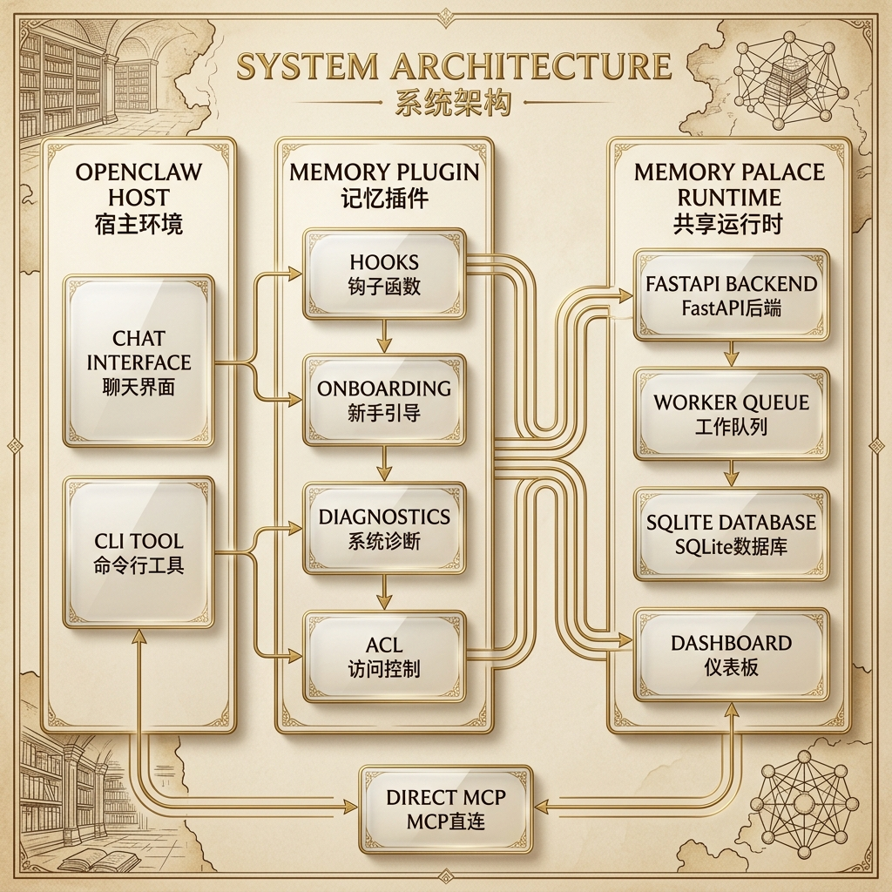

<p align="center">
  
</p>

<h1 align="center">🏛️ Memory Palace · 记忆宫殿</h1>

<p align="center">
  <strong>面向 OpenClaw 的 memory plugin + bundled skills。</strong>
</p>

<p align="center">
  <em>"每一次对话都留下痕迹，每一道痕迹都化为记忆。"</em>
</p>

<p align="center">
  
  
  
  
  
  
  
  
</p>

<p align="center">
  <a href="README.md">English</a> ·
  <a href="docs/README.md">文档中心</a> ·
  <a href="docs/openclaw-doc/README.md">OpenClaw 接入</a> ·
  <a href="docs/skills/README.md">Skills</a> ·
  <a href="docs/EVALUATION.md">评测摘要</a> ·
  <a href="https://github.com/AGI-is-going-to-arrive/Memory-Palace-Openclaw">GitHub</a>
</p>

> 如果这个项目对你的 OpenClaw 使用有帮助，欢迎顺手点个 Star ⭐。

---

## 快速开始

默认前提是：这台机器已经装好了 OpenClaw（`>= 2026.3.2`）。
如果宿主本体还没装，先按 OpenClaw 官方文档把宿主装好，再回来看
`docs/openclaw-doc/01-INSTALL_AND_RUN.md`。
官方宿主安装入口：`https://docs.openclaw.ai/install`

<p align="center">
  
</p>

推荐安装流程：

1. 如果这台机器上还没 clone 当前仓库，就先 clone；如果已经 clone 了，就直接保留本地 checkout。
2. 先把本地 `docs/openclaw-doc/18-CONVERSATIONAL_ONBOARDING.md` 路径交给 OpenClaw CLI 或 WebUI。
3. 如果 OpenClaw 告诉你 plugin 还没装，再按下面这条最短终端安装链继续。
4. apply 或 setup 完成后，再用 `verify / doctor / smoke` 做最终签收。

直接贴给 OpenClaw 的 prompt：

```text
我想按当前默认推荐的 chat-first 路径给 OpenClaw 安装 Memory Palace。请先判断这台机器上是否已经 clone 了 https://github.com/AGI-is-going-to-arrive/Memory-Palace-Openclaw。 如果已经 clone 了，就优先读取本地仓库里的 docs/openclaw-doc/18-CONVERSATIONAL_ONBOARDING.md；如果还没 clone，就先告诉我把仓库 clone 下来，再继续从 docs/openclaw-doc/18-CONVERSATIONAL_ONBOARDING.md 往下走。 如果你也能打开仓库链接，可以把这个 GitHub 页面当成对应参考页：https://github.com/AGI-is-going-to-arrive/Memory-Palace-Openclaw/blob/main/docs/openclaw-doc/18-CONVERSATIONAL_ONBOARDING.md；但一旦本地仓库已经存在，就优先按本地文档路径执行。 然后请先判断 memory-palace plugin 是否已经安装并加载；如果还没装，先给我最短安装链路；如果已经装好，就继续按 memory_onboarding_status -> memory_onboarding_probe -> memory_onboarding_apply 帮我往下走。先检查宿主里是否已有可复用的 provider 配置，不要默认把我推去 dashboard；如果当前还没有完整 provider 栈，就先按 Profile B 起步；如果 embedding + reranker + LLM 都已经就绪，就直接把 Profile D 当成推荐目标。只有 apply 完成后，再提醒我跑 openclaw memory-palace verify / doctor / smoke。
```

```bash
# 0. 克隆仓库
git clone https://github.com/AGI-is-going-to-arrive/Memory-Palace-Openclaw.git
cd Memory-Palace-Openclaw

# 1. 如果 OpenClaw 提示 plugin 还没安装，就走这条终端 fallback
python3 scripts/openclaw_memory_palace.py setup --mode basic --profile b --transport stdio --json

# 2. 如果 setup 或 onboarding 返回 restartRequired=true，先完成 OpenClaw 重载

# 3. 最终签收
openclaw memory-palace verify --json
openclaw memory-palace doctor --json
openclaw memory-palace smoke --json
```

如果你在 Windows PowerShell 里跑，对应命令直接写成：

```powershell
py -3 scripts/openclaw_memory_palace.py setup --mode basic --profile b --transport stdio --json
openclaw memory-palace verify --json
openclaw memory-palace doctor --json
openclaw memory-palace smoke --json
```

如果你只是想确认 plugin 已经真正接进当前宿主，优先用 `openclaw plugins inspect memory-palace --json`。有些宿主也接受 `openclaw plugins info memory-palace`，但 `inspect` 是显式命令面。不要把 `openclaw skills list` 当成这个 plugin 的安装判断条件；onboarding skill 是随 plugin 包一起带进来的，不是单独装到宿主里的另一份 skill。

## 推荐用户路径

- 先从 `docs/openclaw-doc/18-CONVERSATIONAL_ONBOARDING.md` 开始。这是当前最推荐的安装路径，因为它同时覆盖“还没安装”和“已经安装、继续配置”两种状态。
- 如果 OpenClaw 告诉你 plugin 还没安装，再把 `setup --mode basic --profile b` 当成最短终端 fallback。
- 如果你已经准备好了 embedding / reranker / LLM 的 `API base + API key + model name`，强烈建议直接把目标档位升到 **Profile D**，把完整高级能力面一次开齐；如果你只是想先把检索升级到 provider-backed，再走 **Profile C**。

这里要先把两类命令分清：

- **仓库 wrapper**：`python3 scripts/openclaw_memory_palace.py ...`（Windows PowerShell 里写成 `py -3 scripts/openclaw_memory_palace.py ...`）
- **OpenClaw 稳定用户命令面**：`openclaw memory-palace ...`

不要把它们混成一套。尤其是：

- `bootstrap-status`、`provider-probe` 属于仓库 wrapper / onboarding 链路
- 它们**不是** `openclaw memory-palace` 的子命令
- 如果 `setup` 提示 `restartRequired=true`，先完成重载，再把 `verify / doctor / smoke` 当成最终签收
- 真正给用户长期使用的签收命令，仍然是 `verify / doctor / smoke`

当前应该降级理解的安装方式：

- 公开 npm spec `@openclaw/memory-palace` 当前真实结果是 `Package not found on npm`
- `openclaw plugins install memory-palace` 当前会解析成 skill，而不是这个 plugin
- 当前公开文档**不把**这两条当成推荐安装入口
- 所以如果你已经在源码仓目录里，仍然应该先走对话式 onboarding，再把源码仓 `setup` 链当成终端 fallback
- 本地 `tgz` 安装仍然保留，但它属于明确想验证受信任本地包的高级路径

**推荐档位路径：**

- 先用 **Profile B** 完成零配置起步
- 如果你只是先把检索升级到 provider-backed，走 **Profile C**
- 如果你已经准备好 embedding / reranker / LLM 三类配置，并且希望默认打开完整高级能力，强烈建议直接升级到 **Profile D**
- `Profile C / D` 只有在你自己的环境里真实 probe 和验证通过后，才算真正就绪

如果宿主 OpenClaw 里已经装好了 plugin，优先留在聊天里走
`memory_onboarding_status -> memory_onboarding_probe -> memory_onboarding_apply`。
下面这些 repo CLI 命令，属于源码仓路径下的终端 fallback。

```bash
# Profile C = 先升级到 provider-backed retrieval
python3 scripts/openclaw_memory_palace.py setup --mode basic --profile c --transport stdio --json

# 只看 readiness 报告（不会真正改配置）
python3 scripts/openclaw_memory_palace.py onboarding --profile c --json
python3 scripts/openclaw_memory_palace.py onboarding --profile d --json

# 报告没问题后，再真正 apply
python3 scripts/openclaw_memory_palace.py onboarding --profile c --apply --validate --json

# Profile D = embedding / reranker / LLM 都就绪时的全功能目标档
python3 scripts/openclaw_memory_palace.py setup --mode basic --profile d --transport stdio --json
# 或者：python3 scripts/openclaw_memory_palace.py onboarding --profile d --apply --validate --json
```

如果你在 Windows PowerShell 里跑，这一组 repo wrapper fallback 也统一改成 `py -3`。

<details>
<summary><strong>Profile C/D provider 配置示例</strong></summary>

Profile C 需要 embedding 服务和 reranker。Profile C 上的 LLM 辅助套件
仍然是可选增强，应该在 onboarding 里显式开启；Profile D 则把
`write_guard + compact_gist + intent_llm` 视为完整高级目标的一部分。
Profile B 本身不要求外部 embedding / reranker，但如果宿主已经有可复用的
可选 LLM 配置，仍可能被继续复用。

可以直接设置这些环境变量，或者先让仓库 wrapper 生成一份对话友好的 readiness
报告：

- 对话工具链：`memory_onboarding_status -> memory_onboarding_probe -> memory_onboarding_apply`
- 仓库 wrapper 链路：`python3 scripts/openclaw_memory_palace.py bootstrap-status -> provider-probe -> onboarding/setup`（Windows PowerShell 里统一改成 `py -3 scripts/openclaw_memory_palace.py ...`）

```bash
# Embedding（Profile C/D 必需）
RETRIEVAL_EMBEDDING_API_KEY=your-embedding-api-key
RETRIEVAL_EMBEDDING_API_BASE=https://your-embedding-provider/v1/embeddings
RETRIEVAL_EMBEDDING_MODEL=your-embedding-model
RETRIEVAL_EMBEDDING_DIM=1024          # 必须匹配模型输出维度

# Reranker（Profile C/D 必需）
RETRIEVAL_RERANKER_ENABLED=true
RETRIEVAL_RERANKER_API_KEY=your-reranker-api-key
RETRIEVAL_RERANKER_API_BASE=https://your-reranker-provider/v1/rerank
RETRIEVAL_RERANKER_MODEL=your-reranker-model

# Profile C 可选；Profile D 期望启用
WRITE_GUARD_LLM_ENABLED=true
WRITE_GUARD_LLM_API_BASE=https://your-llm-provider/v1
WRITE_GUARD_LLM_API_KEY=your-llm-api-key
WRITE_GUARD_LLM_MODEL=your-llm-model
```

`setup` 和 `onboarding` 会探测 provider 并回报维度。常用参数看
`.env.example`；最终默认值以运行时代码为准。

</details>

---

## 项目亮点

- **给 OpenClaw 用**：`memory-palace` 可以直接接管当前 memory slot，不用改 OpenClaw 源码。
- **长期记忆可查、可看、可复核**：稳定用户命令面是 `openclaw memory-palace ...`，不是一组内部 helper 链。
- **对话式接入**：plugin 装好后，用户可以留在 CLI / WebUI 聊天里走 `memory_onboarding_status -> memory_onboarding_probe -> memory_onboarding_apply`；apply 之后，再用 `openclaw memory-palace verify / doctor / smoke` 做最终签收。
- **实验性多 Agent 记忆隔离**：当前 ACL 仍能复现 `alpha -> 已写入 -> beta -> UNKNOWN` 这条证据链，但它现在应按实验特性理解，不要当成已经完全硬化的安全边界。
- **档位清楚**：`Profile B` 负责先跑通，`Profile C` 负责先把检索升级到 provider-backed，`Profile D` 是 embedding / reranker / LLM 都到位后的全功能高级面。

## 技术架构一眼看懂

- **用户面**：OpenClaw 的 `memory` slot、插件工具、生命周期钩子。
- **插件层**：recall、auto-capture、visual memory、onboarding、ACL、host-bridge 这些逻辑都在 `extensions/memory-palace/`。
- **运行时**：`backend/` 里是 FastAPI + MCP + SQLite，负责长期记忆和 hybrid retrieval。
- **配套运行面**：Dashboard、`verify / doctor / smoke`、打包安装检查，都是同一套 runtime 往上长出来的。

---

## 这个仓库到底是什么

这个仓库现在最应该按下面这句话来理解：

> **给 OpenClaw 用的 `memory-palace` 插件，以及它配套的 skills 和 runtime。**

最关键的边界只有几句：

- 默认 `setup/install` 走的是“改你本机 OpenClaw 配置文件，把插件接进去并激活”这条路，不是改 OpenClaw 源码
- 这不等于替代宿主自己的 `USER.md`、`MEMORY.md`、`memory/*.md`
- 它做的是在宿主之上补 durable、searchable、auditable memory
- 仓库仍保留 direct `skill + MCP` 路线，给 `Claude Code / Codex / Gemini CLI / OpenCode` 用

如果你是 OpenClaw 用户，优先按：

> **OpenClaw plugin 主线**

来读，不要先把它当成独立产品。

如果你想先看 GitHub 里最容易直接浏览的真实 OpenClaw WebUI 证据，先看：

- `docs/openclaw-doc/15-END_USER_INSTALL_AND_USAGE.md`

这页集中放：

- `Skills` 里的 Memory Palace 相关条目
- `Chat` 里的 recall 和 visual memory 证据
- ACL 隔离（`main / alpha / beta -> beta chat -> UNKNOWN`）
- `Profile B / C / D` 的用户侧含义

仓库里的 standalone HTML 仍然保留，但它们更适合 clone 之后本地打开，不再当 GitHub 默认入口。

---

## 从哪里开始看

- **OpenClaw 用户入口**：`docs/openclaw-doc/README.md`
- **直接通过对话完成 onboarding**：`docs/openclaw-doc/18-CONVERSATIONAL_ONBOARDING.md`
- **GitHub 里最适合直接浏览的 WebUI 证据页**：`docs/openclaw-doc/15-END_USER_INSTALL_AND_USAGE.md`
- **direct skill + MCP 入口**：`docs/skills/README.md`
- **评测与当前验证记录**：`docs/EVALUATION.md`

如果你要做的是本地 backend / dashboard 开发，而不是普通 OpenClaw 安装，再去看 `docs/GETTING_STARTED.md`。

---

## 当前验证边界

这部分只负责告诉你“怎么理解当前验证结果”，不把仓库里的复跑写成所有环境的通用承诺。

- `Profile B` 仍然是最稳的第一次安装路径。
- `Profile C / D` 仍然依赖你自己的 provider，必须在你的目标环境真实转绿才算 ready。
- 稳定用户命令面仍然是 `openclaw memory-palace ...`
- 仓库 wrapper 适合生成 readiness 报告和辅助 setup，但它不是长期用户命令面
- 当前公开“对话式 onboarding”口径，验证的是把当前仓库里的文档页面或文档路径交给 OpenClaw；这页不把“任意公开 GitHub URL 都能直接抓取并走通”写成默认承诺
- 当前仓库记录的检查已经确认：
  - `openclaw plugins inspect memory-palace --json` 已能在真实宿主上确认 plugin 已加载；有些宿主也接受 `openclaw plugins info memory-palace`
  - `openclaw skills list` 不是 bundled onboarding skill 的安装判断条件
  - 同一份 onboarding 文档已经验证过可以在 CLI / WebUI、未安装 / 已安装、中英文这几条主分支里给出正确下一步
  - 最新一轮 profile-matrix 记录里，已经复现当前实验性 `A / B / C / D + ACL` 行为
- 具体命令、次数和边界说明统一看 `docs/EVALUATION.md`
- provider 依赖链路在某些环境里仍可能因为目标模型端点不健康而出现 `warn`，所以真正上线前一定要在你的目标环境再跑一次

---

## Thanks

感谢 [linux.do 社区](https://linux.do/)。

## Star History

<a href="https://www.star-history.com/?repos=AGI-is-going-to-arrive%2FMemory-Palace-Openclaw&type=date&legend=top-left">

 <picture>
   <source media="(prefers-color-scheme: dark)" srcset="https://api.star-history.com/chart?repos=AGI-is-going-to-arrive/Memory-Palace-Openclaw&type=date&theme=dark&logscale&legend=top-left" />
   <source media="(prefers-color-scheme: light)" srcset="https://api.star-history.com/chart?repos=AGI-is-going-to-arrive/Memory-Palace-Openclaw&type=date&logscale&legend=top-left" />
   
 </picture>

</a>

---

## License

MIT
