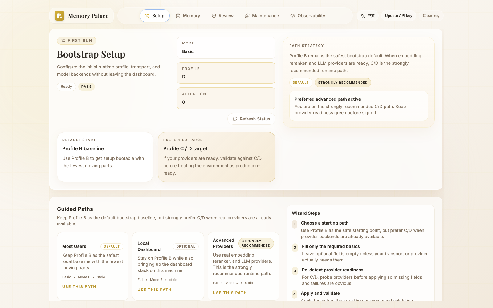
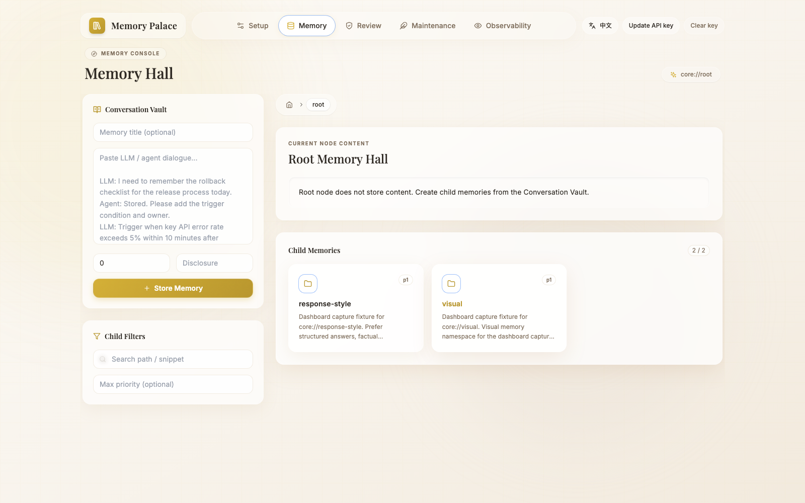
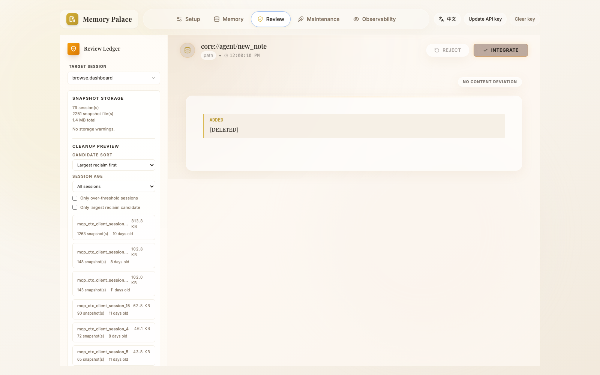

> [中文版](GETTING_STARTED.md)

# Memory Palace Quick Start

This guide helps you get Memory Palace's local development environment or Docker deployment running in 5 minutes.

> A note on positioning:
>
> - The current public release is best understood as an **OpenClaw memory plugin + bundled skills**
> - This page covers the backend / dashboard / direct MCP technical path within the repository
> - If you just want to install the plugin for OpenClaw, see `docs/openclaw-doc/README.en.md` first
> - The direct MCP / skill route currently prioritizes coverage for `Claude Code / Codex / Gemini CLI / OpenCode`; `Cursor` still requires manual verification

---

## 1. Prerequisites

| Dependency | Minimum Version | Check Command |
|---|---|---|
| Python | `3.10-3.14` | `python3 --version` |
| OpenClaw | `2026.3.2+` | `openclaw --version` |
| Node.js | `20.19+` (or `>=22.12`) | `node --version` |
| npm | `9+` | `npm --version` |
| Bun (required when packaging the plugin from source) | Current stable | `bun --version` |
| Docker (optional) | `20+` | `docker --version` |
| Docker Compose (optional) | `2.0+` | `docker compose version` |

> **Tip**: macOS users are recommended to install Python and Node.js via [Homebrew](https://brew.sh). Windows users are recommended to download installers from official websites or use [Scoop](https://scoop.sh).
>
> If you use `nvm` on your machine, you can run `nvm use` directly in the repository root. The bundled `.nvmrc` is pinned to `22.12.0`; the frontend `package.json` also only accepts current LTS lines (`20.19+` or `22.12+`).

---

## 2. Repository Structure Overview

```
memory-palace/
├── backend/              # FastAPI + SQLite backend
│   ├── main.py           # Application entry (FastAPI instance, /health endpoint)
│   ├── mcp_server.py     # 11 MCP tool entries (FastMCP) + compatibility wrapper
│   ├── mcp_runtime_context.py # request-context / session-id helper
│   ├── mcp_client_compat.py # sqlite_client compatibility call helper
│   ├── mcp_transport.py  # SSE host/origin protection helper
│   ├── mcp_uri.py        # URI parsing and writable domain validation
│   ├── mcp_snapshot.py   # Snapshot helper
│   ├── mcp_snapshot_wrappers.py # Snapshot wrapper bound to runtime state
│   ├── mcp_reading.py    # read_memory helper
│   ├── mcp_views.py      # system:// view generation
│   ├── mcp_server_config.py # domain/search/runtime default config
│   ├── mcp_force_create.py # force-create / force-variant judgment helper
│   ├── mcp_runtime_services.py # import-learn / gist / auto-flush service helper
│   ├── mcp_tool_common.py # Shared MCP guard/response helper
│   ├── mcp_tool_read.py  # read_memory MCP tool implementation
│   ├── mcp_tool_search.py # search_memory MCP tool implementation
│   ├── mcp_tool_write_runtime.py # write-lane / index enqueue runtime helper
│   ├── mcp_tool_write.py # create/update/delete/add_alias write tool implementation
│   ├── mcp_tool_runtime.py # compact_context / rebuild_index / index_status implementation
│   ├── runtime_state.py  # Write Lane, Index Worker, session cache
│   ├── run_sse.py        # MCP SSE transport layer (Starlette + API Key auth)
│   ├── mcp_wrapper.py    # MCP wrapper
│   ├── requirements.txt  # Python dependency list
│   ├── db/               # Database schema, retrieval engine
│   │   ├── sqlite_client.py     # Stable export SQLite facade
│   │   ├── sqlite_models.py     # ORM model definitions
│   │   ├── sqlite_paths.py      # SQLite URL / path / time helper
│   │   └── sqlite_client_retrieval.py # Retrieval scoring / context recall helper
│   ├── api/              # HTTP routes
│   │   ├── browse.py     # Memory tree browsing (GET /browse/node)
│   │   ├── review.py     # Review interface (/review/*)
│   │   ├── maintenance.py        # `/maintenance` route compatibility facade
│   │   ├── maintenance_common.py # Maintenance shared auth / env / time helper
│   │   ├── maintenance_models.py # Request models and lazy client proxy
│   │   ├── maintenance_index.py  # Index worker / rebuild / retry logic
│   │   └── maintenance_transport.py # Transport / observability aggregation helper
├── frontend/             # React + Vite + Tailwind Dashboard
│   ├── package.json      # Version 1.0.1
│   └── vite.config.js    # Dev server port 5173, proxied to backend 8000
├── extensions/           # OpenClaw plugin
│   └── memory-palace/
│       ├── index.ts      # Plugin entry and orchestration
│       └── src/          # runtime-layout / prompt-safety / host-bridge / assistant-derived / reflection helpers
├── deploy/               # Docker and Profile configs
│   ├── docker/           # Dockerfile.backend / Dockerfile.frontend
│   └── profiles/         # macos / windows / docker profile templates
├── scripts/              # Operations scripts
│   ├── apply_profile.sh  # Profile apply script (macOS/Linux)
│   ├── apply_profile.ps1 # Profile apply script (Windows)
│   ├── docker_one_click.sh   # Docker one-click deployment (macOS/Linux)
│   ├── docker_one_click.ps1  # Docker one-click deployment (Windows)
├── docs/                 # Project documentation
├── .env.example          # Configuration template (common options)
├── docker-compose.yml    # Compose orchestration file
└── LICENSE               # Open source license
```

---

> The actual commands in the text below are authoritative:
>
> - The backend defaults to `uvicorn` running on `127.0.0.1:8000`
> - The frontend dev server defaults to port `5173`
> - Docker default entry points are `http://127.0.0.1:3000` (Dashboard) and `http://127.0.0.1:3000/sse` (SSE)
> - If you want to see what each of the 5 Dashboard pages does, go directly to `docs/openclaw-doc/16-DASHBOARD_GUIDE.en.md`

<p align="center">
  
</p>

<p align="center">
  
</p>

<p align="center">
  
</p>

## 3. Local Development (Recommended Starting Path)

### Step 1: Prepare the Configuration File

```bash
cp .env.example .env
```

> What you get is the **conservative `.env.example` minimal template**. It is sufficient for your initial local startup, but **it does not mean Profile B has been applied**.
>
> If you want to use the Profile B defaults defined in the repository (e.g., local hash Embedding), prefer using the Profile script below. If you choose to manually edit `.env.example`, think of it as "starting from a minimal template and adding configuration as needed."

> **Important**: After copying, check the `DATABASE_URL` in `.env` and change the path to your actual path. For shared environments or near-production scenarios, using an absolute path is recommended. For example:
>
> ```
> DATABASE_URL=sqlite+aiosqlite:////absolute/path/to/memory_palace/demo.db
> ```

You can also use the Profile script to quickly generate a `.env` with default configuration:

```bash
# macOS — arguments: platform profile [target-file]
bash scripts/apply_profile.sh macos b

# Linux — arguments: platform profile [target-file]
bash scripts/apply_profile.sh linux b

# Windows PowerShell
.\scripts\apply_profile.ps1 -Platform windows -Profile b
```

> The apply_profile script copies `.env.example` to `.env` (or your specified target file), then appends the override configuration for the corresponding Profile. Both macOS and Linux platforms automatically detect and fill in `DATABASE_URL`.
>
> `apply_profile.sh/.ps1` currently deduplicates repeated env keys after generation. The latest recorded Windows real-machine rerun also reconfirmed the native basic-path `setup -> verify -> doctor -> smoke`. Before publishing to another machine, it is still recommended to rerun native validation separately on that target Windows OpenClaw host, rather than treating `pwsh` proxy validation from other environments as equivalent proof.
>
> Whenever this page mentions `provider-probe / onboarding`, it means the **repo wrapper** chain `python3 scripts/openclaw_memory_palace.py ...`; on Windows PowerShell, use `py -3 scripts/openclaw_memory_palace.py ...`. These are not stable `openclaw memory-palace` subcommands.
>
> Keep the current boundary explicit:
> - `apply_profile.*` is best for getting a conservative **Profile B**-style local template first
> - on **Profile C/D**, it is better understood as “generate the right field skeleton and reject obvious placeholders”
> - actual provider readiness still has to be confirmed by `provider-probe / verify / doctor / smoke`
>
> Note that **the profile-b `.env` generated on macOS / Linux / Windows will not automatically populate `MCP_API_KEY`**. If you plan to open the Dashboard next, or directly call `/browse` / `/review` / `/maintenance`, `/sse`, or `/messages`, please set `MCP_API_KEY` yourself, or set `MCP_API_KEY_ALLOW_INSECURE_LOCAL=true` for local loopback debugging only. Only the `docker` platform profile script auto-generates a local key when the key is empty.

#### Key Configuration Options

Below are the most commonly used options in `.env` (see comments in `.env.example` for additional options):

| Option | Description | Template Example Value |
|---|---|---|
| `DATABASE_URL` | SQLite database path (**absolute path recommended**) | `sqlite+aiosqlite:////absolute/path/to/memory_palace/demo.db` |
| `SEARCH_DEFAULT_MODE` | Search mode: `keyword` / `semantic` / `hybrid` | `hybrid` |
| `RETRIEVAL_EMBEDDING_BACKEND` | Embedding backend: `none` / `hash` / `router` / `api` / `openai` | `hash` |
| `RETRIEVAL_EMBEDDING_MODEL` | Embedding model name | `Qwen3-Embedding-8B` |
| `RETRIEVAL_EMBEDDING_DIM` | Embedding request dimension; Profile B defaults to `64` (hash), while Profile C/D should follow the live provider-probe result | `64` (B) / `provider-probe` (C/D) |
| `RETRIEVAL_RERANKER_ENABLED` | Whether to enable the Reranker | `false` |
| `RETRIEVAL_RERANKER_API_BASE` | Reranker API address | empty |
| `RETRIEVAL_RERANKER_API_KEY` | Reranker API key | empty |
| `RETRIEVAL_RERANKER_MODEL` | Reranker model name | `Qwen3-Reranker-8B` |
| `INTENT_LLM_ENABLED` | Experimental intent LLM toggle | `false` |
| `RETRIEVAL_MMR_ENABLED` | Deduplication / diversity re-ranking for hybrid search | `false` |
| `RETRIEVAL_SQLITE_VEC_ENABLED` | sqlite-vec rollout toggle | `false` |
| `MCP_API_KEY` | HTTP/SSE interface authentication key | empty (see auth notes below) |
| `MCP_API_KEY_ALLOW_INSECURE_LOCAL` | Allow keyless access during local debugging (only for direct loopback requests) | `false` |
| `CORS_ALLOW_ORIGINS` | List of origins allowed for cross-origin access (leave empty for local defaults) | empty |
| `VALID_DOMAINS` | Writable memory URI domains allowed (`system://` is a built-in read-only domain) | `core,writer,game,notes` |
| `RUNTIME_FLUSH_HIGH_VALUE_EARLY_ENABLED` | Conservative early flush for short but clearly high-value workflow / preference events | `true` |
| `RUNTIME_FLUSH_HIGH_VALUE_MIN_EVENTS` | Minimum event count before high-value early flush | `2` |
| `RUNTIME_FLUSH_HIGH_VALUE_MIN_CHARS` | Minimum non-CJK character count for high-value early flush | `120` |
| `RUNTIME_FLUSH_HIGH_VALUE_MIN_CHARS_CJK` | Lower CJK character threshold for high-value early flush | `100` |

> Profile B defaults to local hash Embedding with Reranker disabled; it remains the **default starting profile**.
>
> If you already have model services ready, **upgrading to Profile C is strongly recommended**: it requires you to fill in the Embedding / Reranker pipeline in `.env`. If you also want to enable LLM-assisted write guard / gist / intent routing, continue filling in `WRITE_GUARD_LLM_*`, `COMPACT_GIST_LLM_*`, and optionally `INTENT_LLM_*`. See [DEPLOYMENT_PROFILES.en.md](DEPLOYMENT_PROFILES.en.md) for details.
>
> The table above reflects the current real values in `.env.example`. If certain retrieval environment variables are completely absent at runtime, the backend will still apply its own fallback values internally (for example `hash` / `hash-v1` / `64`).
>
> Configuration semantics note: `RETRIEVAL_EMBEDDING_BACKEND` only applies to Embedding. There is no `RETRIEVAL_RERANKER_BACKEND` toggle for Reranker; it reads `RETRIEVAL_RERANKER_*` first, then falls back to `ROUTER_*` (and finally to `OPENAI_*` base/key).
>
> More advanced options (such as `INTENT_LLM_*`, `RETRIEVAL_MMR_*`, `RETRIEVAL_SQLITE_VEC_*`, `CORS_ALLOW_*`, runtime observation/sleep consolidation toggles) are documented in `.env.example` with conservative defaults that do not affect the minimal startup path.
>
> The new runtime flush defaults should be read the same way: they improve summary quality and short high-value flush timing only; they do not change the database schema, MCP API, or the core logic of Profiles A/B/C/D.
>
> Recommended defaults (safe to copy directly):
> - `INTENT_LLM_ENABLED=false`: Start with built-in keyword rules, one fewer external dependency
> - `RETRIEVAL_MMR_ENABLED=false`: Start with raw hybrid results; only enable when "top results are too similar"
> - `RETRIEVAL_SQLITE_VEC_ENABLED=false`: Keep the legacy path for standard deployments
> - `CORS_ALLOW_ORIGINS=`: Leave empty for local development; specify explicit domains when opening browser cross-origin access
>
> Public docs do not assume one fixed provider/model pair. Set `RETRIEVAL_EMBEDDING_MODEL`, `RETRIEVAL_RERANKER_MODEL`, and any optional `*_LLM_MODEL` values to models that are already verified in your own environment.
>
> If you plan to open the Dashboard locally or directly call `/browse` / `/review` / `/maintenance` with `curl`, configure one of the following authentication options:
>
> - `MCP_API_KEY=change-this-local-key`
> - `MCP_API_KEY_ALLOW_INSECURE_LOCAL=true` (only recommended for loopback debugging on your own machine)

### Step 2: Connect the OpenClaw Plugin Pipeline First (Recommended)

If your current goal is to get the **OpenClaw plugin pipeline** running, rather than manually editing your local OpenClaw configuration files, run the following in the repository root:

```bash
python3 scripts/openclaw_memory_palace.py setup --mode basic --profile b --transport stdio --json
openclaw memory-palace verify --json
openclaw memory-palace doctor --json
openclaw memory-palace smoke --json
```

On Windows PowerShell, run the same repo-wrapper command as `py -3 scripts/openclaw_memory_palace.py setup --mode basic --profile b --transport stdio --json`.

> Note: The current stable path for OpenClaw `setup` / package runtime requires **Python `3.10-3.14`**. If your default Python is outside this range, explicitly use a supported version installed on your machine (e.g., `3.14`).
>
> The current public validation baseline is documented in `docs/EVALUATION.en.md`. For this command chain, what matters more is the current behavior: with the current code, `host-config-path` itself should already pass even in a direct shell rerun. If it starts warning again, first check whether `OPENCLAW_CONFIG_PATH` / `OPENCLAW_CONFIG` was pinned to a stale path, or whether the host config file moved or became unreadable, rather than treating that warning as the expected baseline.
>
> If you later open the Dashboard `/setup`, the page will now directly show the most recent provider probe results for `embedding / reranker / llm`, as well as whether it has fallen back to `Profile B` due to a failed probe, rather than just displaying "configured / not configured."
>
> The more stable public reading is:
>
> - `Profile B` is the zero-external-dependency bootstrap tier
> - `Profile C/D` are the provider-ready maximum-capability paths
> - Only after `provider-probe / verify / doctor / smoke` all succeed should `C/D` be described as actually active
>
> If you are **intentionally switching from `Profile B` to `Profile C/D` within the same runtime**, or have changed an existing runtime's `RETRIEVAL_EMBEDDING_DIM`, run this immediately after `setup`:
>
> ```bash
> openclaw memory-palace index --wait --json
> ```
>
> After rebuilding, vector rows with mixed dimensions will return to the single dimension of the currently active profile.
>
> Many embedding models support multiple output dimensions. When you run `provider-probe`, it will auto-detect the maximum usable dimension for your specific provider and model. Trust the probe result rather than mechanically keeping the template value, and rebuild the index if you changed dimensions in an existing runtime.
>
> If one older host session keeps repeating an earlier dimension after you already re-ran `provider-probe` and `index --wait`, prefer starting a fresh session or directly re-running `python3 scripts/openclaw_memory_palace.py provider-probe --json` to confirm live state (on Windows PowerShell: `py -3 scripts/openclaw_memory_palace.py provider-probe --json`). The longer troubleshooting explanation lives in `docs/openclaw-doc/04-TROUBLESHOOTING.en.md`.
>
> Conversely, if you normally use the maintainer automation scripts in the repository, these two pipelines now use isolated temporary config / state / db by design. If they accidentally point to the shared `~/.openclaw` runtime, they will now fail-fast immediately rather than silently corrupting the shared database.

This path will automatically:

- Prepare the user-mode runtime under `~/.openclaw/memory-palace`
- Write `plugins.allow` / `plugins.load.paths` / `plugins.slots.memory` / `plugins.entries.memory-palace`
- If `openclaw.json` already exists, back it up before modifying the configuration
- Default to **Profile B** as the starting point
- If you leave `MCP_API_KEY` empty on this local path, auto-generate a local key

The most commonly misunderstood boundary here:

- This path modifies your local OpenClaw configuration files
- It does not modify OpenClaw source code
- If you want to manage slot binding yourself, the wrapper also supports `--no-activate`

If you want to validate a **locally packaged plugin bundle**, the command chain is still the following:

```bash
cd extensions/memory-palace
npm pack
openclaw plugins install --dangerously-force-unsafe-install ./<generated-tgz>
npm exec --yes --package ./<generated-tgz> memory-palace-openclaw -- setup --mode basic --profile b --transport stdio --json
openclaw memory-palace verify --json
openclaw memory-palace doctor --json
openclaw memory-palace smoke --json
```

> If you already have a trusted packaged `tgz`, replace `./<generated-tgz>`
> in the commands above with that tarball path and skip `npm pack`.
>
> `--dangerously-force-unsafe-install` here is only for a **local tgz you just built from this repository**. `Memory Palace` legitimately shells out to trusted local launcher / onboarding / visual helpers, and `OpenClaw 2026.4.5+` blocks that local package by default. Do not use this flag for an untrusted third-party plugin bundle.
>
> This source-repo `npm pack` path currently depends on **Bun** and a supported **Python `3.10-3.14`**, because the extension's `prepack` runs `bun build`, `bun test`, and the Python packaging wrapper.
>
> The current recorded **local tgz / clean-room** path should still be read as “validated and available,” but this page no longer repeats the session-specific version and status details inline. The safer reading is still: if your immediate goal is just to get the plugin running, prefer the source-repo `setup --mode basic/full` path first; use this package path when you specifically want to validate a locally built deliverable. The latest package/tgz status stays in `docs/EVALUATION.en.md`.

### Step 3: Start the Backend

```bash
cd backend
python3 -m venv .venv

# macOS / Linux
source .venv/bin/activate

# Windows PowerShell
# .\.venv\Scripts\Activate.ps1

pip install -r requirements.txt
uvicorn main:app --host 127.0.0.1 --port 8000 --reload
```

Expected output:

```
Memory API starting...
SQLite database initialized.
INFO:     Uvicorn running on http://127.0.0.1:8000
```

> The backend now completes initialization through a shared `runtime_bootstrap.py`. The `lifespan` in `main.py` follows this bootstrap, and the stdio / SSE startup paths also follow the same logic. In simple terms: legacy SQLite recovery, `init_db()`, and runtime state (Write Lane, Index Worker) startup now all execute in the same order, rather than each entry point doing only half the work.

### Step 4: Start the Frontend

```bash
cd frontend
npm install
npm run dev
```

Expected output:

```
VITE v7.x.x  ready in xxx ms
➜  Local:   http://127.0.0.1:5173/
```

Open your browser and navigate to `http://127.0.0.1:5173` to see the Memory Palace Dashboard.

> If this is **your first local startup** and no bootstrap configuration exists yet, the page may redirect to **`/setup`**. The most stable default choice is still **`basic + Profile B`** to get the bootstrap baseline running.
> However, if your embedding / reranker / LLM providers are already ready, do not stay on B: the current setup page clearly marks **`Profile C / D`** as the recommended target path. Switch to the appropriate path before doing your final validation and sign-off. After clicking `Apply`, if the page shows `Restart Backend`, click it again and wait a few seconds for the page to reconnect.

> If the backend has `MCP_API_KEY` configured but the page still shows `Set API key`, click the top-right corner to enter the same key. This frontend fallback key is now stored only in the current page's memory (memory-only). It is cleared when the tab is closed or refreshed. Use `window.__MEMORY_PALACE_RUNTIME__` injection for persistent auth.

> There is a critical boundary here: the key entered in the top-right corner is primarily a fallback for **Dashboard protected data endpoints** (`/browse/*`, `/review/*`, `/maintenance/*`); on the current same-origin / loopback Dashboard path, the frontend also attaches it to `/bootstrap/provider-probe`, `/bootstrap/apply`, and `/bootstrap/restart`. The real extra restriction is not “this key is useless for bootstrap”, but that `/bootstrap/*` still expects the request to come from the local loopback / current-page origin. If you are not operating from that local page, or you want to avoid page-memory auth entirely, the CLI path is still the safer option:
>
> ```bash
> python3 scripts/openclaw_memory_palace.py setup --mode basic --profile b
> ```

> If you have enabled `MCP_API_KEY_ALLOW_INSECURE_LOCAL=true`, direct requests from the local loopback address can access these protected data endpoints directly; `/bootstrap/*` still checks the loopback / same-origin boundary first, then whether the key is present when required.

> The frontend defaults to English display, with a Chinese/English toggle in the top-right corner. The selected language persists to the browser's `localStorage` and is retained after refresh.
>
> The frontend also includes a runtime text normalization layer: dynamic text commonly seen on pages like `/setup` and `/observability` (bootstrap / diagnostic messages) will attempt to follow the current interface language, rather than displaying raw Chinese strings returned by the backend on an English page.

> The frontend dev server proxies the `/api` path to the backend `http://127.0.0.1:8000` through the proxy configured in `vite.config.js`, so no manual CORS configuration is needed between frontend and backend.

If you want to add a real browser regression check, run:

```bash
cd frontend
npx playwright install chromium
npm run test:e2e
```

This E2E suite covers the Dashboard main path **after bootstrap is complete**: switching between Chinese and English, saving language selection, entering an API key, and opening protected pages. The initial `/setup` redirect is covered separately by frontend tests.

---

## 4. Docker One-Click Deployment

```bash
# macOS / Linux
bash scripts/docker_one_click.sh --profile b

# Windows PowerShell
.\scripts\docker_one_click.ps1 -Profile b

# To inject runtime API keys/addresses from the current process into this run's Docker env file (e.g., for profile c/d)
# you must explicitly enable the injection flag (disabled by default):
bash scripts/docker_one_click.sh --profile c --allow-runtime-env-injection
# or
.\scripts\docker_one_click.ps1 -Profile c -AllowRuntimeEnvInjection
```

> `docker_one_click.sh/.ps1` generates an independent temporary Docker env file for **each run** by default, passing it to `docker compose` via `MEMORY_PALACE_DOCKER_ENV_FILE`. It only reuses a specified file when you explicitly set that environment variable, rather than sharing a fixed `.env.docker`.
>
> Concurrent deployments within the same checkout are serialized by a deployment lock. If another one-click deployment is already running, subsequent processes will exit immediately with a prompt to retry later.
>
> If `MCP_API_KEY` is empty in the Docker env file, `apply_profile.*` auto-generates a local key. The Docker frontend automatically includes this key at the proxy layer, so the Dashboard does not require manually clicking `Set API key` by default.
>
> Docker now binds exposed ports to the local loopback address by default via `MEMORY_PALACE_BIND_HOST=127.0.0.1`. If you explicitly change it to a non-loopback address for remote access, treat the frontend as a privileged proxy for protected Dashboard routes, and ensure proper network isolation and access controls.
>
> **C/D local integration tips**:
>
> - If your local `router` does not yet have embedding / reranker / llm connected, you can directly configure `RETRIEVAL_EMBEDDING_*`, `RETRIEVAL_RERANKER_*`, `WRITE_GUARD_LLM_*` / `COMPACT_GIST_LLM_*` individually.
> - This makes it easier to identify which specific pipeline is unreachable, rather than misdiagnosing "one unconfigured model" as "the entire system is down."
> - If your reranker is a locally self-hosted service such as `llama.cpp`, warm it up manually once with a `/rerank` call before the first `setup --profile c/d --strict-profile`, `verify`, or `smoke`.
> - Regardless of whether you ultimately use the `router` approach or configure `RETRIEVAL_EMBEDDING_*` / `RETRIEVAL_RERANKER_*` directly, re-run startup and health checks using your **final deployment configuration**.

> The script automatically performs the following steps:
>
> 1. Calls the Profile script to generate the Docker env file for this run (temporary by default; reuses a specified path only when `MEMORY_PALACE_DOCKER_ENV_FILE` is explicitly set)
> 2. By default, does not read current process environment variables to override template strategy keys (avoiding implicit profile changes); only injects API addresses/keys/model fields when the injection flag is explicitly enabled
> 3. Detects port conflicts and automatically finds available ports
> 4. Applies a deployment lock for concurrent deployments within the same checkout, preventing multiple `docker_one_click` runs from overwriting each other
> 5. Builds and starts containers via `docker compose`

Default access addresses:

| Service | Address |
|---|---|
| Frontend | `http://localhost:3000` |
| Backend API | `http://localhost:18000` |
| SSE | `http://localhost:3000/sse` |
| Health Check | `http://localhost:18000/health` |
| API Docs (Swagger) | `http://localhost:18000/docs` |

> **Port mapping notes** (from `docker-compose.yml`):
>
> - The frontend container runs internally on port `8080`, mapped externally to `3000` (configurable via the `MEMORY_PALACE_FRONTEND_PORT` environment variable)
> - The backend container runs internally on port `8000`, mapped externally to `18000` (configurable via the `MEMORY_PALACE_BACKEND_PORT` environment variable)
> - If startup prints `[port-adjust]`, the script has already switched to different free ports. In that case, trust the final Frontend / Backend / SSE addresses printed in the console rather than this default table.

Stopping services:

```bash
COMPOSE_PROJECT_NAME=<compose project printed in console> docker compose -f docker-compose.yml down --remove-orphans
```

> If you need to validate Windows paths, it is recommended to run startup and smoke tests directly on the target Windows environment.

To run the repository's built-in gate with frontend browser regression before publishing:

```bash
bash scripts/pre_publish_check.sh --release-gate --profile-smoke-modes local --review-smoke-modes local
```

If you are using the new checkpoint release-gate, it will also run the packaged Python matrix smoke by default:

```bash
python3 scripts/openclaw_memory_palace.py release-gate
```

If you only want to run a faster daily check this time without re-running the `3.10-3.14` packaged Python matrix, add:

```bash
python3 scripts/openclaw_memory_palace.py release-gate --skip-python-matrix
```

If you only want to skip browser E2E while keeping frontend unit tests:

```bash
bash scripts/pre_publish_check.sh --release-gate --skip-frontend-e2e
```

### 4.1 Back Up the Current Database

Before batch testing, migration validation, or large-scale configuration changes, it is recommended to make a SQLite consistency backup:

```bash
# macOS / Linux
bash scripts/backup_memory.sh

# Specify env / output directory
bash scripts/backup_memory.sh --env-file .env --output-dir backups
```

Current profile template directory:

```text
deploy/profiles/{macos,linux,windows,docker}/profile-{a,b,c,d}.env
```

```powershell
# Windows PowerShell
.\scripts\backup_memory.ps1
```

> Backup files are written to `backups/` by default. This is a runtime directory, typically only used on your own machine.
>
> If you are just experimenting locally, treat `backups/` as a "local-machine-only" directory as well.

### 4.2 Files Typically Only Used on Your Own Machine

The repository's `<repo-root>/.gitignore` already excludes the following typical local artifacts:

- Runtime databases: `*.db`, `*.sqlite`, `*.sqlite3`
- Local tool configs: `.mcp.json`, `.claude/`, `.codex/`, `.cursor/`, `.opencode/`, `.gemini/`, `.agent/`
- Local caches and temp directories: `.tmp/`, `backend/.pytest_cache/`
- Frontend local artifacts: `frontend/node_modules/`, `frontend/dist/`
- Logs and snapshots: `*.log`, `snapshots/`, `backups/`
- Temporary test drafts: `frontend/src/*.tmp.test.jsx`
- Internal maintenance-period docs: `docs/improvement/`, `backend/docs/benchmark_*.md`
- One-off comparison summaries: `docs/evaluation_old_vs_new_*.md`

If you plan to share the project, package it for delivery, or just want an environment self-check, run:

```bash
bash scripts/pre_publish_check.sh
```

It checks local sensitive artifacts, databases, logs, personal paths, and `.env.example` placeholder items, helping you identify which content is better left on the current machine. This check also scans for generic macOS / Windows user directory absolute paths in `README/docs`, not just the current machine's username.

If you additionally run these validation scripts:

```bash
python scripts/evaluate_memory_palace_skill.py
cd backend && python ../scripts/evaluate_memory_palace_mcp_e2e.py
```

The scripts generate local summaries such as `TRIGGER_SMOKE_REPORT.md` and `MCP_LIVE_E2E_REPORT.md`. These results are better treated as validation records on your own machine rather than main documentation. They are also excluded by `.gitignore` by default, so the public GitHub repository typically does not include those files.

---

## 5. Initial Verification

> These checks focus on "getting the system running." If you need additional local Markdown validation summaries, run the validation scripts mentioned above.

### 5.1 Health Check

```bash
# Local development
curl -fsS http://127.0.0.1:8000/health

# Docker deployment
curl -fsS http://localhost:18000/health
```

Expected response (from the `/health` endpoint in `main.py`):

```json
{
  "status": "ok",
  "timestamp": "2026-02-19T08:00:00Z",
  "index": {
    "index_available": true,
    "degraded": false
  },
  "runtime": {
    "write_lanes": { ... },
    "index_worker": { ... }
  }
}
```

> `status` being `"ok"` means the system is healthy. If the index is unavailable or reports an error, `status` will change to `"degraded"`.

### 5.2 Browse the Memory Tree

```bash
curl -fsS "http://127.0.0.1:8000/browse/node?domain=core&path=" \
  -H "X-MCP-API-Key: <YOUR_MCP_API_KEY>"
```

> This endpoint comes from `GET /browse/node` in `api/browse.py`, used to view the memory node tree under a specified domain. The `domain` parameter corresponds to the domains configured in `VALID_DOMAINS` in `.env`.
>
> - If you have configured `MCP_API_KEY`, include `X-MCP-API-Key` as shown above
> - If you have enabled `MCP_API_KEY_ALLOW_INSECURE_LOCAL=true` and the request comes from the local loopback address (without forwarded headers), you can omit the authentication header

### 5.3 View API Documentation

Navigate to `http://127.0.0.1:8000/docs` in your browser to open the auto-generated FastAPI Swagger documentation and view all HTTP endpoint parameters and response formats.

---

## 6. MCP Integration

Memory Palace provides **11 tools** via the [MCP protocol](https://modelcontextprotocol.io/). The current `mcp_server.py` still holds the tool entry points and dependency injection layer, but search/write implementations, domain/search/runtime default config, force-create judgment, snapshot wrappers, URI, reading, and system view helpers have been split into separate modules:

| Tool Name | Purpose |
|---|---|
| `read_memory` | Read memory (supports special URIs like `system://boot`, `system://index`) |
| `create_memory` | Create a new memory node |
| `update_memory` | Update an existing memory node (supports diff patch) |
| `delete_memory` | Delete a memory node |
| `add_alias` | Add an alias for a memory node |
| `search_memory` | Search memory (keyword / semantic / hybrid modes) |
| `compact_context` | Compact context (clean up old session logs) |
| `compact_context_reflection` | Write compaction results to the reflection lane; typically called automatically by the plugin |
| `rebuild_index` | Rebuild the search index |
| `index_status` | View index status |
| `ensure_visual_namespace_chain` | Pre-build namespace for visual / OpenClaw scenarios; regular users generally do not need to call this manually |

### 6.1 stdio Mode (Recommended for Local Use)

```bash
bash scripts/run_memory_palace_mcp_stdio.sh
```

> This wrapper path prefers the repository's backend `.venv` and applies the runtime defaults expected by the current project wiring. For regular users, it is closer to the supported integration path than directly running `python mcp_server.py`.
>
> In `stdio` mode, MCP tools communicate directly through the process's standard input/output, **bypassing the HTTP/SSE authentication layer**, so no `MCP_API_KEY` configuration is needed.
>
> If you are doing backend development/debugging only, then the direct form is still fine:
>
> ```bash
> cd backend
> python mcp_server.py
> ```

### 6.2 SSE Mode

```bash
cd backend
HOST=127.0.0.1 PORT=8010 python run_sse.py
```

> `run_sse.py` first tries to listen on `127.0.0.1:8000`; if `8000` is already occupied, the current implementation automatically falls back to `127.0.0.1:8010`. The SSE endpoint path is `/sse`, and SSE mode is protected by `MCP_API_KEY` authentication. The safest rule is to trust the actual address printed in the startup log.
>
> The command above intentionally binds to `127.0.0.1`, which is more suitable for local debugging. If you actually need other machines to connect, change `HOST` to `0.0.0.0` (or your actual listening address), and also set up API Key, reverse proxy, firewall, and transport layer security.
>
> This standalone `run_sse.py` path is now primarily retained for local standalone debugging and backward compatibility. The main backend `uvicorn main:app` now also mounts `/sse`, `/messages`, and `/sse/messages` directly, so a single process can serve both the REST API and SSE.
>
> If you use Docker one-click deployment, SSE is no longer started by a separate container. Instead, it is mounted directly within the backend process and exposed through the frontend proxy at `http://127.0.0.1:3000/sse`.
>
> The `HOST=127.0.0.1 PORT=8010` example above is the **local loopback** form. Only change to `HOST=0.0.0.0` (or the target bind address) when you actually need to allow remote clients, and ensure proper network-side security controls.

### 6.3 Client Configuration Examples

**stdio mode** (for Claude Code / Codex / OpenCode, etc.; `Cursor` still requires manual verification):

```json
{
  "mcpServers": {
    "memory-palace": {
      "command": "bash",
      "args": ["/path/to/memory-palace/scripts/run_memory_palace_mcp_stdio.sh"]
    }
  }
}
```

**SSE mode**:

```json
{
  "mcpServers": {
    "memory-palace": {
      "url": "http://127.0.0.1:8010/sse"
    }
  }
}
```

> Please replace `/path/to/memory-palace` with your actual project path. The SSE mode port must match the `PORT` used when starting `run_sse.py`.
>
> SSE is still protected by `MCP_API_KEY`. Most clients also require additional request header or Bearer Token configuration; consult the client's own MCP documentation for the exact field name.
>
> If you change `HOST` to a non-loopback address for remote access, `Host` / `Origin` validation will still apply by default. To allow remote traffic, explicitly configure `MCP_ALLOWED_HOSTS` / `MCP_ALLOWED_ORIGINS`.

---

## 7. HTTP/SSE Interface Authentication

Some HTTP interfaces of Memory Palace are protected by `MCP_API_KEY`, using a **fail-closed** strategy (returns `401` by default when no Key is configured).

### Protected Interfaces

| Route Prefix | Description | Auth Method |
|---|---|---|
| `/maintenance/*` | Maintenance interface (orphan node cleanup, etc.) | `require_maintenance_api_key` |
| `/review/*` | Review interface (content review workflow) | `require_maintenance_api_key` |
| `/browse/*` (GET/POST/PUT/DELETE) | Memory tree read/write operations | `require_maintenance_api_key` |
| `run_sse.py`'s `/sse` and `/messages` | MCP SSE transport channel and message entry | `apply_mcp_api_key_middleware` |

### Authentication Methods

The backend supports two Header formats for API Key delivery (current implementation in `api/maintenance_common.py`; `maintenance.py` reuses this logic; the SSE side corresponds to `run_sse.py`):

```bash
# Method 1: Custom Header
curl -fsS http://127.0.0.1:8000/maintenance/orphans \
  -H "X-MCP-API-Key: <YOUR_MCP_API_KEY>"

# Method 2: Bearer Token
curl -fsS http://127.0.0.1:8000/maintenance/orphans \
  -H "Authorization: Bearer <YOUR_MCP_API_KEY>"
```

### Frontend Authentication Configuration

If the frontend also needs to access protected interfaces, inject the runtime configuration in the `<head>` of `frontend/index.html` (the frontend `src/lib/api.js` reads `window.__MEMORY_PALACE_RUNTIME__`):

```html
<script>
  window.__MEMORY_PALACE_RUNTIME__ = {
    maintenanceApiKey: "<YOUR_MCP_API_KEY>",
    maintenanceApiKeyMode: "header"
  };
</script>
```

> This configuration is primarily for the **local manual frontend + backend startup** scenario.
>
> Docker one-click deployment does not require writing the key into the page by default: the frontend container automatically forwards the same `MCP_API_KEY` at the proxy layer for `/api/*`, `/sse`, and `/messages`.

### Skip Authentication for Local Debugging

If you do not want to configure an API Key during local development, set the following in `.env`:

```env
MCP_API_KEY_ALLOW_INSECURE_LOCAL=true
```

> This option only applies to **direct requests** from `127.0.0.1` / `::1` / `localhost`. Requests with forwarded headers will still be rejected. It only affects HTTP/SSE interfaces and **does not affect** stdio mode (stdio does not go through the authentication layer).

---

## 8. Common Beginner Questions

| Question | Cause and Solution |
|---|---|
| `ModuleNotFoundError` when starting the backend | Virtual environment not activated or dependencies not installed. Run `source .venv/bin/activate && pip install -r requirements.txt` |
| `DATABASE_URL` error | Use an absolute path with the `sqlite+aiosqlite:///` prefix. Example: `sqlite+aiosqlite:////absolute/path/to/memory_palace.db` |
| Frontend API returns `502` or `Network Error` | Confirm the backend is running on port `8000`. Check that the proxy target in `vite.config.js` matches the backend port |
| Protected interfaces return `401` | Local manual startup: configure `MCP_API_KEY` or set `MCP_API_KEY_ALLOW_INSECURE_LOCAL=true`. Docker: first confirm whether you used the Docker env file generated by `apply_profile.*` / `docker_one_click.*` |
| Docker startup port conflict | `docker_one_click.sh` automatically finds available ports by default. You can also manually specify ports via `--frontend-port` / `--backend-port` |

For more troubleshooting, see [TROUBLESHOOTING.en.md](TROUBLESHOOTING.en.md).

---

## 9. Further Reading

| Document | Content |
|---|---|
| [DEPLOYMENT_PROFILES.en.md](DEPLOYMENT_PROFILES.en.md) | Deployment profiles (A/B/C/D) parameter details and selection guide |
| [TOOLS.en.md](TOOLS.en.md) | Complete semantics, parameters, and return formats for all 11 MCP tools |
| [TECHNICAL_OVERVIEW.en.md](TECHNICAL_OVERVIEW.en.md) | System architecture, data flow, and technical details |
| [TROUBLESHOOTING.en.md](TROUBLESHOOTING.en.md) | Common troubleshooting and diagnostics |
| [SECURITY_AND_PRIVACY.en.md](SECURITY_AND_PRIVACY.en.md) | Security model and privacy design |
