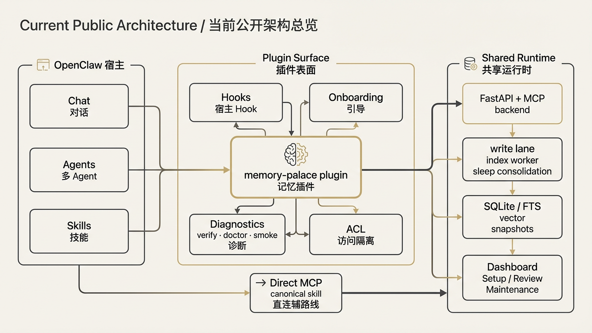
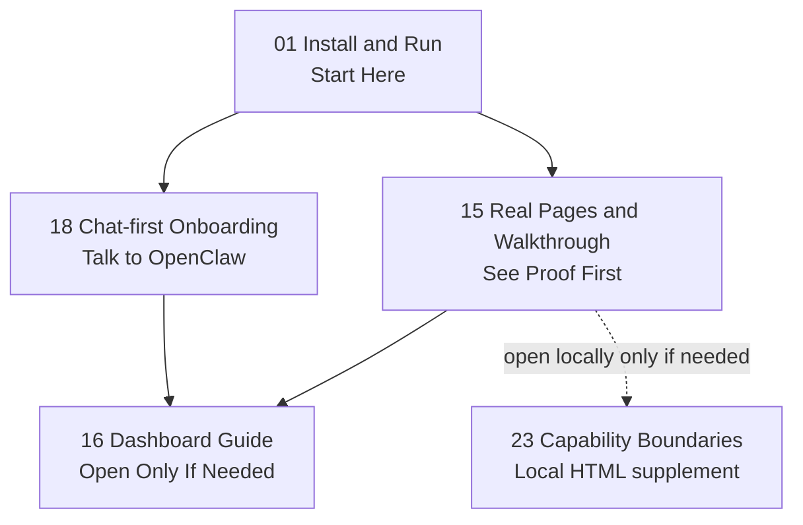
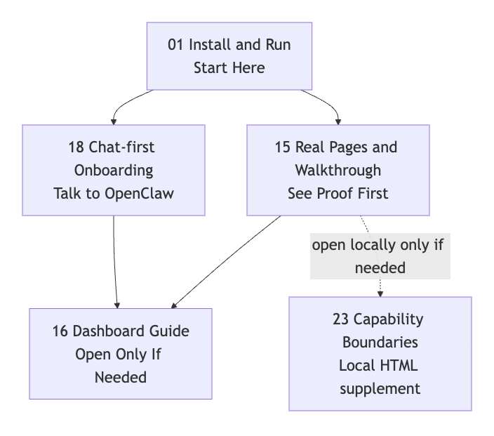

> [中文版](README.md)

# Memory Palace Documentation Hub

  

  

The most important thing first:

> The current public release should be read as an **OpenClaw memory plugin + bundled skills**.

> If this repo helps with your OpenClaw workflow, please give it a GitHub star ⭐.

That means:

- the main entry point is `docs/openclaw-doc/README.en.md`
- do not start by reading this repo as a standalone Memory Palace product
- `memory-palace` plugs into the memory slot OpenClaw is already using
- it does not replace the host's own `USER.md / MEMORY.md / memory/*.md`
- `README.md`, this page, and `openclaw-doc/README.en.md` now share the same public message

This is the current public reading order at a glance:

If your viewer does not render Mermaid, use this static image instead:

---

## Users: Default Path

- [openclaw-doc/README.en.md](openclaw-doc/README.en.md)
  - Main entry for OpenClaw users
- [openclaw-doc/01-INSTALL_AND_RUN.en.md](openclaw-doc/01-INSTALL_AND_RUN.en.md)
  - Safest install path and command boundaries
- [openclaw-doc/18-CONVERSATIONAL_ONBOARDING.en.md](openclaw-doc/18-CONVERSATIONAL_ONBOARDING.en.md)
  - Chat-first onboarding without opening the Dashboard
- [openclaw-doc/15-END_USER_INSTALL_AND_USAGE.en.md](openclaw-doc/15-END_USER_INSTALL_AND_USAGE.en.md)
  - Real pages, screenshots, and videos first
- [openclaw-doc/16-DASHBOARD_GUIDE.en.md](openclaw-doc/16-DASHBOARD_GUIDE.en.md)
  - Read this only when you actually plan to open the Dashboard

---

## Optional Next Reads

- [openclaw-doc/25-MEMORY_ARCHITECTURE_AND_PROFILES.en.md](openclaw-doc/25-MEMORY_ARCHITECTURE_AND_PROFILES.en.md)
  - Read this when you want one page that explains memory architecture, ACL, multi-agent isolation, and Profile A/B/C/D boundaries together
- [skills/SKILLS_QUICKSTART.en.md](skills/SKILLS_QUICKSTART.en.md)
  - Read this only if you want to skip the default OpenClaw path and wire the skill / service stack directly
- [EVALUATION.en.md](EVALUATION.en.md)
  - Current validation summary

---

## For Development and Self-Hosting

- [GETTING_STARTED.en.md](GETTING_STARTED.en.md)
  - Local backend / frontend / Docker setup
- [TECHNICAL_OVERVIEW.en.md](TECHNICAL_OVERVIEW.en.md)
  - Technical overview
- [TOOLS.en.md](TOOLS.en.md)
  - Low-level tool reference
- [DEPLOYMENT_PROFILES.en.md](DEPLOYMENT_PROFILES.en.md)
  - A / B / C / D profile guidance
- [openclaw-doc/25-MEMORY_ARCHITECTURE_AND_PROFILES.en.md](openclaw-doc/25-MEMORY_ARCHITECTURE_AND_PROFILES.en.md)
  - OpenClaw-facing technical explainer for architecture, runtime flow, ACL, and profile boundaries
- [SECURITY_AND_PRIVACY.en.md](SECURITY_AND_PRIVACY.en.md)
  - Pre-sharing security checklist
- [TROUBLESHOOTING.en.md](TROUBLESHOOTING.en.md)
  - General troubleshooting

---

## Supplementary / Historical Materials

The numbered documents `docs/openclaw-doc/00/06/07/12/17` are now supplementary material.

Maintainer execution handbooks such as development / review / E2E / release-gate guides are no longer part of the default user reading list. Only open them when you are doing maintenance or release work.

If this is your first time using the repository:

- you do not need those pages first
- the user-facing entry pages above are enough

In short:

- **default user entry set**: `01 / 15 / 18`
- **read only when you need the Dashboard**: `16`
- **open locally only when needed**: `23`
- **supplementary material**: `00 / 06 / 07 / 12 / 17`

---

## Current Organization Principles

This documentation pass follows a simple rule set:

- document the paths users actually take first
- keep repository wrapper commands separate from real `openclaw memory-palace` commands
- keep validation notes in `EVALUATION.en.md`
- keep real page assets in `openclaw-doc/15-END_USER_INSTALL_AND_USAGE.en.md`
- keep chat-first onboarding boundaries in `openclaw-doc/18-CONVERSATIONAL_ONBOARDING.en.md`

If you only want to check whether the public message is ready for end users,
start with these three pages:

- [openclaw-doc/01-INSTALL_AND_RUN.en.md](openclaw-doc/01-INSTALL_AND_RUN.en.md)
- [openclaw-doc/15-END_USER_INSTALL_AND_USAGE.en.md](openclaw-doc/15-END_USER_INSTALL_AND_USAGE.en.md)
- [openclaw-doc/18-CONVERSATIONAL_ONBOARDING.en.md](openclaw-doc/18-CONVERSATIONAL_ONBOARDING.en.md)
