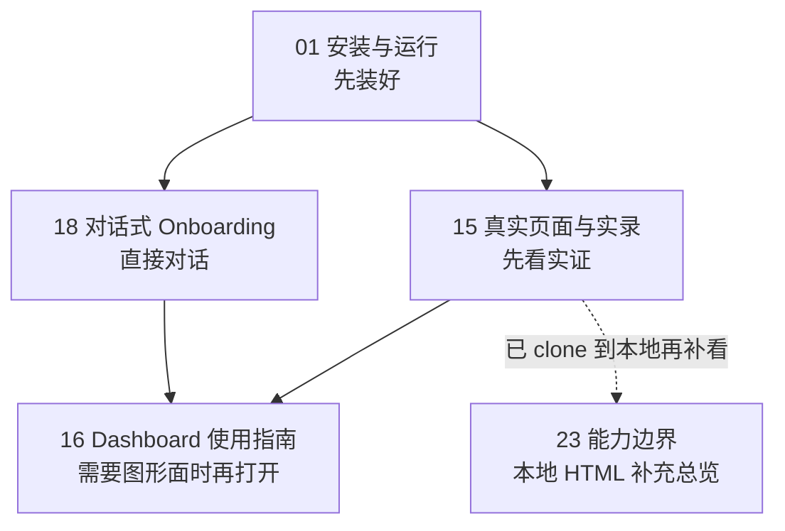
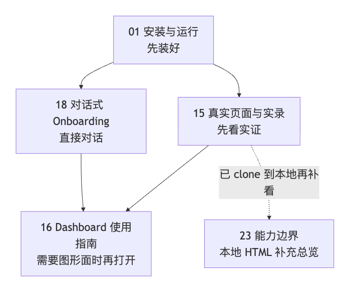

> [English](README.en.md)

# Memory Palace 文档中心

  

  

先说一句最重要的：

> 当前公开发布请先按 **OpenClaw memory plugin + bundled skills** 来理解。

> 如果这个项目对你的 OpenClaw 使用有帮助，欢迎顺手点个 Star ⭐。

也就是：

- 主入口是 `docs/openclaw-doc/README.md`
- 不要先把仓库当成独立的 Memory Palace 产品来读
- `memory-palace` 会接到 OpenClaw 当前在用的记忆入口上
- 但不会替代宿主自己的 `USER.md / MEMORY.md / memory/*.md`
- `README.md`、本页、`openclaw-doc/README.md` 现在是统一口径

先看一眼当前公开入口顺序：

如果当前查看器不渲染 Mermaid，可以直接看这张静态图：

---

## 用户默认先看这几页

- [openclaw-doc/README.md](openclaw-doc/README.md)
  - OpenClaw 用户主入口
- [openclaw-doc/01-INSTALL_AND_RUN.md](openclaw-doc/01-INSTALL_AND_RUN.md)
  - 最稳的安装路径和命令边界
- [openclaw-doc/18-CONVERSATIONAL_ONBOARDING.md](openclaw-doc/18-CONVERSATIONAL_ONBOARDING.md)
  - 不打开 Dashboard，直接通过对话完成 onboarding
- [openclaw-doc/15-END_USER_INSTALL_AND_USAGE.md](openclaw-doc/15-END_USER_INSTALL_AND_USAGE.md)
  - 先看真实页面、截图和视频
- [openclaw-doc/16-DASHBOARD_GUIDE.md](openclaw-doc/16-DASHBOARD_GUIDE.md)
  - 只有你确实准备打开 Dashboard 时再看

---

## 按需再看

- [openclaw-doc/25-MEMORY_ARCHITECTURE_AND_PROFILES.md](openclaw-doc/25-MEMORY_ARCHITECTURE_AND_PROFILES.md)
  - 想一次看懂记忆架构、ACL、多 Agent 隔离和 Profile A/B/C/D 边界时再看
- [skills/SKILLS_QUICKSTART.md](skills/SKILLS_QUICKSTART.md)
  - 只有你准备跳过默认接入流程，自己直连 skill 和底层服务时再看
- [EVALUATION.md](EVALUATION.md)
  - 当前记录在案的验证摘要

---

## 开发和自托管再看这些

- [GETTING_STARTED.md](GETTING_STARTED.md)
  - 本地 backend / frontend / Docker 起步
- [TECHNICAL_OVERVIEW.md](TECHNICAL_OVERVIEW.md)
  - 技术总览
- [TOOLS.md](TOOLS.md)
  - 底层工具参数参考
- [DEPLOYMENT_PROFILES.md](DEPLOYMENT_PROFILES.md)
  - A / B / C / D 档位说明
- [openclaw-doc/25-MEMORY_ARCHITECTURE_AND_PROFILES.md](openclaw-doc/25-MEMORY_ARCHITECTURE_AND_PROFILES.md)
  - OpenClaw 场景下的整体记忆技术说明：架构、主链、ACL、Profile 边界
- [SECURITY_AND_PRIVACY.md](SECURITY_AND_PRIVACY.md)
  - 分享前安全检查
- [TROUBLESHOOTING.md](TROUBLESHOOTING.md)
  - 通用排障

---

## 补充 / 历史资料

`docs/openclaw-doc/00/06/07/12/17` 这组编号资料，现在都按补充资料理解。

维护者执行手册（例如开发 / Review / E2E / release gate）不再放进默认用户阅读清单；只有在你明确做维护或发布时再看对应资料。

如果你只是第一次使用这个仓库：

- 不需要先读这些页
- 先看上面的用户入口就够了

更直接地说：

- **用户默认入口**：`01 / 15 / 18`
- **需要 Dashboard 时再看**：`16`
- **已 clone 到本地后按需补看**：`23`
- **补充资料**：`00 / 06 / 07 / 12 / 17`

---

## 当前整理原则

这轮文档统一按下面几条来写：

- 优先写用户真正会走的路径
- 仓库 wrapper 命令和真实 `openclaw memory-palace` 命令分开写
- 真实验证说明统一回到 `EVALUATION.md`
- 真实页面素材统一回到 `openclaw-doc/15-END_USER_INSTALL_AND_USAGE.md`
- 对话式 onboarding 的边界统一回到 `openclaw-doc/18-CONVERSATIONAL_ONBOARDING.md`

如果你只想先确认“这套公开口径能不能直接拿给用户看”，从这三页开始就够了：

- [openclaw-doc/01-INSTALL_AND_RUN.md](openclaw-doc/01-INSTALL_AND_RUN.md)
- [openclaw-doc/15-END_USER_INSTALL_AND_USAGE.md](openclaw-doc/15-END_USER_INSTALL_AND_USAGE.md)
- [openclaw-doc/18-CONVERSATIONAL_ONBOARDING.md](openclaw-doc/18-CONVERSATIONAL_ONBOARDING.md)
