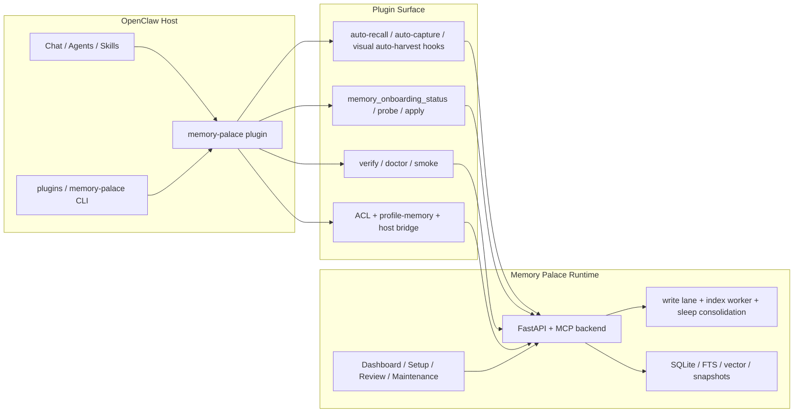

> [中文版](TECHNICAL_OVERVIEW.md)

# Memory Palace Technical Overview

  

This page is for technical users who want to understand the current
implementation or extend the project.

Keep the positioning clear first:

- the public product entry is still **OpenClaw plugin + bundled skills**
- this page explains the technical chain behind that public entry
- backend / dashboard / canonical skill bundle are support surfaces, not a
  second standalone product

---

## 1. Stack

| Layer | Technology | Purpose |
|---|---|---|
| Backend | FastAPI + SQLAlchemy + SQLite | durable memory, retrieval, review, maintenance |
| MCP | `mcp.server.fastmcp` | common tool surface for agent clients |
| Frontend | React + Vite + TailwindCSS + Framer Motion | dashboard and setup UI |
| Runtime | queue + workers | write serialization, index rebuild, vitality decay |
| Deployment | Docker Compose + profile scripts | A/B/C/D deployment paths |

See [backend/requirements.txt](../backend/requirements.txt) and
[frontend/package.json](../frontend/package.json) for the actual dependency
lists.

---

## 2. Current Runtime Shape

Read that diagram literally:

- **the OpenClaw plugin is the main product entry**
- bundled onboarding / diagnostics / ACL hang off the plugin surface
- backend / SQLite / workers / dashboard are one shared runtime
- direct MCP / canonical skill remains a secondary route

  

---

## 3. Backend Layout

The backend is split into a few stable areas:

- `backend/main.py`
  - FastAPI entry, lifecycle, router registration, health endpoint
- `backend/mcp_server.py`
  - MCP server assembly and stable tool surface
- `backend/runtime_state.py`
  - write lane, index worker, vitality cleanup, flush tracker
- `backend/api/`
  - HTTP routes for browse / review / maintenance
- `backend/db/`
  - SQLite facade, ORM models, migrations, retrieval helpers

Two runtime helpers matter in the current codebase:

- `backend/runtime_bootstrap.py`
  - shared startup bootstrap for FastAPI / stdio / SSE
- `backend/runtime_env.py`
  - shared env-file resolution logic

The installer and release helpers live under the repository-level `scripts/`
directory rather than `backend/`.

---

## 4. HTTP API Groups

In plain language:

- `/browse`
  - read and write durable memories
- `/review`
  - inspect diffs, roll back, confirm integration
- `/maintenance`
  - rebuild, cleanup, import, observability, operations

### `/browse`

| Method | Path | Purpose |
|---|---|---|
| `GET` | `/browse/node` | browse the memory tree |
| `POST` | `/browse/node` | create a memory |
| `PUT` | `/browse/node` | update a memory |
| `DELETE` | `/browse/node` | delete a memory path |

### `/review`

Use this when a write needs review:

- list sessions
- inspect snapshots
- open diffs
- roll back
- confirm integration

### `/maintenance`

Use this for operator work:

- orphan cleanup
- external import
- explicit learn
- vitality cleanup
- index rebuild and status

---

## 5. Frontend and Dashboard

The dashboard is a support surface, not the public product entry.

Main pages:

- `Setup`
- `Memory`
- `Review`
- `Maintenance`
- `Observability`

Important boundary:

- most normal OpenClaw users should finish the first install through
  `setup` and the chat-first onboarding path
- open the dashboard only when you actually need the graphical surface

---

## 6. Plugin Boundary

The plugin layer lives in `extensions/memory-palace/`.

It is responsible for:

- hooking into OpenClaw's memory slot
- exposing `memory_search / memory_get / memory_store_visual`
- exposing `memory_onboarding_status / probe / apply`
- wiring profile memory, host bridge, ACL, reflection, and visual helpers

Important user-facing boundary:

- `memory-palace` extends the host's memory behavior
- it does **not** delete or replace the host's own
  `USER.md / MEMORY.md / memory/*.md`

---

## 7. Where to Read Next

- installation and user path:
  - [openclaw-doc/01-INSTALL_AND_RUN.en.md](openclaw-doc/01-INSTALL_AND_RUN.en.md)
- profile choice:
  - [DEPLOYMENT_PROFILES.en.md](DEPLOYMENT_PROFILES.en.md)
- troubleshooting:
  - [TROUBLESHOOTING.en.md](TROUBLESHOOTING.en.md)
- tool reference:
  - [TOOLS.en.md](TOOLS.en.md)
- privacy and sharing checklist:
  - [SECURITY_AND_PRIVACY.en.md](SECURITY_AND_PRIVACY.en.md)
