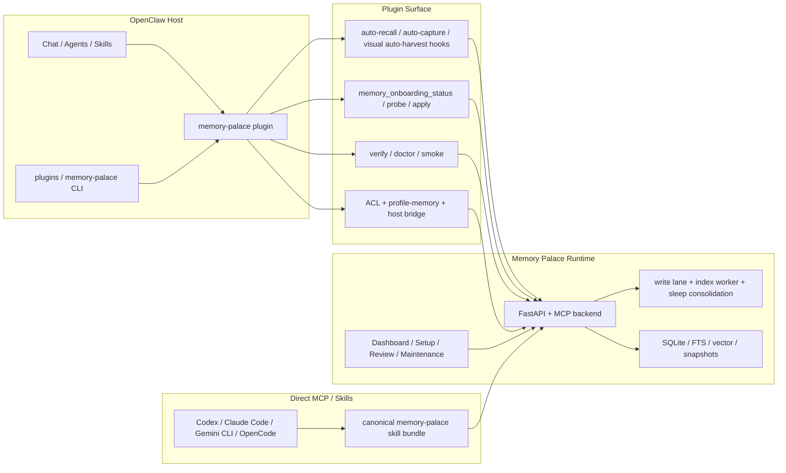
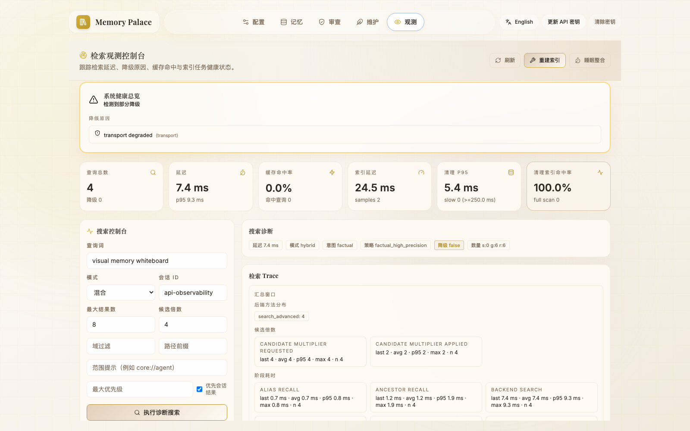

> [English](TECHNICAL_OVERVIEW.en.md)

# Memory Palace 技术总览

<p align="center">
  
</p>

本文档面向需要了解系统内部实现或进行二次开发的技术用户，涵盖后端、前端、MCP 工具层、运行时与部署架构。

先补一句定位，避免和公开入口混淆：

- 当前公开发布更应该按 **OpenClaw memory plugin + bundled skills** 来理解
- 本页讲的是这条主链背后的技术实现
- backend / dashboard / canonical skill bundle 是配套运行面，不是“替代宿主 memory 的另一套系统”

---

## 1. 技术栈

| 层 | 技术 | 版本要求 | 作用 |
|---|---|---|---|
| Backend | FastAPI + SQLAlchemy + SQLite | FastAPI ≥0.109 · SQLAlchemy ≥2.0 · aiosqlite ≥0.19 | 记忆读写、检索、审查、维护 |
| MCP | `mcp.server.fastmcp` | mcp ≥0.1 | 为 Claude Code / Codex / Gemini CLI / OpenCode 等暴露统一工具面 |
| Frontend | React + Vite + TailwindCSS + Framer Motion | React ≥18.2 · Vite ≥7.3 · TailwindCSS ≥3.3 · Framer Motion ≥12.34 | 可视化管理 Dashboard |
| Runtime | 内置队列与 worker | — | 写入串行化、索引重建、vitality 衰减、sleep consolidation |
| Deployment | Docker Compose + profile 脚本 | Docker ≥20 · Compose ≥2.0 | A/B/C/D 档位快速部署 |

核心依赖详见 `backend/requirements.txt` 和 `frontend/package.json`。

### 当前真实运行架构（Mermaid）



这个图对应当前真实设计，不是抽象宣传图：

- **OpenClaw plugin 是主入口**
- **bundled onboarding / diagnostics / ACL 能力都挂在 plugin 表面**
- **backend / SQLite / worker / dashboard 是同一套共享 runtime**
- **direct MCP / canonical skill 是辅路线，不是第二套独立产品**

<p align="center">
  
</p>

---

## 2. 后端结构

```
backend/
├── main.py               # FastAPI 入口，注册路由，生命周期管理
├── mcp_server.py          # 11 个 MCP 工具入口 + MCP 装配 / 兼容 wrapper
├── mcp_runtime_context.py # MCP request-context / session-id helper
├── mcp_client_compat.py   # sqlite_client 兼容调用 helper
├── mcp_server_config.py   # MCP server 的 domain/search/runtime 默认配置
├── mcp_force_create.py    # force-create / force-variant 判定 helper
├── mcp_transport.py       # SSE host/origin 保护 helper
├── mcp_uri.py             # URI 解析与可写 domain 校验
├── mcp_snapshot.py        # 写入前快照 helper
├── mcp_snapshot_wrappers.py # 绑定 runtime state 的 snapshot wrapper 实现
├── mcp_reading.py         # read_memory / partial-read helper
├── mcp_views.py           # system://boot / index / audit / recent 视图生成
├── mcp_runtime_services.py # import-learn / gist / auto-flush 服务 helper
├── mcp_tool_common.py     # 共享 MCP guard/response helper 实现
├── mcp_tool_read.py       # read_memory MCP 工具实现
├── mcp_tool_search.py     # search_memory MCP 工具实现
├── mcp_tool_write_runtime.py # write-lane / index enqueue runtime helper
├── mcp_tool_write.py      # create/update/delete/add_alias 写入工具实现
├── mcp_tool_runtime.py    # compact_context / rebuild_index / index_status MCP 工具实现
├── runtime_state.py       # 写入 lane、索引 worker、vitality 衰减、cleanup review 管理
├── run_sse.py             # SSE 传输层，支持 API Key 鉴权门控
├── mcp_wrapper.py         # MCP 启动封装
├── api/
│   ├── __init__.py        # 路由导出
│   ├── browse.py          # 记忆浏览与写入接口（prefix: /browse）
│   ├── review.py          # 审查、回滚与集成接口（prefix: /review）
│   ├── maintenance.py     # `/maintenance` 兼容 facade；继续挂载原有路由
│   ├── maintenance_common.py # maintenance 共用鉴权 / env / 时间 helper
│   ├── maintenance_models.py # maintenance 请求模型与 lazy client proxy
│   ├── maintenance_index.py  # index worker / rebuild / retry / sleep 路径
│   ├── maintenance_transport.py # transport snapshot / observability 聚合 helper
│   └── utils.py           # Diff 计算工具（优先 diff-match-patch，缺失时回退到 difflib.HtmlDiff）
├── db/
│   ├── __init__.py        # 客户端工厂（get_sqlite_client / close_sqlite_client）
│   ├── sqlite_client.py   # 对外稳定 facade（仍导出 SQLiteClient / 模型 / helper）
│   ├── sqlite_models.py   # ORM 模型定义
│   ├── sqlite_paths.py    # sqlite URL / 路径 / 时间 helper
│   ├── sqlite_client_retrieval.py # 检索打分 / context recall helper mixin
│   ├── snapshot.py        # 快照管理器（按 session 记录写操作的前置状态）
│   ├── migration_runner.py# 原子数据库迁移执行器（BEGIN IMMEDIATE 事务保护）
│   └── migrations/        # SQL 迁移脚本目录
├── models/
│   ├── __init__.py        # 模型导出
│   └── schemas.py         # Pydantic 数据模型定义
```

> 补充说明：部署、profile 应用、分享前自检等脚本位于仓库根目录的 `scripts/`，不在 `backend/` 子目录里。安装脚本已拆分为 `scripts/installer/` 模块包（`_constants.py`、`_utils.py`、`_provider.py`、`_onboarding.py`、`_core.py`），`scripts/openclaw_memory_palace_installer.py` 保持为向后兼容的 facade。安装脚本现在也接受旧版环境变量短名（如 `EMBEDDING_API_KEY`），自动映射到正式名（`RETRIEVAL_EMBEDDING_API_KEY`）并输出迁移提示。

### 核心模块说明

- **`main.py`**：FastAPI 应用入口，负责生命周期管理（数据库初始化、legacy 数据库文件兼容恢复）、CORS 配置、路由注册（`review`、`browse`、`maintenance`）和健康检查（含索引状态、write lane 与 index worker 运行时状态报告）。默认 CORS origin 收敛为本地常用列表（`localhost/127.0.0.1` 的 `5173/3000`）；显式配置 wildcard（`*`）时会自动禁用 credentials；legacy sqlite 恢复前会执行 regular-file + quick_check + 核心表存在校验。当前 `main.py` 的启动期不再自己散落执行这套初始化，而是通过共享的 `runtime_bootstrap.py` 统一完成，避免 FastAPI / stdio / SSE 三条入口各自漏掉一部分启动逻辑。
- **`mcp_server.py`**：保留 11 个 MCP 工具入口、运行时依赖注入和兼容 wrapper；`search/write` 工具实现、domain/search/runtime 默认配置、force-create 判定、snapshot wrapper、request-context/session-id、以及 URI / transport / read / system-view 这些 helper 现在已经拆到独立模块里。系统 URI（`system://boot`、`system://index`、`system://index-lite`、`system://audit`、`system://recent`）当前通过 `mcp_views.py` 生成。stdio 启动当前也走共享的 `runtime_bootstrap.py`；另外，只有当 `OPENCLAW_MEMORY_PALACE_ENV_FILE` 真正指向一份存在的文件时，repo 根目录 `.env` fallback 才会关闭，不会再把一个失效路径误当成 authoritative runtime env。
- `ensure_visual_namespace_chain` 这类工具当前主要是给上层插件内部调用的 helper，不是普通用户的日常入口。
- **`runtime_bootstrap.py`**：共享启动 bootstrap，负责把 legacy sqlite 恢复、`init_db()` 和 `runtime_state.ensure_started(...)` 收口到同一条初始化顺序里；`main.py`、stdio MCP 启动和 SSE 启动当前都走这条路径。
- **`runtime_env.py`**：共享 runtime env 判定 helper，负责区分“`OPENCLAW_MEMORY_PALACE_ENV_FILE` 只是带了一个字符串”与“这条路径真的存在一份 env 文件”，从而决定 repo 根 `.env` fallback 该不该关闭。
- **`runtime_state.py`**：管理写入 lane（串行化写操作）、索引 worker（异步队列处理索引重建任务）、vitality 衰减调度、cleanup review 审批流程和 sleep consolidation 调度等运行时状态。
- **`api/maintenance.py`**：现在是 `/maintenance` 的兼容 facade。共享鉴权和基础 helper 放在 `maintenance_common.py`，请求模型放在 `maintenance_models.py`，index worker 路径放在 `maintenance_index.py`，transport / observability 聚合 helper 放在 `maintenance_transport.py`。对外路由路径和导入名保持不变。
- **`db/sqlite_client.py`**：现在保留为 SQLite 的稳定 facade，继续承载 `SQLiteClient` 与原有导出口径；ORM、SQLite 路径 helper、检索打分 helper 已拆到独立模块。对外行为不变，但内部职责更清楚。初始化阶段仍会基于数据库文件路径创建 `.init.lock`，把 `init_db()` 串行化到进程级，减少并发启动时的 SQLite 竞态。未显式传 `title` 的 `create_memory` 当前也会先通过 DB-backed `auto_path_counters` 预留下一段数字路径；检索 chunking 也已经从“纯固定字符窗口”收口到更贴近段落 / 句末 / 标题 / 代码块边界的切法。

---

## 3. HTTP API 入口

先说人话：

- `/browse`：平时最常用，负责**看记忆、写记忆**
- `/review`：出了改动要复核时用，负责**看 diff、回滚、确认集成**
- `/maintenance`：系统运维入口，负责**清理、重建索引、看运行状态**

如果你只是接一个普通客户端，通常先看 `/browse` 和 `/review` 就够了。

### 浏览与写入（`/browse`）

| 方法 | 路径 | 鉴权 | 说明 |
|---|---|---|---|
| `GET` | `/browse/node` | API Key | 浏览记忆树（含子节点、面包屑、gist、别名） |
| `POST` | `/browse/node` | API Key | 创建记忆节点（含 write_guard） |
| `PUT` | `/browse/node` | API Key | 更新记忆节点（含 write_guard） |
| `DELETE` | `/browse/node` | API Key | 删除记忆路径 |

这是最像“主业务接口”的一组：

- 记忆树浏览
- 新建 / 更新 / 删除记忆
- 返回结果里会带上当前节点、子节点、面包屑、gist 等前端直接要用的数据

### 审查与回滚（`/review`）

路由级 API Key 鉴权（所有端点均需要鉴权）。

| 方法 | 路径 | 说明 |
|---|---|---|
| `GET` | `/review/sessions` | 列出审查会话 |
| `GET` | `/review/sessions/{session_id}/snapshots` | 查看会话快照列表 |
| `GET` | `/review/sessions/{session_id}/snapshots/{resource_id}` | 查看快照详情 |
| `GET` | `/review/sessions/{session_id}/diff/{resource_id}` | 查看版本 diff |
| `POST` | `/review/sessions/{session_id}/rollback/{resource_id}` | 执行回滚 |
| `DELETE` | `/review/sessions/{session_id}/snapshots/{resource_id}` | 确认集成（删除快照） |
| `DELETE` | `/review/sessions/{session_id}` | 清除整个 session 的快照 |
| `GET` | `/review/deprecated` | 列出所有 deprecated 记忆 |
| `DELETE` | `/review/memories/{memory_id}` | 永久删除已审查的记忆 |
| `POST` | `/review/diff` | 通用文本 diff 计算 |

这组接口更像“变更复核区”：

- 先看 session
- 再看 snapshot / diff
- 最后决定是 rollback 还是 integrate

### 维护与观测（`/maintenance`）

路由级 API Key 鉴权（所有端点均需要鉴权）。

| 方法 | 路径 | 说明 |
|---|---|---|
| `GET` | `/maintenance/orphans` | 查看孤儿记忆（deprecated 或无路径指向） |
| `GET` | `/maintenance/orphans/{memory_id}` | 查看孤儿记忆详情 |
| `DELETE` | `/maintenance/orphans/{memory_id}` | 永久删除孤儿记忆 |
| `POST` | `/maintenance/import/prepare` | 准备外部导入任务（生成可执行计划） |
| `POST` | `/maintenance/import/execute` | 执行外部导入任务 |
| `GET` | `/maintenance/import/jobs/{job_id}` | 查看导入任务状态 |
| `POST` | `/maintenance/import/jobs/{job_id}/rollback` | 回滚导入任务 |
| `POST` | `/maintenance/learn/trigger` | 触发显式学习任务 |
| `GET` | `/maintenance/learn/jobs/{job_id}` | 查看显式学习任务状态 |
| `POST` | `/maintenance/learn/jobs/{job_id}/rollback` | 回滚显式学习任务 |
| `POST` | `/maintenance/vitality/decay` | 触发 vitality 衰减 |
| `POST` | `/maintenance/vitality/candidates/query` | 查询清理候选记忆（支持 `domain` / `path_prefix` 过滤） |
| `POST` | `/maintenance/vitality/cleanup/prepare` | 准备清理审批（生成 review_id + token） |
| `POST` | `/maintenance/vitality/cleanup/confirm` | 确认并执行清理（需 review_id + token + 确认短语） |
| `GET` | `/maintenance/index/worker` | 查看索引 worker 状态 |
| `GET` | `/maintenance/index/job/{job_id}` | 查看索引任务详情 |
| `POST` | `/maintenance/index/job/{job_id}/cancel` | 取消索引任务 |
| `POST` | `/maintenance/index/job/{job_id}/retry` | 重试索引任务 |
| `POST` | `/maintenance/index/rebuild` | 触发全量索引重建 |
| `POST` | `/maintenance/index/reindex/{memory_id}` | 单条索引重建 |
| `POST` | `/maintenance/index/sleep-consolidation` | 触发 sleep consolidation |
| `POST` | `/maintenance/gist-audit/run` | 触发 gist 质量回评后台任务，立即返回 `job_id` |
| `GET` | `/maintenance/gist-audit/job/{job_id}` | 查看 gist 质量回评任务状态与结果 |
| `POST` | `/maintenance/observability/search` | 观测搜索（含检索统计） |
| `GET` | `/maintenance/observability/summary` | 观测概览（含 `gist_audit` 质量统计） |

这组接口比较多，但可以简单分成 5 类：

1. **导入 / 学习任务**：`import/*`、`learn/*`
2. **孤儿记忆清理**：`orphans*`
3. **活力治理**：`vitality/*`
4. **索引任务**：`index/*`
5. **运行态观测 / gist 回评**：`observability/*`、`gist-audit/*`

完整 API 文档可启动后端后访问 `http://127.0.0.1:8000/docs`（Swagger UI）。

### 首启配置与本地重启（`/bootstrap`）

这组接口只服务一个目标：**把首启配置和本地受控重启做成可视化流程**。

| 方法 | 路径 | 说明 |
|---|---|---|
| `GET` | `/bootstrap/status` | 读取当前 bootstrap 状态、档位、transport、是否需要重启 |
| `POST` | `/bootstrap/apply` | 写入 bootstrap 配置，返回生效档位、警告、下一步提示 |
| `POST` | `/bootstrap/restart` | 仅在 loopback 本地场景下执行受控重启 |

这里要特别注意一个边界：

- `/bootstrap/*` 不是普通 `/browse` / `/review` / `/maintenance` 的同一路浏览器鉴权注入
- 顶部 `Set API key` 只会给 Dashboard 数据接口补头，不会自动放行 `/bootstrap/*`
- 所以 `/setup` 页更适合“第一次本地配置”或“你已经有运行时注入 / 服务端代理”的场景

---

## 4. MCP 工具实现

实现文件：`backend/mcp_server.py`

| 工具 | 类型 | 说明 |
|---|---|---|
| `read_memory` | 读取 | 读取记忆内容，支持整段与分片（chunk_id / range / max_chars）；分片会尽量优先贴着段落、句末和代码块边界，支持系统 URI（`system://boot`、`system://index`、`system://index-lite`、`system://audit`、`system://recent`） |
| `create_memory` | 写入 | 创建新记忆节点（含 write_guard，进入 write lane 串行化；未命名 create 会按父路径自动分配数字 ID） |
| `update_memory` | 写入 | 更新已有记忆（old_string/new_string 精准替换 或 append 追加，含 write_guard） |
| `delete_memory` | 写入 | 删除记忆路径（进入 write lane 串行化） |
| `add_alias` | 写入 | 为同一记忆添加别名路径（可跨 domain） |
| `search_memory` | 检索 | 统一检索入口（keyword/semantic/hybrid），支持意图分类与策略模板 |
| `compact_context` | 治理 | 将当前会话上下文压缩为长期记忆摘要（进入 write lane 串行化） |
| `rebuild_index` | 维护 | 全量或单条索引重建，支持同步等待与 sleep consolidation |
| `index_status` | 维护 | 查询索引可用性、运行时状态与配置开关 |
| `ensure_visual_namespace_chain` | 维护 | 批量补齐 visual 记忆父级 namespace，减少逐段创建往返 |

工具返回约定与降级语义详见：[TOOLS.md](TOOLS.md)

---

## 5. 前端结构

```
frontend/src/
├── App.jsx                                    # 路由与页面骨架
├── main.jsx                                   # React 入口
├── i18n.js                                    # react-i18next 初始化、默认语言与 locale 持久化
├── index.css                                  # 全局样式（TailwindCSS）
├── locales/
│   ├── en.js                                  # 英文文案
│   └── zh-CN.js                               # 中文文案
├── features/
│   ├── setup/SetupPage.jsx                    # 首启 bootstrap 配置、本地受控重启
│   ├── setup/setupI18n.js                     # bootstrap 动态文案归一化
│   ├── memory/MemoryBrowser.jsx               # 树形浏览、编辑、gist 视图
│   ├── review/ReviewPage.jsx                  # diff、rollback、integrate
│   ├── maintenance/MaintenancePage.jsx        # vitality 清理与维护任务
│   ├── observability/ObservabilityPage.jsx    # 检索统计与任务可观测主页面
│   ├── observability/hooks/useObservabilitySearch.js
│   │                                         # 诊断搜索表单状态与 payload 组装
│   ├── observability/hooks/useObservabilityJobs.js
│   │                                         # index job / retry / cancel / detail inspector 状态
│   ├── observability/lib/transportDiagnostics.js
│   │                                         # transport diagnostics 归一化与 fallback 聚合
│   └── observability/observabilityI18n.js     # 诊断 / transport 文案归一化
├── components/
│   ├── DiffViewer.jsx                         # Diff 可视化
│   ├── FluidBackground.jsx                    # 流体动画背景
│   ├── GlassCard.jsx                          # 毛玻璃卡片
│   └── SnapshotList.jsx                       # 快照列表
├── lib/
│   ├── api.js                                 # 统一 API 客户端与运行时鉴权注入
│   ├── format.js                              # 跟随当前语言的日期/数字格式化
│   ├── api.test.js                            # API 客户端单元测试
│   └── api.contract.test.js                   # API 鉴权契约测试
├── e2e/
│   ├── dashboard-auth-i18n.spec.ts            # Playwright 真实浏览器 E2E
│   ├── dashboard-five-pages.spec.ts           # 五页主链烟测
│   └── setup-profile-cd.spec.ts               # setup 中 Profile C/D browser flow
└── test/                                      # 前端测试目录
```

### Dashboard 五个功能模块

| 模块 | 路由 | 功能 |
|---|---|---|
| Setup | `/setup` | 首启 bootstrap 配置、档位选择、传输方式选择、本地受控重启 |
| Memory Browser | `/memory` | 按域（domain）树形浏览、内联编辑、查看 gist 摘要、别名管理 |
| Review | `/review` | 查看写入快照 diff、支持 rollback 回滚和 integrate 确认、清理 deprecated 记忆 |
| Maintenance | `/maintenance` | 查看 vitality 评分、清理孤儿记忆、触发索引重建、管理清理审批流程，支持 `domain` / `path_prefix` 过滤 |
| Observability | `/observability` | 检索日志与统计、任务执行记录、索引 worker 状态、系统状态概览，以及 `gist_audit` 质量统计，支持 `scope_hint` 与更细的运行时快照 |

补充说明：

- 当前版本的应用壳层右上角有统一的鉴权入口：`Set API key` / `Update API key` / `Clear key`
- 如果是手工输入的 Dashboard API key，它仅保存在当前页面的内存中（memory-only），关闭标签页或刷新后需重新输入，或由部署脚本通过 `window.__MEMORY_PALACE_RUNTIME__` 注入
- 当前前端默认英文，右上角支持中英切换，所选语言会保存到浏览器 `localStorage`
- 如果还没配置鉴权，页面外壳仍会打开，但受保护的数据请求会先显示授权提示、空态或 `401`
- 如果当前还没有 bootstrap 配置，页面可能会先进入 `/setup`；本地 API 场景下可直接点 `Restart Backend` 载入新配置
- Docker 一键部署默认不需要手动点 `Set API key`：前端代理会在服务端自动转发同一把 `MCP_API_KEY`
- 前端现在同时有两层验证：`npm test` 跑单测，`npm run test:e2e` 跑真实浏览器链路
- `ObservabilityPage` 这一层现在已经把高耦合状态逻辑拆到 hooks，把 transport diagnostics 的纯聚合逻辑拆到独立 helper；页面本身主要保留派生值与渲染编排

---

## 6. 前端鉴权注入模型

前端不会从 `VITE_*` 构建变量读取维护密钥，采用运行时注入方式：

```html
<script>
  window.__MEMORY_PALACE_RUNTIME__ = {
    maintenanceApiKey: "<YOUR_MCP_API_KEY>",
    maintenanceApiKeyMode: "header"
  };
</script>
```

`maintenanceApiKeyMode` 支持：`header`（发送 `X-MCP-API-Key` 头）或 `bearer`（发送 `Authorization: Bearer` 头）。

> 兼容性：运行时对象也兼容旧字段名 `window.__MCP_RUNTIME_CONFIG__`。
>
> 代码参考：`frontend/src/lib/api.js` 第 14 行。
>
> 说人话就是：前端把鉴权做成了“运行时再决定”。你既可以在页面顶部临时补 key，也可以由部署脚本在页面加载前注入；如果是页面里手工补的 key，它仅保存在当前页面的内存中（memory-only），关闭标签页或刷新后需重新输入，或由部署脚本通过 `window.__MEMORY_PALACE_RUNTIME__` 注入。
>
> Docker 一键部署走的是第三种方式：不把 key 注入页面，而是在前端代理层自动转发。
>
> 再补一句避免误会：这套浏览器侧注入只覆盖 `/browse/*`、`/review/*`、`/maintenance/*`，**不覆盖 `/bootstrap/*`**。

---

## 7. 数据与任务流

### 写入路径

1. `create_memory` / `update_memory` 进入 **write lane**（串行化写操作）。
   - 未命名 `create_memory` 会先按父路径保留下一段数字 ID；显式数字标题也会推动后续自动编号起点。
   - `update_memory` 更新内容时必须传入 `expected_old_id`（调用方读到的 memory id），DB 层会校验当前 id 是否一致；如果另一个进程已经更新了该路径（id 已变），抛出冲突错误而不是静默覆盖。这保证了多进程共享同一 SQLite 时不会出现 stale-read 覆盖。
2. 写前执行 **write_guard** 判定（核心决策：`ADD` / `UPDATE` / `NOOP` / `DELETE`；`BYPASS` 为上层 metadata-only 更新时的流程标记）。
   - write_guard 支持三级判定链：语义匹配 → 关键词匹配 → LLM 决策（可选）。
   - LLM 决策开启后，prompt 会显式要求模型判断新内容是否与已有记忆矛盾（偏好反转、模式回滚、功能禁用等），并在返回的 JSON 中包含 `contradiction` 布尔字段。
3. 生成 **snapshot** 与版本变更（按 `path` 和 `memory` 两维度分别记录）。
4. 入队 **索引任务**（队列满会返回 `index_dropped` / `queue_full`）。

### 并发安全与锁重试

- **write lane 全局串行**：默认 `RUNTIME_WRITE_GLOBAL_CONCURRENCY=1`，单进程内所有写操作全局串行，不会竞态。
- **跨进程 CAS 保护**：多进程共享同一 SQLite 文件时，`update_memory` 的 `expected_old_id` 校验防止 stale-read 覆盖。
- **SQLite 锁重试**：遇到 `database is locked` 时自动指数退避重试（默认 3 次）。write lane status 中新增 `lock_retries_total` 和 `lock_retries_exhausted` 计数器，方便观测多进程竞争压力。
- **迁移原子化**：`migration_runner.py` 使用 `isolation_level=None` + 显式 `BEGIN IMMEDIATE`，DDL 和 version INSERT 在同一事务内执行，失败时整体回滚，不会留下半应用状态。

### 检索路径

1. **`preprocess_query`** 对查询文本进行预处理（标准化空白、分词、多语言/URI 保留）。
2. **`classify_intent`** 默认按 4 种核心意图路由；无显著关键词信号时默认 `factual`（模板 `factual_high_precision`），当信号冲突或低信号混合时回退 `unknown`（模板 `default`）：
   - `factual` → 策略模板 `factual_high_precision`（高精度匹配）
   - `exploratory` → 策略模板 `exploratory_high_recall`（高召回探索）
   - `temporal` → 策略模板 `temporal_time_filtered`（时间过滤）
   - `causal` → 策略模板 `causal_wide_pool`（因果推理，宽候选池）
   - `unknown` → 策略模板 `default`（冲突或低信号混合时保守回退）
3. 执行 **keyword / semantic / hybrid** 检索。
4. 可选 **reranker** 重排序（通过远程 API 调用）。
5. 支持额外的查询侧约束，例如 `scope_hint`、`domain`、`path_prefix`、`max_priority`。
6. 返回 `results` 与 `degrade_reasons`。

> 意图分类使用 `keyword_scoring_v2` 方法实现（`db/sqlite_client.py` `classify_intent` 方法），通过关键词匹配评分与排名进行意图推断，无需外部模型调用。
>
> **配置策略说明**：
> - 本项目支持两种思路：`1)` 分别直配 embedding / reranker / llm；`2)` 通过 `router` 统一代理这些能力。
> - `INTENT_LLM_ENABLED` 默认关闭；开启后会优先尝试 LLM 意图分类，失败则回退到现有关键词规则。
> - `RETRIEVAL_RERANK_TOP_N` 在 **backend / benchmark** 口径下默认 `48`；这是当前质量优先默认值。
> - OpenClaw 插件走 `scripts/run_memory_palace_mcp_stdio.sh` 时，若未显式覆盖，当前 wrapper 默认会把 `RETRIEVAL_RERANK_TOP_N` 设为 `12`，作为产品侧低延迟默认。
> - 显式设为 `12` 仍然应理解成低延迟选项，而不是“无代价优化”；在检索 benchmark 上它可能带来真实的 `NDCG@10 / Recall@10` 损失。
> - `RETRIEVAL_FACTUAL_CANDIDATE_MULTIPLIER_CAP` 默认 `2`；它只影响 `factual_high_precision` 这类意图模板。设为 `0` 表示禁用 factual 缩池，主要用于 benchmark / 诊断对照，不建议直接改成新的默认值。
> - `RETRIEVAL_MMR_ENABLED` 默认关闭；只有 `hybrid` 检索下才会做去重 / 多样性重排。
> - `RETRIEVAL_SQLITE_VEC_ENABLED` 默认关闭；当前仍保留 legacy 向量路径为默认实现，sqlite-vec 走受控 rollout。
> - 本地开发默认更推荐前者，因为三条链路的故障通常彼此独立，分别配置更容易确认是哪一个模型、哪个端点或哪组密钥出了问题。
> - `router` 更适合作为生产 / 客户环境的统一入口：便于集中做鉴权、限流、审计、模型切换与 fallback 编排。

<p align="center">
  
</p>

<p align="center">
  
</p>

---

## 8. 部署口径

| 场景 | 宿主机端口 | 容器内部端口 | 说明 |
|---|---|---|---|
| 本地开发 | Backend `8000` · Frontend `5173` | — | 直接启动 |
| Docker 默认 | Backend `18000` · Frontend `3000` · SSE `3000/sse` | Backend `8000` · Frontend `8080`（SSE 由 backend 内嵌挂载） | 端口可通过环境变量覆盖 |

Docker 端口环境变量：

- Backend：`MEMORY_PALACE_BACKEND_PORT`（回退到 `NOCTURNE_BACKEND_PORT`，默认 `18000`）
- Frontend：`MEMORY_PALACE_FRONTEND_PORT`（回退到 `NOCTURNE_FRONTEND_PORT`，默认 `3000`）

相关文件：

- Compose 文件：`docker-compose.yml`
- 镜像定义：`deploy/docker/Dockerfile.backend`（基于 `python:3.12-slim`）、`deploy/docker/Dockerfile.frontend`（构建阶段 `node:22-alpine`，运行阶段 `nginxinc/nginx-unprivileged:1.27-alpine`）
- Nginx 配置模板：`deploy/docker/nginx.conf.template`
- 入口脚本：`deploy/docker/backend-entrypoint.sh`、`deploy/docker/frontend-entrypoint.sh`
- 备份脚本：`scripts/backup_memory.sh`、`scripts/backup_memory.ps1`
- 分享前检查：`scripts/pre_publish_check.sh`

当前 Docker 口径再补一句人话：

- `backend` 与 `frontend` 都带健康检查。
- `frontend` 现在只等待健康的 `backend`，因为 `/sse`、`/messages` 已经由同一个 backend 进程内嵌提供。
- Nginx 在 `/sse`、`/messages`、`/sse/messages` 代理块里显式写了 `Connection ""`，避免 SSE 长连接被代理层提早掐断。

---

## 9. 安全默认值

- `/maintenance/*`、`/review/*` 所有端点均需 API Key 鉴权。
- `/browse` 读写操作（GET/POST/PUT/DELETE）均通过端点级 `Depends(require_maintenance_api_key)` 门控。
- 公开 HTTP 端点包括 `/`、`/health`，以及 FastAPI 默认文档端点；其余 Browse / Review / Maintenance 与 SSE 通道遵循同一鉴权逻辑。
- `MCP_API_KEY` 为空时默认 **fail-closed**（拒绝请求）。
- 仅在 `MCP_API_KEY_ALLOW_INSECURE_LOCAL=true` **且** loopback 请求（`127.0.0.1` / `::1` / `localhost`）时可本地放行，且仅限直连 loopback 且无 forwarding headers 的请求。
- MCP 的 SSE/HTTP transport 会跟随实际 `HOST` 绑定地址初始化：loopback 绑定继续保留 `Host` / `Origin` 保护；非 loopback 绑定则按远程访问场景工作，并交给 API Key 与网络侧防护共同兜底。
- 非法 `Host` / `Origin` 被拒时，`421` / `403` 属于预期拒绝路径；当前实现不会再额外打印一整段 Python traceback。
- Docker 容器默认以非 root 用户运行：
  - Backend：自定义用户 `app`（UID `10001`，GID `10001`）
  - Frontend：使用 `nginx-unprivileged` 官方非 root 镜像

详细策略：[SECURITY_AND_PRIVACY.md](SECURITY_AND_PRIVACY.md)
