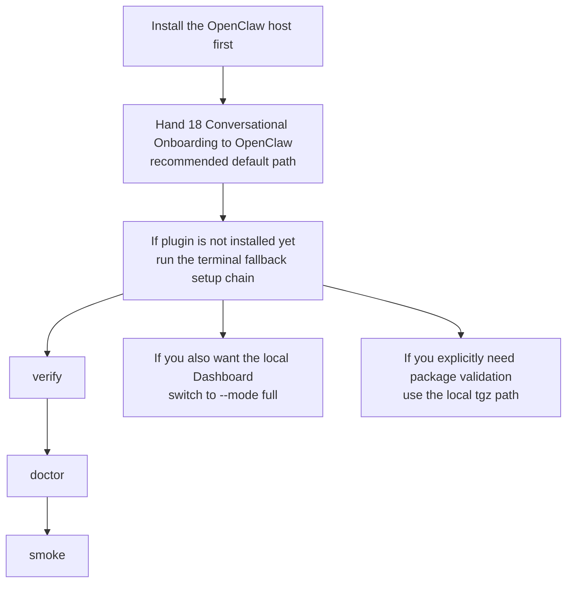
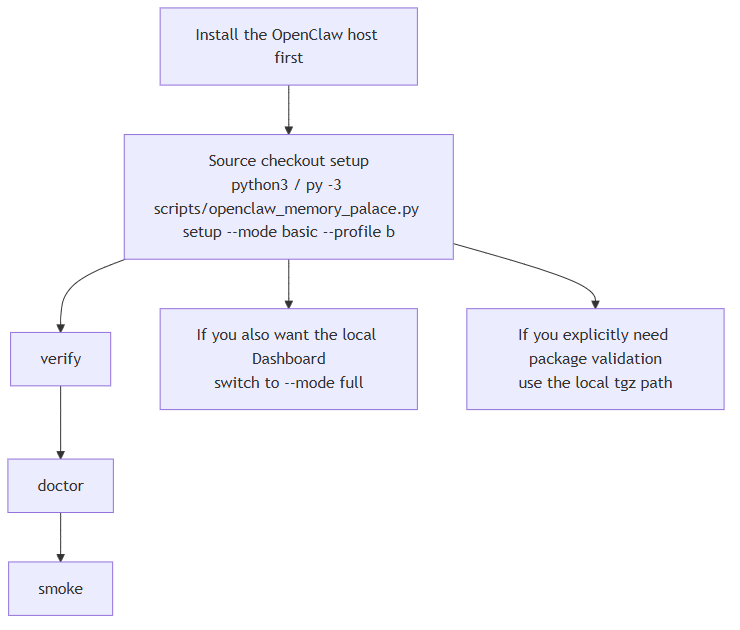

> [中文版](01-INSTALL_AND_RUN.md)

# 01 - Installation and Running

<p align="center">
  
</p>

This page covers one thing:

> **How to actually get `memory-palace` running as an OpenClaw memory plugin.**

If you just want to see real pages and assets first, go to:

- [15-END_USER_INSTALL_AND_USAGE.en.md](15-END_USER_INSTALL_AND_USAGE.en.md)

If you do not have a graphical dashboard and want to complete configuration through chat-driven guidance, go to:

- [18-CONVERSATIONAL_ONBOARDING.en.md](18-CONVERSATIONAL_ONBOARDING.en.md)

If you just want the latest recorded validation notes and rerun commands, go to:

- [../EVALUATION.en.md](../EVALUATION.en.md)

This page assumes OpenClaw itself is already installed on the current machine.
If the host CLI is not installed yet, this repository does **not** duplicate
the host-install steps. Install OpenClaw first with the official host
installation guide, then come back to this page:

- `https://docs.openclaw.ai/install`

This is the safest execution order for this page at a glance:



If your viewer does not render Mermaid, use this static image instead:



---

## 1. Understand the Boundaries First

- `memory-palace` takes over OpenClaw's active memory slot
- The default `setup/install` backs up and updates your local OpenClaw configuration file to register and activate the plugin for the `memory` slot — this does not modify OpenClaw's source code
- This does not delete the host's own `USER.md / MEMORY.md / memory/*.md`
- The stable command surface is `openclaw memory-palace ...`
- Automatic recall / auto-capture / visual auto-harvest depend on a host that supports hooks
- The minimum supported host version for this automatic chain is `OpenClaw >= 2026.3.2`
- On newer hosts, the installer may also enable compatibility shims such as
  `memory-core`, while `plugins.slots.memory` still points at `memory-palace`

---

## 2. Recommended Starting Path

### Recommended Default: Conversational Onboarding First

Start with:

- [18-CONVERSATIONAL_ONBOARDING.en.md](18-CONVERSATIONAL_ONBOARDING.en.md)

That is now the recommended install path for normal users.

The intended order is:

1. Hand the onboarding page to OpenClaw in CLI or WebUI.
2. Let OpenClaw decide whether the plugin is already installed.
3. If it is not installed yet, follow the shortest install chain it gives you.
4. After apply or setup, finish with `verify / doctor / smoke`.

### Terminal Fallback: `setup --mode basic --profile b`

```bash
python3 scripts/openclaw_memory_palace.py setup --mode basic --profile b --transport stdio --json
openclaw memory-palace verify --json
openclaw memory-palace doctor --json
openclaw memory-palace smoke --json
```

If you are running on Windows PowerShell, run:

```powershell
py -3 scripts/openclaw_memory_palace.py setup --mode basic --profile b --transport stdio --json
openclaw memory-palace verify --json
openclaw memory-palace doctor --json
openclaw memory-palace smoke --json
```

If you only want to confirm that the plugin is already loaded into the current host, prefer `openclaw plugins inspect memory-palace --json`. Some hosts also accept `openclaw plugins info memory-palace`, but `inspect` is the explicit command surface. Do not use `openclaw skills list` as the install gate for the bundled onboarding skill.

The same Windows PowerShell rule applies to the later repo-wrapper examples on this page too, including `--no-activate`, `setup --mode full`, and readiness-only `onboarding` examples.

If you want to manage the slot binding yourself, the wrapper also supports:

```bash
python3 scripts/openclaw_memory_palace.py setup --mode basic --profile b --transport stdio --no-activate --json
```

This path still prepares the runtime and plugin configuration, but does not automatically switch `plugins.slots.memory` to `memory-palace`. This is an advanced usage and is not the default recommended path.

Two fresh local defaults from the current code are also worth remembering:

- fresh local setup now binds the backend API and standalone SSE sidecar to `127.0.0.1`
- if you need remote or shared access, set the host / SSE target explicitly and provide the API key on purpose

### If You Also Want to Bring Up the Dashboard

```bash
python3 scripts/openclaw_memory_palace.py setup --mode full --profile b --transport stdio --json
```

### Currently Downgraded Install Shapes

Start by clarifying the boundary of the two public-looking plugin-install commands:

- `openclaw plugins install @openclaw/memory-palace`
- `openclaw plugins install memory-palace`

The real result today is:

- the npm spec currently returns `Package not found on npm`
- the plain `memory-palace` install currently resolves to a skill rather than a plugin
- neither of those should be treated as the recommended install path right now
- if you are already inside a source checkout, keep the `setup` chain above as
  the terminal fallback after the conversational onboarding path
- the packaged-install route currently documented for users is the **local tgz**
  path below

### If You Want to Install via Package

```bash
cd extensions/memory-palace
npm pack
openclaw plugins install ./<generated-tgz>
npm exec --yes --package ./<generated-tgz> memory-palace-openclaw -- setup --mode basic --profile b --transport stdio --json
openclaw memory-palace verify --json
openclaw memory-palace doctor --json
openclaw memory-palace smoke --json
```

Install the local `tgz` according to the current trust / package-install behavior of your OpenClaw build. Start with `openclaw plugins install ./<generated-tgz>`. If your current host build rejects that first command and asks for an extra trust flag for local tarballs, rerun it with the exact flag the host prints out. Some local-tarball builds currently ask for `--dangerously-force-unsafe-install`; do not turn any one host-specific trust flag combination into a permanent universal command in the public docs.

If you already have a trusted packaged `tgz`, replace `./<generated-tgz>` in
the commands above with that tarball path and skip `npm pack`.

This source-repo `npm pack` path requires **Bun** and a supported
**Python `3.10-3.14`**, because `extensions/memory-palace/package.json` runs
`bun build`, `bun test`, and the Python packaging wrapper during `prepack`.

The more stable user-facing reading is still:

- use this path when you explicitly want to validate a **locally built plugin package**
- if your goal is simply to get the feature running first, prefer the
  **conversational onboarding path**, then fall back to the
  **source-repo `setup --mode basic/full` path** only when OpenClaw tells you
  the plugin is not installed yet
- exact rerun commands, package-install notes, and caveats stay in [../EVALUATION.en.md](../EVALUATION.en.md)
- if `openclaw plugins install` fails on your own host version later, go back to [04-TROUBLESHOOTING.en.md](04-TROUBLESHOOTING.en.md) for the dedicated troubleshooting path

---

## 3. Prerequisites

### `basic`

- OpenClaw `>= 2026.3.2`
- Python `3.10-3.14`
- Node `^20.19.0 || >=22.12.0 <23`

### Building `tgz` from Source

In addition to the above, you also need:

- Bun

---

## 4. How to Read Validation Results

Use validation results as environment-specific evidence, not as universal promises.

- `Profile B` is still the default first-run baseline.
- The real threshold is whether your own `verify / doctor / smoke` chain passes.
- If the installer also enables a compatibility shim such as `memory-core`, that
  does not change the active slot as long as `plugins.slots.memory` still points
  at `memory-palace`.
- This round also reconfirmed that:
  - `openclaw plugins inspect memory-palace --json` reports the plugin as loaded on the real host; some hosts also accept `openclaw plugins info memory-palace`
  - `openclaw skills list` is not the install gate for the bundled onboarding skill
  - the same onboarding document can drive the correct next step in CLI / WebUI, in installed / uninstalled states, in both Chinese and English
  - the latest recorded profile-matrix run reproduced the current experimental `A / B / C / D + ACL` behavior
- Exact recorded host versions, rerun counts, and caveats belong in
  [../EVALUATION.en.md](../EVALUATION.en.md), not on this page.

---

## 5. When to Upgrade to `Profile C/D`

Only upgrade to `C/D` when you have the provider inputs you actually need.

Treat `C/D` as provider-backed profiles:

- they are expected to work when your own services are healthy
- they are not "zero-configuration out of the box"
- `Profile C` requires `embedding + reranker`
- `Profile C` only treats `write_guard / compact_gist / intent_llm` as optional opt-in assists
- `Profile D` expects the full `embedding + reranker + LLM` assist surface by default
- before sharing a target-host claim, rerun validation in that target environment

One more runtime boundary matters here:

- if the result payload says `restartRequired=true`
- restart the current OpenClaw host / gateway first
- only then judge the active profile, provider state, and chat-visible behavior

For more detailed profile information, see:

- [03-PROFILES_AND_DEPLOY.en.md](03-PROFILES_AND_DEPLOY.en.md)
- [../DEPLOYMENT_PROFILES.en.md](../DEPLOYMENT_PROFILES.en.md)

---

## 6. Most Commonly Used Commands After Installation

```bash
openclaw memory-palace status --json
openclaw memory-palace verify --json
openclaw memory-palace doctor --json
openclaw memory-palace smoke --json
openclaw memory-palace search "your query" --json
openclaw memory-palace get core://agent --json
openclaw memory-palace index --wait --json
```

If you want to permanently save image-related context, explicitly use:

```bash
openclaw memory-palace store-visual --help
```

---

## 7. When to Refer to Other Pages

- To see real screenshots, GIFs, and videos:
  - [15-END_USER_INSTALL_AND_USAGE.en.md](15-END_USER_INSTALL_AND_USAGE.en.md)
- To understand plugin / skill / MCP division of labor:
  - [02-SKILLS_AND_MCP.en.md](02-SKILLS_AND_MCP.en.md)
- For troubleshooting:
  - [04-TROUBLESHOOTING.en.md](04-TROUBLESHOOTING.en.md)
- For the complete verification baseline:
  - [../EVALUATION.en.md](../EVALUATION.en.md)
