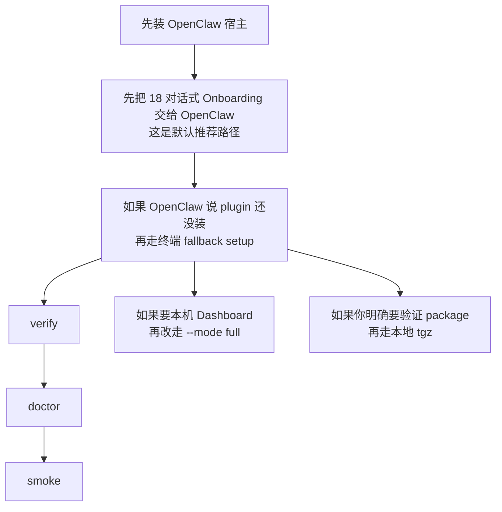
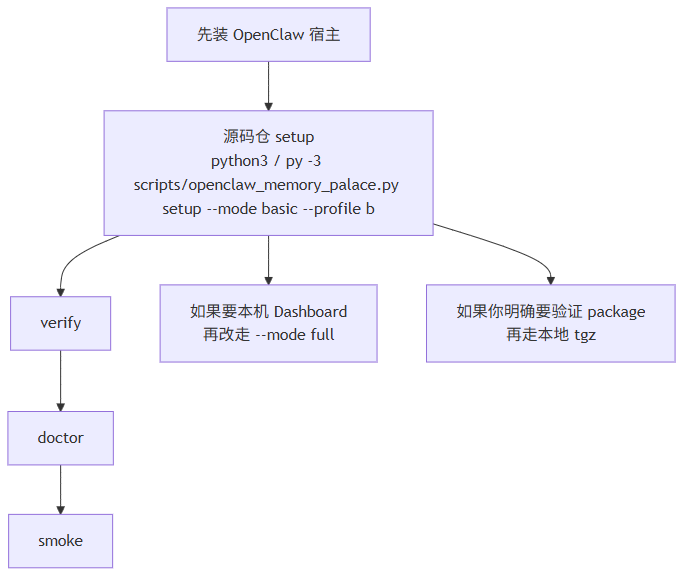

> [English](01-INSTALL_AND_RUN.en.md)

# 01 · 安装与运行

<p align="center">
  
</p>

这页只讲一件事：

> **怎么把 `memory-palace` 作为 OpenClaw memory plugin 真正跑起来。**

如果你只想先看真实页面和素材，直接看：

- [15-END_USER_INSTALL_AND_USAGE.md](15-END_USER_INSTALL_AND_USAGE.md)

如果你当前没有图形化 Dashboard，想直接通过对话完成配置，直接看：

- [18-CONVERSATIONAL_ONBOARDING.md](18-CONVERSATIONAL_ONBOARDING.md)

如果你只想看当前记录在案的验证说明，直接看：

- [../EVALUATION.md](../EVALUATION.md)

这页默认前提是：当前机器已经装好了 OpenClaw 本体。
如果宿主 CLI 还没装，这个仓库**不重复 OpenClaw 本体安装步骤**；先按
OpenClaw 官方安装文档把宿主装好，再回来看这页：

- `https://docs.openclaw.ai/install`

先把这页的最稳执行顺序压成一张图：



如果当前查看器不渲染 Mermaid，可以直接看这张静态图：



---

## 1. 先把边界看清

- `memory-palace` 会接管 OpenClaw 的 active memory slot
- 默认 `setup/install` 会备份并更新你本机的 OpenClaw 配置文件，把插件接进去并激活 `memory` slot；这不是改 OpenClaw 源码
- 这不等于删掉宿主自己的 `USER.md / MEMORY.md / memory/*.md`
- 稳定用户命令面是 `openclaw memory-palace ...`
- 自动 recall / auto-capture / visual auto-harvest 依赖支持 hooks 的宿主
- 当前这条自动链路的支持下限是 `OpenClaw >= 2026.3.2`

这里还有一个经常会混淆的点：

- 仓库 wrapper 命令是 `python3 scripts/openclaw_memory_palace.py ...`（Windows PowerShell 里写成 `py -3 scripts/openclaw_memory_palace.py ...`）
- 用户长期使用的稳定命令是 `openclaw memory-palace ...`

不要把它们混成一套。尤其是：

- `bootstrap-status`
- `provider-probe`

这两个名字属于仓库 wrapper / onboarding 链路，不属于 `openclaw memory-palace` 的稳定子命令面。

---

## 2. 最稳的起步方式

### 2.1 默认推荐：先走对话式 Onboarding

先看：

- [18-CONVERSATIONAL_ONBOARDING.md](18-CONVERSATIONAL_ONBOARDING.md)

这条路现在是普通用户的默认推荐安装路径。

更稳的执行顺序是：

1. 先把 onboarding 页面交给 OpenClaw CLI 或 WebUI。
2. 让 OpenClaw 先判断 plugin 是否已经安装。
3. 如果它判断“还没安装”，再按它给出的最短安装链路继续。
4. apply 或 setup 完成后，再用 `verify / doctor / smoke` 做最终签收。

### 2.2 终端 fallback：`setup --mode basic --profile b`

```bash
python3 scripts/openclaw_memory_palace.py setup --mode basic --profile b --transport stdio --json
openclaw memory-palace verify --json
openclaw memory-palace doctor --json
openclaw memory-palace smoke --json
```

如果你在 Windows PowerShell 里跑，直接执行：

```powershell
py -3 scripts/openclaw_memory_palace.py setup --mode basic --profile b --transport stdio --json
openclaw memory-palace verify --json
openclaw memory-palace doctor --json
openclaw memory-palace smoke --json
```

如果你只是想确认 plugin 已经真正加载进当前宿主，优先用 `openclaw plugins inspect memory-palace --json`。有些宿主也接受 `openclaw plugins info memory-palace`，但 `inspect` 是显式命令面。不要把 `openclaw skills list` 当成 bundled onboarding skill 的安装判断条件。

这页后面再出现的 repo wrapper 示例，在 Windows PowerShell 里也统一把 `python3` 改成 `py -3`，包括 `--no-activate`、`setup --mode full` 和只看 readiness 的 `onboarding` 示例。

如果你想自己管理 slot 绑定，wrapper 也支持：

```bash
python3 scripts/openclaw_memory_palace.py setup --mode basic --profile b --transport stdio --no-activate --json
```

这条路会继续准备 runtime 和插件配置，但不会自动把
`plugins.slots.memory` 切到 `memory-palace`。它属于高级用法，不是默认推荐路径。

### 2.2 如果你还想把 Dashboard 一起带起来

```bash
python3 scripts/openclaw_memory_palace.py setup --mode full --profile b --transport stdio --json
```

---

## 3. 当前应该降级理解的安装方式

先把两条看起来像公开 plugin 安装入口的命令边界讲清楚：

- `openclaw plugins install @openclaw/memory-palace`
- `openclaw plugins install memory-palace`

当前真实结果是：

- npm spec 现在会直接返回 `Package not found on npm`
- 直接写 `memory-palace` 当前会被解析成 skill，而不是 plugin
- 所以当前不应把这两条当成推荐安装入口
- 如果你已经在源码仓里，更稳的顺序仍然是先走对话式 onboarding，再把上面的源码仓 `setup` 当成终端 fallback

### 3.1 如果你就在源码仓目录里

把这条当成终端 fallback 执行：

```bash
python3 scripts/openclaw_memory_palace.py setup --mode basic --profile b --transport stdio --json
openclaw memory-palace verify --json
openclaw memory-palace doctor --json
openclaw memory-palace smoke --json
```

这条路径会：

- 准备 `~/.openclaw/memory-palace` 下的 runtime
- 把 `plugins.allow / plugins.load.paths / plugins.slots.memory / plugins.entries.memory-palace` 写进宿主 OpenClaw 配置
- 把 bundled skills 一起带进宿主

所以对“源码仓 + 这台机器上已有 OpenClaw”的场景，这条命令链应理解成最短终端 fallback，而不是默认推荐入口。

### 3.2 如果你明确要验证本地 `tgz`

这条路径保留给高级场景：

- 你手里已经有受信任的本地包
- 或者你就是要验证 clean-room / package 形态

如果你要从当前源码仓生成本地包，先执行：

```bash
cd extensions/memory-palace
npm pack
```

然后先按当前宿主支持的本地包路径把这个 `tgz` 安装进 OpenClaw：

```bash
openclaw plugins install ./<generated-tgz>
```

如果你这台宿主的当前版本还要求额外 trust flag，就按那一版宿主提示补上同一条 flag。不要把某一个特定宿主版本的额外 trust flag，写死成所有宿主都一样的公共命令。

安装完成后，先用包内入口完成 setup：

```bash
npm exec --yes --package ./<generated-tgz> memory-palace-openclaw -- setup --mode basic --profile b --transport stdio --json
```

然后回到稳定用户命令面签收：

```bash
openclaw memory-palace verify --json
openclaw memory-palace doctor --json
openclaw memory-palace smoke --json
```

这条 `npm pack` 路径要求当前机器具备：

- Bun
- 受支持的 Python `3.10-3.14`

因为 `extensions/memory-palace/package.json` 的 `prepack` 会执行
`bun build`、`bun test` 和 Python 打包 wrapper。

更稳的用户口径是：

- 如果你只是想先把功能跑起来，优先走**对话式 onboarding**
- 只有当 OpenClaw 明确告诉你 plugin 还没装，或者你就是要手动走终端时，再回到源码仓 `setup`

---

## 4. `Profile C / D` 什么时候再上

只有你已经准备好自己真正要用到的 provider，再上 `C / D`。

更稳的理解是：

- `Profile B`：默认零配置起步档
- `Profile C`：硬前提是 `embedding + reranker`
- `Profile C` 里的 `write_guard / compact_gist / intent_llm` 只算可选增强
- `Profile D`：默认期望 `embedding + reranker + LLM` 的完整高级辅助面

如果你只是想先看 readiness 报告，可以用：

```bash
python3 scripts/openclaw_memory_palace.py onboarding --profile c --json
python3 scripts/openclaw_memory_palace.py onboarding --profile d --json
```

这类 `onboarding` / `bootstrap-status` / `provider-probe` 命令属于**仓库 wrapper 辅助面**；
它们不是 `openclaw memory-palace` 的长期用户命令面。

真正会改配置的，还是下面两类：

- `setup ...`
- 或者 `onboarding --apply --validate ...`

还有一个很容易漏掉的边界：

- 如果返回结果里带了 `restartRequired=true`
- 先重启当前 OpenClaw 宿主 / gateway
- 再判断当前 profile、provider probe 和聊天里的实际表现

真正的判断标准仍然是：

- 你的 provider probe 是否通过
- 以及 `verify / doctor / smoke` 是否在你的目标环境真实转绿

---

## 5. 安装后最常用的命令

```bash
openclaw memory-palace status --json
openclaw memory-palace verify --json
openclaw memory-palace doctor --json
openclaw memory-palace smoke --json
openclaw memory-palace search "your query" --json
openclaw memory-palace get core://agent --json
openclaw memory-palace index --wait --json
openclaw memory-palace store-visual --help
```

这组命令才是用户长期会碰到的稳定面。

---

## 6. 验证结果应该怎么理解

把验证结果理解成“环境内证据”，不要理解成“所有环境自动成立的承诺”。

- `Profile B` 仍然是默认起步档
- `Profile C / D` 仍然依赖你自己的 provider
- 目标宿主上线前，应该在你的目标环境自己再跑一次
- 具体的命令、次数、跳过项和边界说明，统一看 [../EVALUATION.md](../EVALUATION.md)

这轮公开文档只把当前已经确认的事实写出来：

- plugin 已可由 `openclaw plugins inspect memory-palace --json` 确认加载；有些宿主也接受 `openclaw plugins info memory-palace`
- `openclaw skills list` 不是 bundled onboarding skill 的安装判断条件
- 仓库记录里，最新一轮 profile-matrix 已复现当前实验性 `A / B / C / D + ACL` 行为
- 同一份 onboarding 文档已经验证过可以在 CLI / WebUI、未安装 / 已安装、中英文这些主分支里给出正确下一步

但也不要把仓库里的某一次本地复跑写成通用承诺：

- provider 依赖链路在某些环境里仍可能因为目标模型端点本身不健康而出现 `warn`
- 所以真正上线前，还是要以你自己的目标环境为准

---

## 7. 什么时候该回去看别的页

- 想看真实截图、视频：
  - [15-END_USER_INSTALL_AND_USAGE.md](15-END_USER_INSTALL_AND_USAGE.md)
- 想通过对话完成 install / probe / apply：
  - [18-CONVERSATIONAL_ONBOARDING.md](18-CONVERSATIONAL_ONBOARDING.md)
- 想看问题排查：
  - [04-TROUBLESHOOTING.md](04-TROUBLESHOOTING.md)
- 想看完整验证记录：
  - [../EVALUATION.md](../EVALUATION.md)
