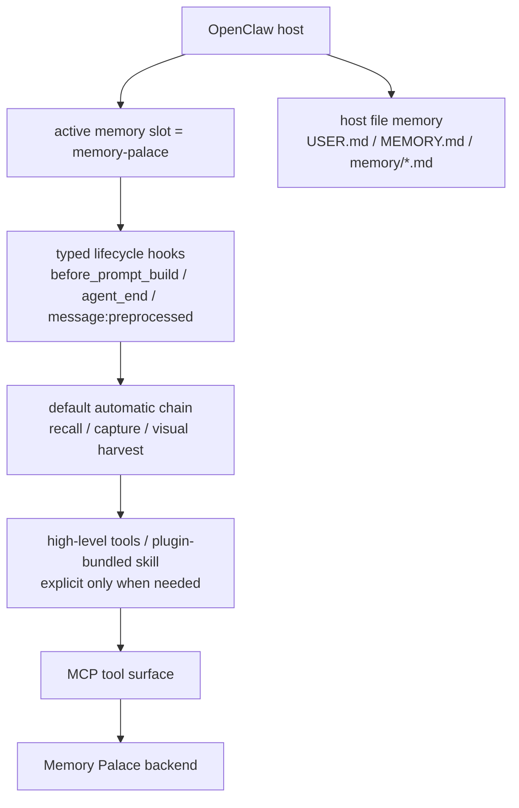
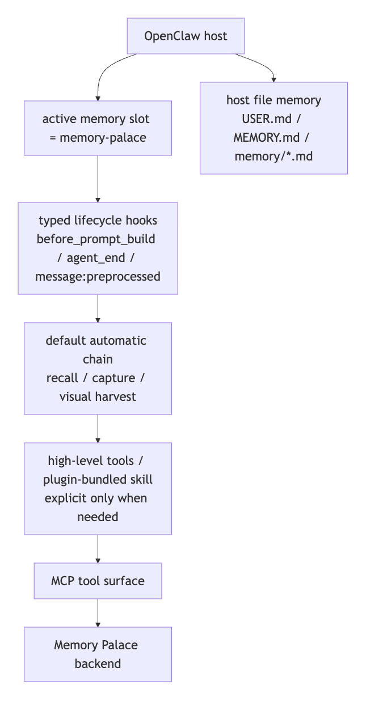

> [中文版](02-SKILLS_AND_MCP.md)

# 02 - How to Configure Skills and MCP

This page specifically explains the most commonly confused topic:

> **What are the respective responsibilities of the OpenClaw default chain, plugin-bundled skills, and underlying MCP?**

---

## The Short Answer

After installing `memory-palace`, what OpenClaw users get by default is not "11 raw MCP tools," but rather:

```text
active memory slot
-> before_prompt_build primary automatic recall
-> older hosts fall back to before_agent_start
-> agent_end automatic capture
-> visual context automatic harvest
-> explicit high-level tools only when needed
-> MCP
-> Memory Palace backend
```

The current layering is easier to read like this:



If your viewer does not render Mermaid, use this static image instead:



A note on host compatibility, to avoid interpreting the above as universally true for all OpenClaw hosts:

- The default automatic chain described above
  - Depends on an OpenClaw host that supports **typed lifecycle hooks**
  - The minimum supported version based on code and testing is:
    - `OpenClaw >= 2026.3.2`
- If the host does not have this capability:
  - Explicit `openclaw memory-palace ...` commands still work
  - But the default automatic recall / auto-capture / visual harvest should not be assumed to be operational
  - `verify / doctor` will report this directly

In plain terms:

- **The default chain is already productionized**
- Skills are now the **enhancement layer**
- MCP has been pushed down to the implementation layer
- Integration works by updating your local OpenClaw configuration file to switch the active memory slot to `memory-palace` — this does not modify host source code
- But this does not replace or delete the host's own file-based memory
- During daily use, most requests do not require manual tool invocation

---

## 1. Current Default Chain

Here is the actual current default chain laid out explicitly:

```text
OpenClaw
-> active memory slot = memory-palace
-> before_prompt_build primary automatic recall
-> older hosts fall back to before_agent_start
-> agent_end automatic capture
-> visual context automatic harvest
-> explicit escalation to memory_search / memory_get / memory_store_visual only when needed
-> MCP
-> Memory Palace backend
```

This section comes before "when to use which tool" — and for good reason:

- The default behavior already happens first
- Skills do not decide "whether to use the memory workflow" every time
- MCP is not the interaction layer that regular users face by default

---

## 2. Canonical Skill vs OpenClaw Skill

| Dimension | Canonical Skill | OpenClaw Plugin Skill |
| --- | --- | --- |
| Repository form | Documentation-side skill spec | Skill bundled into the plugin package |
| Serves | Claude / Codex / Gemini / OpenCode | OpenClaw |
| Default entry point | skill + MCP | active memory slot + plugin hooks + `openclaw memory-palace ...` |
| System form factor | Closer to raw MCP tool surface | Productionized memory plugin |
| Primary skill responsibility | Tells the model how to safely use underlying MCP | Tells the model the default chain is already working, and when explicit intervention is needed |

In plain terms:

- The canonical skill is more like "how to use MCP"
- The OpenClaw skill is more like "the default chain is already working — when do you need to explicitly escalate?"

---

## 3. Automatic Path vs Manual Path

### Automatic Path

What happens automatically by default:

- `before_prompt_build`
  - The current primary automatic recall entry
  - Only falls back to `before_agent_start` on older host hook paths
- `agent_end`
  - Automatic capture of some text-based durable memory
- `message:preprocessed`
  - This is the earlier hook entry by default
  - For preprocessed `webchat` text, if the host-side transcript or `agent_end` for that turn is incomplete, the plugin currently uses this hook as a fallback to run one text auto-capture pass
- `agent_end`
  - Automatic harvest of visual context from the current turn

Additional implementation notes:

- Even if the host lacks `ctx` for the three visual harvest hooks, the plugin normalizes it to an empty object and continues
- When `agent_end` auto-capture encounters an expected `write_guard` collision, the current semantics are skip, not a failure warning
- Between `before_prompt_build` and the legacy `before_agent_start` path, the plugin now uses a session-scoped marker so the same turn does not recall twice
- `command:new` reflection is now also deduped per session, with TTL and cache bounds, so long-running hosts do not keep rewriting the same reflection or growing the cache without limit

But keep this boundary in mind as well:

- The plugin currently handles cases where `ctx` is missing
- However, if the host lacks typed lifecycle hooks entirely:
  - The default automatic chain will not be registered
  - In such scenarios, use explicit `openclaw memory-palace ...` commands
  - Do not assume "the default automatic chain is productionized"

The most critical boundary to remember:

- Text durable memory:
  - Automatic recall by default
  - Automatic capture of some user messages by default
- Visual memory:
  - Automatic harvest by default
  - **Not** automatically stored long-term by default

### Manual Path

Explicit intervention is only needed when you escalate to:

- `memory_search`
- `memory_get`
- `memory_store_visual`
- `openclaw memory-palace status`
- `openclaw memory-palace verify`
- `openclaw memory-palace doctor`
- `openclaw memory-palace smoke`
- `openclaw memory-palace index`

So the key takeaways are:

- You do not need to `memory_search` before every request
- Not every image is automatically stored as long-term visual memory
- For most regular conversations, users just need to chat normally

One more important boundary that is easily misunderstood:

- In addition to the `memory-palace` plugin chain, the OpenClaw Web UI / CLI also still retains the host's own:
  - `USER.md`
  - `MEMORY.md`
  - `memory/*.md`

So "the default chain is already working" does not mean "every memory reference on the page necessarily comes from plugin durable memory."

A note on installation, to avoid thinking skills need a separate installation:

- If you followed the recommended `setup`
  - The plugin is automatically connected
  - MCP runtime config is automatically written
  - The plugin-bundled OpenClaw skill is included with the plugin / package
  - On Windows, do not treat `openclaw skills list` as the definitive install check for that bundled skill; prefer `openclaw plugins inspect memory-palace --json`, then confirm with `verify / doctor` if needed

---

## 4. What Layers Exist in the Project

### A. Canonical Skill

In the repository, this exists as a documentation-side skill specification.

It serves:

- Claude / Codex / Gemini / OpenCode and other clients that use canonical skill + MCP directly

Its mental model is closer to:

- The skill tells the model how to safely use underlying MCP tools

### B. OpenClaw Plugin-Bundled Skill

In the repository, this exists as part of the plugin package output.

It serves:

- OpenClaw

Its premise is not "users directly face 11 MCP tools," but rather:

- The active memory plugin is already `memory-palace`
- Plugin hooks are already working
- The model only needs to explicitly intervene in advanced scenarios
- Even when a hook is missing `ctx`, the plugin currently handles compatibility normalization — this should not be interpreted as "it crashes by default"

### C. Underlying MCP

Location:

- `backend/mcp_server.py`

It is responsible for:

- Actually executing memory read/write, search, governance, and index maintenance

But for OpenClaw users, it is now the **implementation layer**, not the default interaction layer.

### D. What Gets Automatically Connected During One-Click Install

This needs to be clearly stated to avoid confusing:

- plugin
- skill
- MCP

as three separate installations.

If you followed the recommended:

- `setup`
- package `setup`

What gets automatically handled:

- OpenClaw plugin itself
- MCP runtime / transport configuration
- Plugin-bundled OpenClaw skill

That bundled skill should be verified through plugin load plus `verify / doctor`, not through `openclaw skills list` alone.

What does **not** get automatically registered:

- The `docs/skills/...` canonical skill set

In plain terms:

- After installation, OpenClaw users can use it right away
- You do not need to "install the plugin + install MCP + install the skill" separately
- But if you want the Claude / Codex / Gemini / OpenCode canonical skill path, that follows its own installation process

An additional note to avoid confusing the two types of skills:

- Plugin-bundled OpenClaw skill
  - The runtime skill for daily use after installation
- Plugin-bundled OpenClaw onboarding skill
  - Now has a separate entry point
  - Used for "completing setup / provider probe / fallback explanation through conversation"
  - This is not the same as turning the runtime memory skill into an installation wizard

What users actually need to distinguish are two classes of OpenClaw skill:

- **runtime skill**
  - used for day-to-day durable memory behavior
- **onboarding skill**
  - used for install / bootstrap / reconfigure / provider onboarding

An additional note on the current real implementation, to avoid thinking "it's just a guidance document":

- The onboarding path is more than just a skill description
- The plugin already includes:
  - `memory_onboarding_status`
  - `memory_onboarding_probe`
  - `memory_onboarding_apply`
- So OpenClaw conversations now have a dedicated onboarding tool surface
- Those onboarding tools exist only after the plugin is installed and loaded on the host

### E. How to Distinguish Host Memory from Plugin Durable Memory

This must be clearly stated; otherwise, it is easy to mistake `Source:` references seen on the page as citations from the plugin itself.

The current real situation:

- **Host file-based memory**
  - `USER.md`
  - `MEMORY.md`
  - `memory/*.md`
- **Memory Palace plugin durable memory**
  - `memory-palace/...`
  - Primary storage is in the plugin's own database

If you see on the OpenClaw page:

- `Source: USER.md#...`
- `Source: MEMORY.md#...`
- `Source: memory/2026-03-17.md#...`

This should be understood as:

- Host file-based memory hit

If you see:

- `memory-palace/core/...`

This is closer to:

- Plugin durable memory hit

An additional boundary verified in the local real Web UI:

- The plugin does participate in:
  - `memory-palace-profile` injection
  - `before_prompt_build` as the primary recall path, with `before_agent_start` kept as a compatibility fallback
  - `memory_search`
- Stable user facts such as `workflow`
  - Can now be written to:
    - `core://agents/{agentId}/profile/workflow`
  - And are then prioritized for injection as `memory-palace-profile` in new sessions
- But if the corresponding fact only exists in the host's `USER.md / memory/*.md` and has not actually been written to plugin durable memory
  - The final response may still fall back to host file-based memory

In plain terms:

- **The plugin is working**
- **Host memory is also working**
- **The plugin now has a minimal profile block**
- But these two layers should not be conflated as the same thing

---

## 5. What Role Should Skills Play Now

The more accurate understanding now should be:

- **The default chain** is responsible for:
  - Automatic recall
  - Automatic capture
  - Automatic visual harvest
- **The OpenClaw skill** is responsible for:
  - Telling the model the default chain is already working
  - Reminding the model when explicit intervention is needed
  - Making high-level tool usage more stable
- **MCP** is responsible for:
  - Actually sending these operations to the Memory Palace backend

So in OpenClaw, the skill is now more like:

- An "enhancer"

Rather than:

- The "default entry point"

---

## 6. What Users Should Not Need To Think About

Regular OpenClaw users do not need to understand these underlying details by default:

- What the 11 raw MCP tools are called individually
- Whether each request should follow a `search -> read -> create -> update` sequence
- The underlying implementation differences between visual auto-harvest and visual auto-store
- How plugin hooks are registered to `message:preprocessed / before_prompt_build / agent_end`

These only become relevant in advanced maintenance scenarios.

---

## 7. What Still Needs Explicit Action

The boundaries that still require explicit action:

- Visual long-term storage:
  - Still requires explicit `memory_store_visual`
- Deep maintenance:
  - Still requires explicit `status / verify / doctor / smoke / index`
- Default chain:
  - Does not automatically write everything without limits
  - Does not replace all explicit verification

A practical note:

- `verify / doctor`
  - Also check:
    - Whether the plugin-bundled skill is in place
    - Current `profileMemory` configuration
    - Whether a profile block has been detected
  - On Windows, this is the safer proof path than depending on `openclaw skills list`

---

## 8. When Do You Need Explicit Tools

### `memory_search`

Good for:

- When the user explicitly wants to "check if something is in memory"
- Explicit verification when default recall seems insufficiently precise

Not for:

- Manually searching before every single request

### `memory_get`

Good for:

- After `memory_search` returns a hit, explicitly reading a specific entry's full content

### `memory_store_visual`

Good for:

- When you have confirmed you want to **permanently store an image as visual memory**
- Or when you have explicit caption / OCR / scene / entities data to persist

Not for:

- Confusing visual auto-harvest with visual auto-store

### `openclaw memory-palace ...`

Good for:

- Checking health status
- Diagnosing degraded / transport / index issues
- Manual smoke testing
- Rebuilding the index

Commonly used:

- `status`
- `verify`
- `doctor`
- `smoke`
- `index`

An additional note closer to the real codebase:

- `verify / doctor`
  - Also explicitly check:
    - Whether the plugin-bundled skill is in place
    - Whether visual auto-harvest is enabled

---

## 9. Underlying MCP Tools Actually Used

The underlying MCP tools that the OpenClaw plugin actually calls include:

- `search_memory`
- `read_memory`
- `create_memory`
- `update_memory`
- `add_alias`
- `rebuild_index`
- `index_status`
- `ensure_visual_namespace_chain`

But the key point is:

- These tools are now implementation details of the plugin
- Regular OpenClaw users do not need to understand them directly

---

## 10. Should You Use `memory` or `memory-palace`

The most practical entry point, aligned with the actual codebase, remains:

```bash
openclaw memory-palace ...
```

Rather than first using:

```bash
openclaw memory ...
```

to check whether the plugin has successfully taken over.

In plain terms:

- The current default commitment is `memory-palace`
- Whether `memory` can further delegate to the active memory plugin is an additional host capability, not the default public-facing contract of this repository

---

## 11. The One Thing OpenClaw Users Should Remember

> In OpenClaw, the default memory chain already works automatically; the skill tells the model when to explicitly intervene, high-level tools handle execution, and MCP sends operations to the backend.
