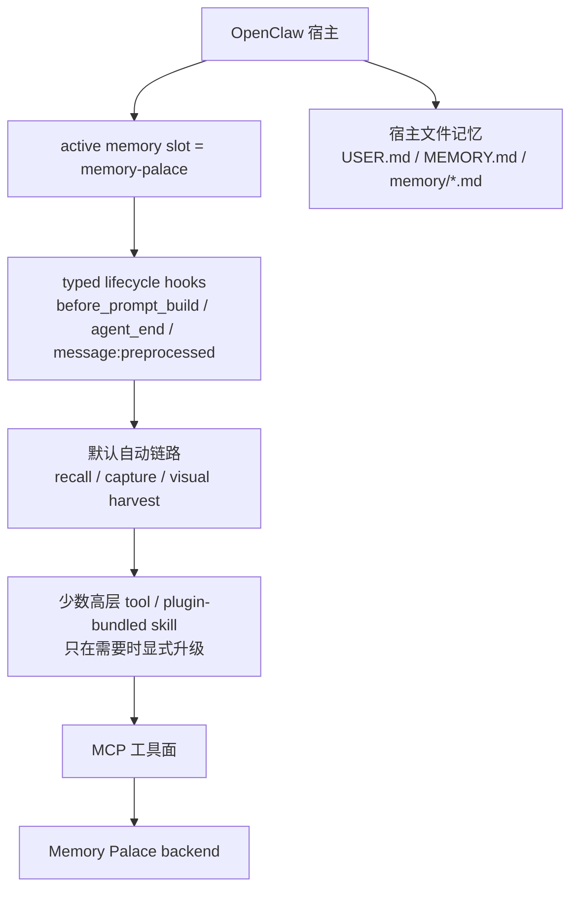
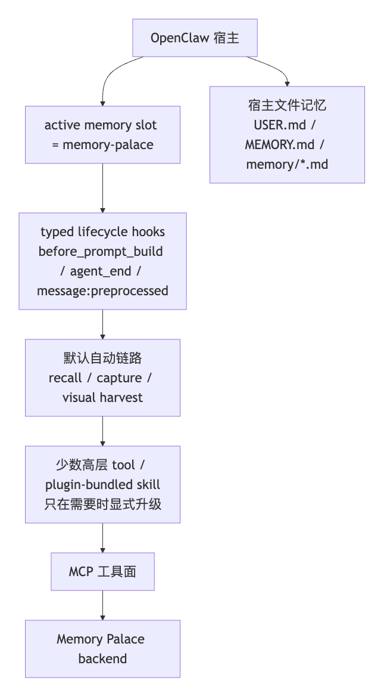

> [English](02-SKILLS_AND_MCP.en.md)

# 02 · Skills 与 MCP 到底怎么配

这一页专门解释最容易混淆的事：

> **OpenClaw 默认主链**、**插件自带 skill**、**底层 MCP**，现在分别负责什么？

---

## 🧠 先讲结论

当前 OpenClaw 用户装完 `memory-palace` 之后，默认拿到的不是”裸 11 个 MCP 工具”，而是：

```text
active memory slot
→ before_prompt_build 主自动 recall
→ 旧宿主回退到 before_agent_start
→ agent_end 自动 capture
→ visual context 自动 harvest
→ 需要时才显式调用少数高层工具
→ MCP
→ Memory Palace backend
```

把当前分层压缩成一张图，就是：



如果当前查看器不渲染 Mermaid，可以直接看这张静态图：



这里补一句宿主边界，避免把这段话理解成“任何 OpenClaw 宿主都天然成立”：

- 上面这条默认自动链路
  - 依赖 **支持 typed lifecycle hooks** 的 OpenClaw 宿主
  - 当前支持下限按代码和实测口径是：
    - `OpenClaw >= 2026.3.2`
- 如果宿主没有这层能力：
  - 显式 `openclaw memory-palace ...` 仍然能用
  - 但默认自动 recall / auto-capture / visual harvest 不应继续按“已经在工作”理解
  - `verify / doctor` 当前也会把这件事直接报出来

说人话就是：

- **默认主链已经产品化**
- skill 现在是**增强层**
- MCP 退到实现层
- 接入方式上会通过你本机的 OpenClaw 配置文件把 active memory slot 切到 `memory-palace`
  - 这不是改宿主源码
- 但这不等于替代或删除宿主自己的文件记忆
- 日常使用时，大多数请求不需要先手工碰工具

---

## 1️⃣ Current Default Chain

先把当前真实默认链路单独摆出来：

```text
OpenClaw
→ active memory slot = memory-palace
→ before_prompt_build 主自动 recall
→ 旧宿主回退到 before_agent_start
→ agent_end 自动 capture
→ visual context 自动 harvest
→ 需要时才显式升级到 memory_search / memory_get / memory_store_visual
→ MCP
→ Memory Palace backend
```

这节要先于“什么时候用哪个工具”。

原因很简单：

- 当前默认行为已经先发生
- skill 不是每次都在决定“要不要走记忆工作流”
- MCP 也不是普通用户默认面对的交互层

---

## 2️⃣ Canonical Skill vs OpenClaw Skill

| 维度 | canonical skill | OpenClaw plugin skill |
| --- | --- | --- |
| 仓库中的形态 | 文档侧 skill 规范 | 插件打包出来的 OpenClaw skill |
| 服务对象 | Claude / Codex / Gemini / OpenCode | OpenClaw |
| 默认入口 | skill + MCP | active memory slot + plugin hooks + `openclaw memory-palace ...` |
| 面对的系统形态 | 更接近裸 MCP 工具面 | 已经产品化的 memory plugin |
| skill 主要职责 | 告诉模型怎么安全使用底层 MCP | 告诉模型默认链路已经在工作，以及何时才需要显式介入 |

说人话就是：

- canonical skill 更像“怎么用 MCP”
- OpenClaw skill 更像“默认主链已经在工作，什么时候才需要显式升级”

---

## 3️⃣ Automatic Path vs Manual Path

### 自动路径

默认自动发生的是：

- `before_prompt_build`
  - 当前主自动 recall 入口
  - 如果宿主还是旧 hook 路径，才回退到 `before_agent_start`
- `agent_end`
  - 自动 capture 一部分文本 durable memory
- `message:preprocessed`
  - 默认是较早的 hook 入口
  - 对 `webchat` 这类已经预处理好的文本，如果宿主这轮 transcript / `agent_end` 不完整，当前也会用它兜底补一次文本 auto-capture
- `agent_end`
  - 自动 harvest 当前回合 visual context

当前实现再补一句：

- 上面三条 visual harvest hook 即使宿主缺少 `ctx`，插件也会先归一成空对象再继续跑
- `agent_end` auto-capture 遇到预期的 `write_guard` 碰撞时，当前语义是 skip，不是失败 warning
- `before_prompt_build` 和旧版 `before_agent_start` 之间，当前会按 session 做一次性标记，避免同一轮重复 recall
- `command:new` reflection 现在也会按 session 做去重，并带 TTL 和容量上限，避免长会话里重复写入或缓存越跑越大

但要把另一个边界也一起记住：

- `ctx` 缺失这类情况，插件当前会兜住
- 可如果宿主连 typed lifecycle hooks 本身都没有：
  - 默认自动链路就不会被注册
  - 这类场景当前要按显式 `openclaw memory-palace ...` 为主
  - 不再按“默认自动链路已经产品化”理解

补一句最关键的边界：

- 文本 durable memory：
  - 默认会自动 recall
  - 默认会自动 capture 一部分用户消息
- visual memory：
  - 默认会 auto-harvest
  - 默认**不会**自动长期存库

### 手动路径

只有需要显式介入时，才升级到：

- `memory_search`
- `memory_get`
- `memory_store_visual`
- `openclaw memory-palace status`
- `openclaw memory-palace verify`
- `openclaw memory-palace doctor`
- `openclaw memory-palace smoke`
- `openclaw memory-palace index`

所以真正要记住的是：

- 不是每次都要先 `memory_search`
- 也不是每张图都会自动长期落成 visual memory
- 大多数普通对话，用户只需要正常聊天就行

这里要再补一句当前最容易误会的边界：

- OpenClaw Web UI / CLI 当前除了会走 `memory-palace` 这条 plugin 链路
- 宿主自身也还保留：
  - `USER.md`
  - `MEMORY.md`
  - `memory/*.md`

所以“默认链路已经在工作”不等于“页面里所有记忆引用都一定来自 plugin durable memory”。

这里再补一句安装口径，避免把 skill 理解成“还要再单独装一次”：

- 如果你走的是当前推荐的 `setup`
  - plugin 会自动接好
  - MCP runtime config 会自动写好
  - plugin-bundled OpenClaw skill 也会跟着 plugin / package 一起到位
  - 在 Windows 上，不要把 `openclaw skills list` 当成这份 bundled skill 的 definitive check；更稳的是先看 `openclaw plugins inspect memory-palace --json`，再结合 `verify / doctor`

---

## 4️⃣ 现在项目里有哪几层

### A. canonical skill

仓库里以文档规范的形式存在。

它服务的是：

- Claude / Codex / Gemini / OpenCode 这类直接走 canonical skill + MCP 的客户端

它的心智更接近：

- skill 告诉模型怎么安全使用底层 MCP 工具

### B. OpenClaw plugin 自带 skill

仓库里以插件打包产物的一部分存在。

它服务的是：

- OpenClaw

它的前提不是”用户直接面对 11 个 MCP 工具”，而是：

- active memory plugin 已经是 `memory-palace`
- 插件 hooks 已经在工作
- 模型只在高级场景才需要显式介入
- 即使某次 hook 缺少 `ctx`，当前插件也会先做兼容归一，不该再把这件事直接理解成“默认就会崩”

### C. 底层 MCP

位置：

- `backend/mcp_server.py`

它负责：

- 真正执行记忆读写、检索、治理、索引维护

但对 OpenClaw 用户来说，它现在属于**实现层**，不是默认交互层。

### D. 一键安装时到底自动接了什么

这块一定要单独说清，不然最容易把：

- plugin
- skill
- MCP

误会成 3 次独立安装。

如果你走的是当前推荐的：

- `setup`
- package `setup`

当前会自动处理的是：

- OpenClaw plugin 本体
- MCP runtime / transport 配置
- plugin-bundled OpenClaw skill

这份 bundled skill 的到位与否，更适合通过 plugin load 加上 `verify / doctor` 判断，而不是只看 `openclaw skills list`。

当前**不会**自动替你注册的是：

- `docs/skills/...` 那套 canonical skill

说人话就是：

- OpenClaw 用户装完以后，默认已经能用
- 不需要再手工“装一次 plugin + 装一次 MCP + 再装一次 skill”
- 但如果你要的是 Claude / Codex / Gemini / OpenCode 那条 canonical skill 路线
  - 那还是 canonical skill 自己那套安装口径

这里再补一句，避免把两种 skill 混成一件事：

- plugin-bundled OpenClaw skill
  - 是安装后日常使用的运行时 skill
- plugin-bundled OpenClaw onboarding skill
  - 现在已经是单独入口
  - 用来做“通过对话完成 setup / provider probe / fallback 解释”
  - 不等于把当前运行时记忆 skill 再改成安装向导

当前要分清的是两类 OpenClaw skill：

- **运行时 skill**
  - 面向日常 durable memory 使用
- **onboarding skill**
  - 面向安装 / bootstrap / reconfigure / provider onboarding

再补一句当前真实实现，避免把它理解成“只有一段引导文案”：

- onboarding 这条线现在不只是一份 skill 描述
- 插件里还已经有：
  - `memory_onboarding_status`
  - `memory_onboarding_probe`
  - `memory_onboarding_apply`
- 所以 OpenClaw 对话里现在已经有一套独立的 onboarding 工具面
- 但这些 onboarding tool 只有在插件已经安装并加载后才会存在

### E. 宿主 memory 与 plugin durable memory 现在怎么区分

这一点当前一定要单独说清，不然最容易把页面里看到的 `Source:` 误会成 plugin 自己的 citation。

当前真实情况是：

- **宿主文件记忆**
  - `USER.md`
  - `MEMORY.md`
  - `memory/*.md`
- **Memory Palace plugin durable memory**
  - `memory-palace/...`
  - 主存储在 plugin 自己的数据库里

如果你在 OpenClaw 页面里看到：

- `Source: USER.md#...`
- `Source: MEMORY.md#...`
- `Source: memory/2026-03-17.md#...`

这更应该理解成：

- 宿主文件记忆命中

如果你看到的是：

- `memory-palace/core/...`

这才更接近：

- plugin durable memory 命中

再补一句当前本地真实 Web UI 已经验证过的边界：

- plugin 确实会参与：
  - `memory-palace-profile` 注入
  - `before_prompt_build` 主 recall（旧宿主回退到 `before_agent_start`）
  - `memory_search`
- 当前 `workflow` 这类稳定用户事实
  - 已经可以先写进：
    - `core://agents/{agentId}/profile/workflow`
  - 然后在新会话里优先以 `memory-palace-profile` 形式注入
- 但如果对应事实只在宿主 `USER.md / memory/*.md` 里，而没有真正写进 plugin durable memory
  - 最终回答仍然可能回退到宿主文件记忆

说人话就是：

- **plugin 在工作**
- **宿主 memory 也在工作**
- **plugin 现在已经有最小 profile block**
- 但这两层现在仍然不能混写成同一回事

---

## 5️⃣ skill 现在该扮演什么角色

当前更准确的理解应该是：

- **默认主链**负责：
  - 自动 recall
  - 自动 capture
  - 自动 visual harvest
- **OpenClaw skill**负责：
  - 告诉模型默认链路已经在工作
  - 提醒模型何时才需要显式介入
  - 让高层工具的使用更稳定
- **MCP**负责：
  - 把这些操作真正送进 Memory Palace 后端

所以 OpenClaw 里，skill 现在更像：

- “增强器”

而不是：

- “默认主入口”

---

## 6️⃣ What Users Should Not Need To Think About

OpenClaw 普通用户默认不需要理解这些底层细节：

- 原始 11 个 MCP tools 分别叫什么
- 每次请求到底应不应该先 `search -> read -> create -> update`
- visual auto-harvest 与 visual auto-store 的底层实现差异
- 插件 hooks 是怎么注册到 `message:preprocessed / before_prompt_build / agent_end` 的

只有在高级维护链路里，才需要退到底层心智。

---

## 7️⃣ What Still Needs Explicit Action

当前仍然需要显式动作的边界是：

- visual 长期存储：
  - 仍然需要显式 `memory_store_visual`
- 深层维护：
  - 仍然需要显式 `status / verify / doctor / smoke / index`
- default chain：
  - 不是无限制自动写一切
  - 不会替代所有显式查证

补一句更实用的：

- `verify / doctor`
  - 当前也会顺手检查：
    - plugin-bundled skill 是否已经到位
    - `profileMemory` 当前配置
    - profile block 当前是否已经探测到
  - 在 Windows 上，这条链路比单看 `openclaw skills list` 更稳

---

## 8️⃣ 什么时候才需要显式工具

### `memory_search`

适合：

- 用户明确要“查记忆里有没有”
- 默认 recall 看起来不够精确时，做显式查证

不适合：

- 把每次请求都先手工 search 一遍

### `memory_get`

适合：

- `memory_search` 命中后，明确读取某条正文

### `memory_store_visual`

适合：

- 你已经确认要把某张图**长期存成 visual memory**
- 或你已经有明确 caption / OCR / scene / entities，想显式落库

不适合：

- 把 visual auto-harvest 误当成 visual auto-store

### `openclaw memory-palace ...`

适合：

- 看健康状态
- 诊断 degraded / transport / index 问题
- 手工 smoke
- 重建索引

常用的是：

- `status`
- `verify`
- `doctor`
- `smoke`
- `index`

再补一句当前更贴近真实代码的口径：

- `verify / doctor`
  - 现在还会显式检查：
    - plugin-bundled skill 是否到位
    - visual auto-harvest 是否已启用

---

## 9️⃣ 当前实际用到的底层 MCP 工具

当前 OpenClaw 插件实际会调用的底层 MCP 工具主要包括：

- `search_memory`
- `read_memory`
- `create_memory`
- `update_memory`
- `add_alias`
- `rebuild_index`
- `index_status`
- `ensure_visual_namespace_chain`

但这里要强调的是：

- 这些工具现在主要是插件实现细节
- 普通 OpenClaw 用户默认不需要直接理解它们

---

## 🔟 现在到底该用 `memory` 还是 `memory-palace`

对用户最实用、也和当前仓真实代码对齐的入口仍然是：

```bash
openclaw memory-palace ...
```

而不是先拿：

```bash
openclaw memory ...
```

去判断插件有没有接管成功。

说人话就是：

- 当前默认承诺的是 `memory-palace`
- `memory` 是否能进一步委托给活动 memory plugin，属于宿主额外能力，不是当前仓默认对外口径

---

## 1️⃣1️⃣ OpenClaw 用户最该记住的一句话

> 在 OpenClaw 里，默认记忆链路已经自动工作；skill 负责提醒模型何时才显式介入，高层工具负责执行，MCP 负责把操作送进后端。
