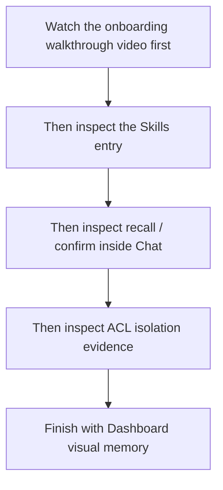
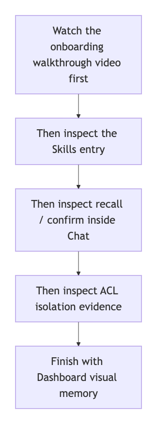

> [中文版](15-END_USER_INSTALL_AND_USAGE.md)

# 15 · End-User Installation and Usage Walkthrough

This page now focuses on one thing:

> **Show end users what actually appears inside the OpenClaw WebUI.**

Read this page with the following framing:

- the primary narrative starts from `OpenClaw WebUI`
- public pages link to publishable copies under `assets/real-openclaw-run/`
- Dashboard assets still exist, but they are no longer the default entry point of this page
- detailed validation notes live in [../EVALUATION.en.md](../EVALUATION.en.md)

If you want the recommended viewing order first, start with this map:

If your viewer does not render Mermaid, use this static image instead:

---

## 1. Start with These Real Assets

If you want the complete user path first, start with these 4 videos:

- [openclaw-onboarding-doc-flow.zh.burned-captions.mp4](assets/real-openclaw-run/openclaw-onboarding-doc-flow.zh.burned-captions.mp4)
- [openclaw-onboarding-doc-flow.en.burned-captions.mp4](assets/real-openclaw-run/openclaw-onboarding-doc-flow.en.burned-captions.mp4)
- [openclaw-control-ui-capability-tour.en.mp4](assets/real-openclaw-run/openclaw-control-ui-capability-tour.en.mp4)
- [openclaw-control-ui-acl-scenario.en.mp4](assets/real-openclaw-run/openclaw-control-ui-acl-scenario.en.mp4)

If you want a screenshot-first overview, start with this set:

- [openclaw-control-ui-skills-memory-palace.png](assets/real-openclaw-run/openclaw-control-ui-skills-memory-palace.png)
- [openclaw-control-ui-skills-memory-palace-detail.png](assets/real-openclaw-run/openclaw-control-ui-skills-memory-palace-detail.png)
- [openclaw-control-ui-chat-recall-confirmed.png](assets/real-openclaw-run/openclaw-control-ui-chat-recall-confirmed.png)
- [openclaw-control-ui-chat-force-confirm.png](assets/real-openclaw-run/openclaw-control-ui-chat-force-confirm.png)
- [dashboard-visual-memory-root.en.png](assets/real-openclaw-run/dashboard-visual-memory-root.en.png)
- [dashboard-visual-memory.en.png](assets/real-openclaw-run/dashboard-visual-memory.en.png)
- [24-acl-agents-page.en.png](assets/real-openclaw-run/24-acl-agents-page.en.png)
- [24-acl-alpha-memory-confirmed.en.png](assets/real-openclaw-run/24-acl-alpha-memory-confirmed.en.png)
- [24-acl-beta-chat-isolated.en.png](assets/real-openclaw-run/24-acl-beta-chat-isolated.en.png)

---

## 2. How the Plugin + Skill Show Up in the WebUI

If your main question is:

> **Can I hand the onboarding document to OpenClaw and have it return the correct next install / configuration step inside chat?**

Start with these two videos:

- [openclaw-onboarding-doc-flow.zh.burned-captions.mp4](assets/real-openclaw-run/openclaw-onboarding-doc-flow.zh.burned-captions.mp4)
- [openclaw-onboarding-doc-flow.en.burned-captions.mp4](assets/real-openclaw-run/openclaw-onboarding-doc-flow.en.burned-captions.mp4)

These two clips establish the same boundary:

- **when the plugin is not installed yet**, OpenClaw does not pretend `memory_onboarding_*` already exists; it gives the shortest install chain first
- **when the plugin is already installed**, OpenClaw stays in the same chat thread and continues through `memory_onboarding_status -> memory_onboarding_probe -> memory_onboarding_apply`
- the user still hands OpenClaw **the same onboarding document**, not two different entry pages

The test boundary matters here:

- this doc-chat validation proves that the answer chain and the next-step guidance are correct
- it does **not** turn “one chat turn fully completes final `Profile B / C / D apply`” into a default public promise

| WebUI Page | Asset | What Users Actually See |
|---|---|---|
| `Skills` | [openclaw-control-ui-skills-memory-palace.png](assets/real-openclaw-run/openclaw-control-ui-skills-memory-palace.png) | Memory Palace-related entries appear as host-visible items; do not treat any one visible label as fixed across host builds |
| `Skills` | [openclaw-control-ui-skills-memory-palace-detail.png](assets/real-openclaw-run/openclaw-control-ui-skills-memory-palace-detail.png) | After expanding the entry, users can directly see recall, explicit memory verification, visual memory storage, and plugin health / index maintenance |
| `Chat` | [openclaw-control-ui-chat-recall-confirmed.png](assets/real-openclaw-run/openclaw-control-ui-chat-recall-confirmed.png) | recall block, tool output, and answer block stay inside the native chat thread |
| `Chat` | [openclaw-control-ui-chat-force-confirm.png](assets/real-openclaw-run/openclaw-control-ui-chat-force-confirm.png) | treat this as guarded-write evidence from a controlled rerun path: the block, confirm, and store steps stay inside the native chat page, but do not generalize it as a blanket current-host strict success claim for every advanced profile |
| `Dashboard / Memory` | [dashboard-visual-memory-root.en.png](assets/real-openclaw-run/dashboard-visual-memory-root.en.png) | first proves that the `Memory Hall` root really contains a `visual` branch |
| `Dashboard / Memory` | [dashboard-visual-memory.en.png](assets/real-openclaw-run/dashboard-visual-memory.en.png) | then proves that the `core://visual/...` node page visibly contains `Visual Memory / Summary / OCR / Entities` |

In one sentence:

> **What OpenClaw users see by default are recall blocks, tool cards, and answer blocks inside the native WebUI pages, not a separate Memory Palace frontend.**

---

## 3. How ACL / Profile A / B / C / D Show Up in the WebUI

### ACL

Here, read `ACL` as **experimental multi-agent memory isolation**:

- once enabled, the current tested plugin path can narrow each agent to its own long-term memory area by default
- when it is not enabled, multi-agent long-term memory is not guaranteed to stay strictly isolated
- the current public proof on this page is still a checked local / isolated flow
- do not read it as a fully hardened backend security boundary yet

Start with the video:

- [openclaw-control-ui-acl-scenario.en.mp4](assets/real-openclaw-run/openclaw-control-ui-acl-scenario.en.mp4)

Then use these screenshots:

- [24-acl-agents-page.en.png](assets/real-openclaw-run/24-acl-agents-page.en.png)
- [24-acl-alpha-memory-confirmed.en.png](assets/real-openclaw-run/24-acl-alpha-memory-confirmed.en.png)
- [24-acl-beta-chat-isolated.en.png](assets/real-openclaw-run/24-acl-beta-chat-isolated.en.png)

This evidence set is only making four points about the current experimental behavior:

- the `main / alpha / beta` agent set really exists
- `alpha` really writes a memory first
- after switching to `beta`, the recall block stays inside the `beta` scope
- asking `What is alpha's default workflow?` returns `UNKNOWN`

### Profile A / B / C / D

The public wording is now straightforward:

- do not read `Profile A / B / C / D` as four different WebUI products
- the visible shell is still the same `Chat / Skills / Agents`
- the main differences are in the underlying chain, retrieval quality, and capability ceiling
- `Profile A / B` stay on the more basic side
- `Profile C` publicly defaults to `embedding + reranker`
- `Profile C` exposes `write_guard / compact_gist / intent_llm` only when the optional LLM suite is turned on
- `Profile D` is the full advanced target profile, but it should only be treated as ready after provider checks and the final sign-off commands pass

---

## 4. How to Read the Current Validation Boundary

This page now focuses on **real page evidence**. It does not turn one recorded rerun into a universal promise for every environment.

The safer reading is:

- `Profile B` proves that users can already see `skill entry / recall block / tool card / answer block` inside OpenClaw WebUI
- `Profile C / D` prove that the same WebUI shell can sit on top of a deeper provider-backed chain
- but `C / D` are not “ready” just because env values exist; the safer threshold is still `probe / verify / doctor / smoke`

Two things are already confirmed in the recorded repository checks:

- the same onboarding document has already been verified to drive the correct next step in CLI / WebUI, in installed / uninstalled states, in both Chinese and English
- the latest profile-matrix record reproduced the current experimental `A / B / C / D + ACL` behavior

For detailed commands, counts, and caveats, see:

- [../EVALUATION.en.md](../EVALUATION.en.md)

---

## 5. If You Still Want the Dashboard

Dashboard assets have not been removed, but they are no longer the default focus of this page.

If you do need them:

- [16-DASHBOARD_GUIDE.en.md](16-DASHBOARD_GUIDE.en.md)

If you want a local HTML overview as a supplement:

- [23-PROFILE_CAPABILITY_BOUNDARIES.en.html](23-PROFILE_CAPABILITY_BOUNDARIES.en.html)
