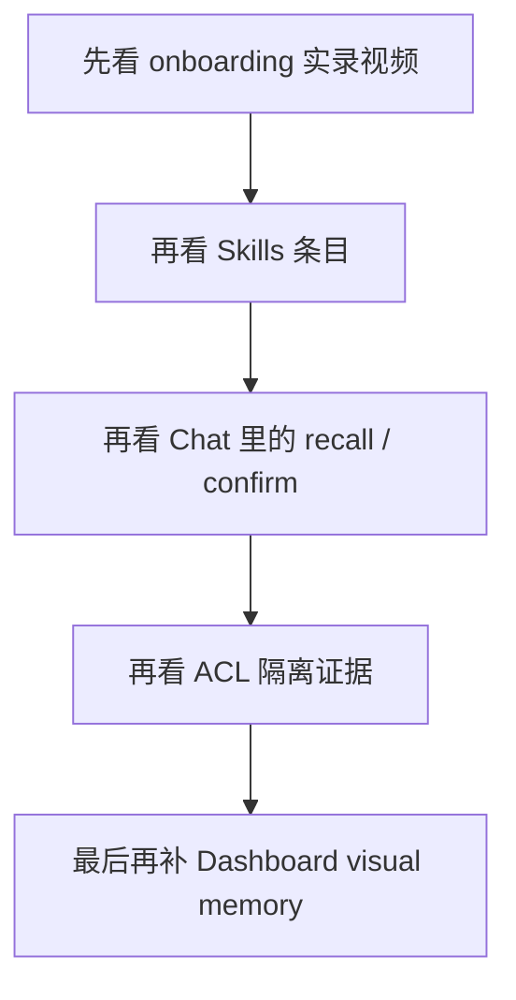
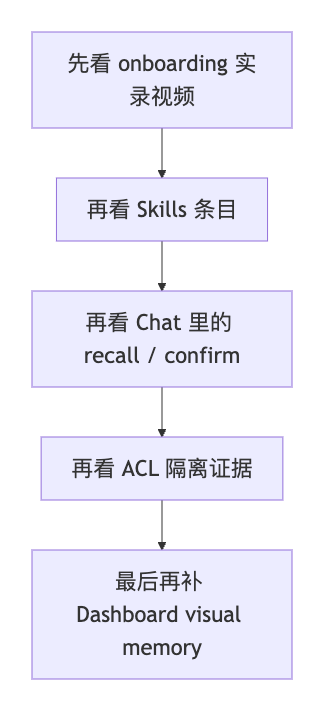

> [English](15-END_USER_INSTALL_AND_USAGE.en.md)

# 15 · 最终用户安装与使用实录

这页现在只保留一件事：

> **让最终用户先看清 OpenClaw WebUI 里到底会出现什么。**

当前这页统一按下面这组口径来读：

- 主叙事优先看 `OpenClaw WebUI`
- 公开页统一引用 `assets/real-openclaw-run/` 下的可发布副本
- Dashboard 素材仍然保留，但不再是这页的默认入口
- 详细验证记录统一看 [../EVALUATION.md](../EVALUATION.md)

如果你想先知道这页最推荐的观看顺序，可以先看这张图：

如果当前查看器不渲染 Mermaid，可以直接看这张静态图：

---

## 1. 先看这些真实素材

如果你先想看完整用户路径，优先看这 4 条视频：

- [openclaw-onboarding-doc-flow.zh.burned-captions.mp4](assets/real-openclaw-run/openclaw-onboarding-doc-flow.zh.burned-captions.mp4)
- [openclaw-onboarding-doc-flow.en.burned-captions.mp4](assets/real-openclaw-run/openclaw-onboarding-doc-flow.en.burned-captions.mp4)
- [openclaw-control-ui-capability-tour.zh.mp4](assets/real-openclaw-run/openclaw-control-ui-capability-tour.zh.mp4)
- [openclaw-control-ui-acl-scenario.zh.mp4](assets/real-openclaw-run/openclaw-control-ui-acl-scenario.zh.mp4)

如果你先想一眼看截图，先看这组：

- [openclaw-control-ui-skills-memory-palace.png](assets/real-openclaw-run/openclaw-control-ui-skills-memory-palace.png)
- [openclaw-control-ui-skills-memory-palace-detail.zh.png](assets/real-openclaw-run/openclaw-control-ui-skills-memory-palace-detail.zh.png)
- [openclaw-control-ui-chat-recall-confirmed.png](assets/real-openclaw-run/openclaw-control-ui-chat-recall-confirmed.png)
- [openclaw-control-ui-chat-force-confirm.png](assets/real-openclaw-run/openclaw-control-ui-chat-force-confirm.png)
- [dashboard-visual-memory-root.png](assets/real-openclaw-run/dashboard-visual-memory-root.zh.png)
- [dashboard-visual-memory.png](assets/real-openclaw-run/dashboard-visual-memory.zh.png)
- [24-acl-agents-page.png](assets/real-openclaw-run/24-acl-agents-page.png)
- [24-acl-alpha-memory-confirmed.png](assets/real-openclaw-run/24-acl-alpha-memory-confirmed.png)
- [24-acl-beta-chat-isolated.png](assets/real-openclaw-run/24-acl-beta-chat-isolated.png)

---

## 2. plugin + skill 在 WebUI 里怎么体现

如果你这轮最关心的是：

> **把 onboarding 文档直接交给 OpenClaw，然后让它在聊天里先给出正确的下一步安装 / 配置引导**

先看这两条：

- [openclaw-onboarding-doc-flow.zh.burned-captions.mp4](assets/real-openclaw-run/openclaw-onboarding-doc-flow.zh.burned-captions.mp4)
- [openclaw-onboarding-doc-flow.en.burned-captions.mp4](assets/real-openclaw-run/openclaw-onboarding-doc-flow.en.burned-captions.mp4)

这两条片子讲的是同一个口径：

- **plugin 还没装时**，OpenClaw 不会假装 `memory_onboarding_*` 已经存在，而是先给出最短安装链路
- **plugin 已装时**，OpenClaw 会继续留在聊天线程里，按 `memory_onboarding_status -> memory_onboarding_probe -> memory_onboarding_apply` 这条真实工具链给出下一步
- 也就是说，用户交给 OpenClaw 的仍然是**同一份 onboarding 文档**，不是两套不同入口

这里再把验证边界说清：

- 这组“文档直交 OpenClaw”测试验证的是**回答链路和下一步指导是否正确**
- 它本身不把“一轮聊天就自动完成最终 `Profile B / C / D apply`”写成默认承诺

| WebUI 页面 | 素材 | 用户真正看到什么 |
|---|---|---|
| `Skills` | [openclaw-control-ui-skills-memory-palace.png](assets/real-openclaw-run/openclaw-control-ui-skills-memory-palace.png) | Memory Palace 相关条目会以宿主可见条目的形式出现；不要把某一个显示名当成所有宿主构建里固定不变的名字 |
| `Skills` | [openclaw-control-ui-skills-memory-palace-detail.zh.png](assets/real-openclaw-run/openclaw-control-ui-skills-memory-palace-detail.zh.png) | 点开条目后，用户能直接看到长期记忆回想、显式记忆核验、visual memory 存储、plugin health / index maintenance 这些能力 |
| `Chat` | [openclaw-control-ui-chat-recall-confirmed.png](assets/real-openclaw-run/openclaw-control-ui-chat-recall-confirmed.png) | recall block、tool output 和 answer block 都留在原生聊天线程里 |
| `Chat` | [openclaw-control-ui-chat-force-confirm.png](assets/real-openclaw-run/openclaw-control-ui-chat-force-confirm.png) | 这张图只适合当受控场景里的 guarded write 证据：先拦截、再确认、再写入都留在原生聊天页；不要把它直接泛化成“所有 current-host strict 高级档位都已经稳定显示同样成功证据” |
| `Dashboard / Memory` | [dashboard-visual-memory-root.png](assets/real-openclaw-run/dashboard-visual-memory-root.zh.png) | 先证明 `Memory Hall` 根节点下面确实有 `visual` 分支 |
| `Dashboard / Memory` | [dashboard-visual-memory.png](assets/real-openclaw-run/dashboard-visual-memory.zh.png) | 再证明 `core://visual/...` 节点页里 `Visual Memory / Summary / OCR / Entities` 都真实可见 |

一句话总结：

> **OpenClaw 用户默认看到的是原生 WebUI 页面里长出来的 recall block、tool card 和 answer block，而不是另开一套 Memory Palace 前端。**

---

## 3. ACL / Profile A / B / C / D 在 WebUI 里怎么看

### ACL

这里的 `ACL`，当前更准确的理解是**实验性的多 Agent 记忆隔离**：

- 开启后，当前已验证的 plugin 主路径里，每个 agent 默认会收紧到自己那一块长期记忆
- 不开启时，多 agent 的长期记忆不保证严格隔离
- 这页公开证据验证的仍然是本地 / 隔离场景下的真实链路
- 现阶段不要把它理解成已经完全硬化的后端安全边界

最优先看视频：

- [openclaw-control-ui-acl-scenario.zh.mp4](assets/real-openclaw-run/openclaw-control-ui-acl-scenario.zh.mp4)
- [openclaw-control-ui-acl-scenario.en.mp4](assets/real-openclaw-run/openclaw-control-ui-acl-scenario.en.mp4)

再配三张图：

- [24-acl-agents-page.png](assets/real-openclaw-run/24-acl-agents-page.png)
- [24-acl-alpha-memory-confirmed.png](assets/real-openclaw-run/24-acl-alpha-memory-confirmed.png)
- [24-acl-beta-chat-isolated.png](assets/real-openclaw-run/24-acl-beta-chat-isolated.png)

这组证据只讲当前实验行为的四件事：

- `main / alpha / beta` 这组 agent 确实存在
- `alpha` 里确实先写入了一条记忆
- 切到 `beta` 后，recall block 只剩 `beta` 范围
- 再问 `What is alpha's default workflow?`，回答直接是 `UNKNOWN`

### Profile A / B / C / D

这次公开口径可以直接理解成：

- 不再把 `Profile A / B / C / D` 写成四套不同的 OpenClaw WebUI 页面
- 用户真正看到的表面仍然是同一组 `Chat / Skills / Agents`
- 差异主要体现在背后链路、检索质量和能力上限
- `Profile A / B` 更偏基础路径
- `Profile C` 默认只保证 `embedding + reranker`
- `Profile C` 里的 `write_guard / compact_gist / intent_llm` 只在 opt-in LLM 时出现
- `Profile D` 是全功能高级目标档，但也只有在 provider 检查和最终签收都通过后，才应该被当成 ready

---

## 4. 当前验证边界怎么读

这页现在只负责给你看**真实页面证据**，不负责把某次本地复跑写成所有环境的通用承诺。

更稳的读法是：

- `Profile B` 的重点是：用户已经能在 OpenClaw WebUI 里看到 `skill entry / recall block / tool card / answer block`
- `Profile C / D` 的重点是：同一套 WebUI 表面后面，换成了更深的 provider 链路
- 但 `C / D` 不是“填了 env 就算配好”；更稳的判断仍然是 `probe / verify / doctor / smoke`

当前仓库里已经确认过的两件事是：

- 同一份 onboarding 文档已经验证过可以在 CLI / WebUI、未安装 / 已安装、中英文这些主分支里给出正确下一步
- 最新一轮 profile-matrix 记录里，已经复现当前实验性 `A / B / C / D + ACL` 行为

详细命令、次数和补充说明统一看：

- [../EVALUATION.md](../EVALUATION.md)

---

## 5. 如果你还要看 Dashboard

Dashboard 素材没有消失，但它们不再是这页的默认主角。

如果你确实需要：

- [16-DASHBOARD_GUIDE.md](16-DASHBOARD_GUIDE.md)

如果你想在本地再看一页总览 HTML：

- [23-PROFILE_CAPABILITY_BOUNDARIES.html](23-PROFILE_CAPABILITY_BOUNDARIES.html)
