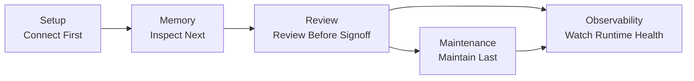
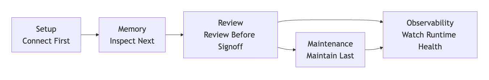
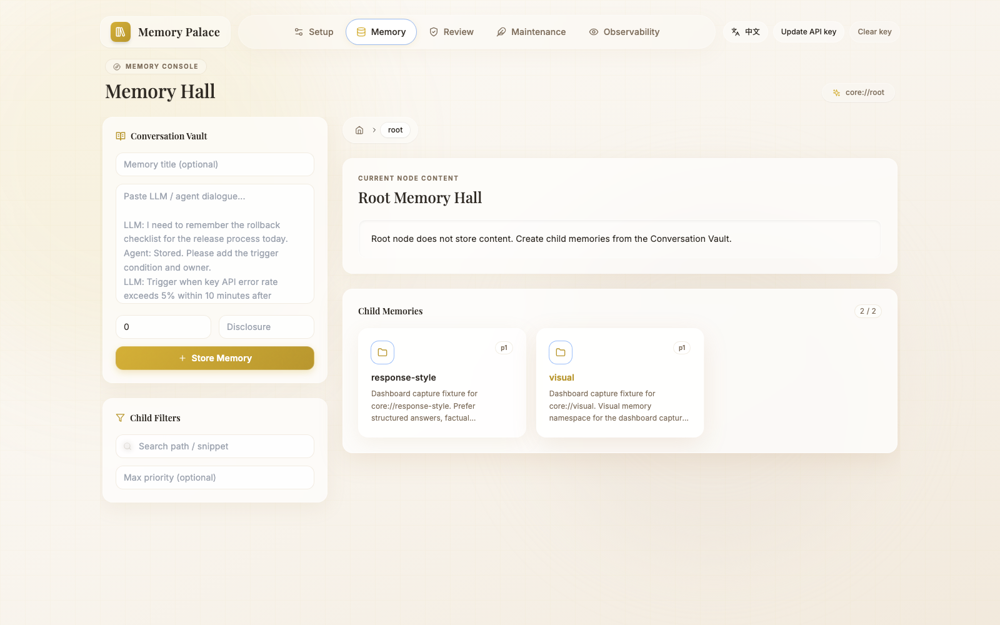
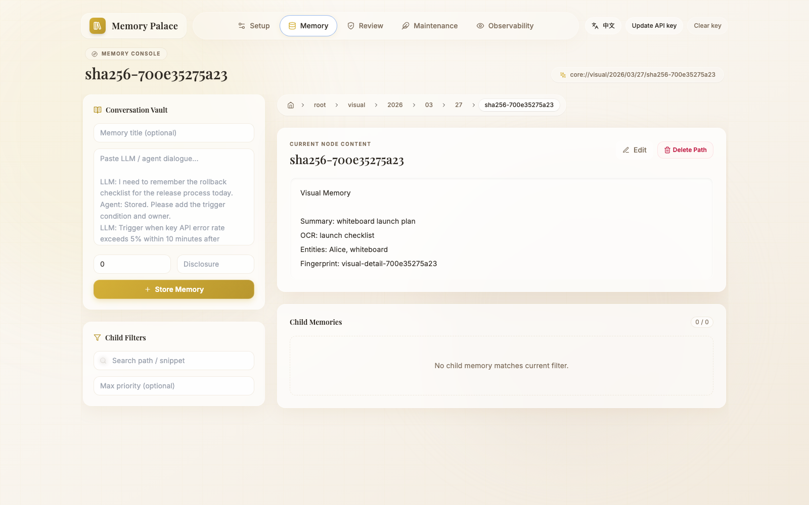
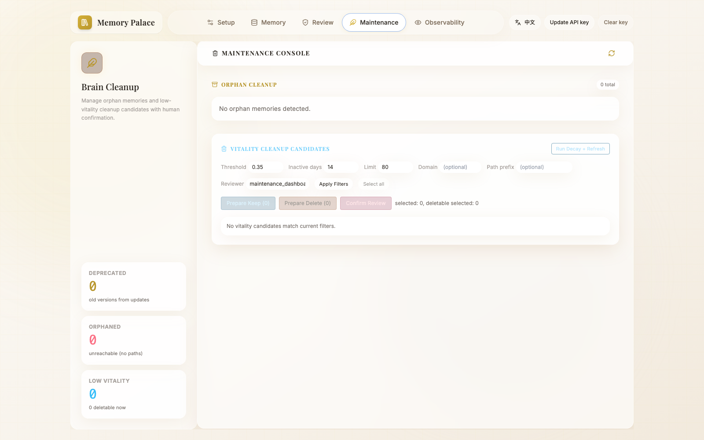
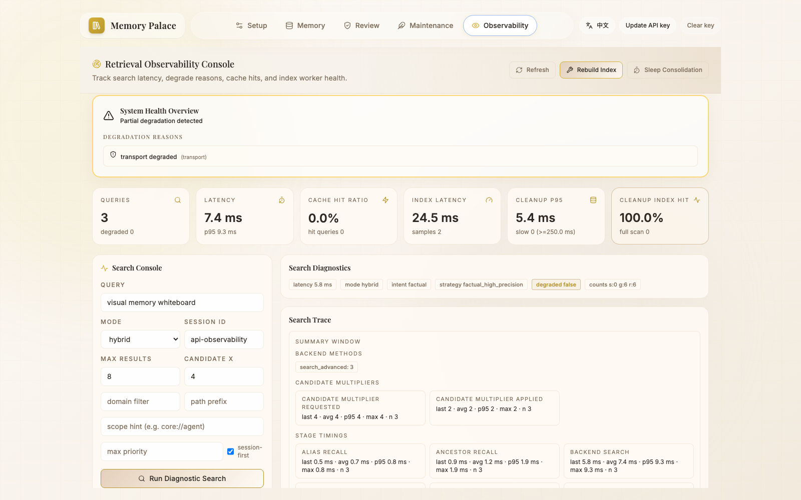

> [中文版](16-DASHBOARD_GUIDE.md)

# 16 · Dashboard Guide

This page covers one thing:

> **What this Dashboard is actually responsible for, and how to read it.**

The positioning is simple:

- it is the **companion operations surface** for the `memory-palace` OpenClaw plugin
- it is not the repository's main public product homepage
- the safer mental model is:
  - the OpenClaw plugin handles host integration
  - the CLI handles the most reliable command surface
  - the Dashboard visualizes setup / memory / review / maintenance / observability

If you have not installed the plugin yet, go back to:

- `01-INSTALL_AND_RUN.en.md`

If you only want to see what the real pages look like:

- `15-END_USER_INSTALL_AND_USAGE.en.md`

If you do not want to open the Dashboard and prefer a chat-first path:

- `18-CONVERSATIONAL_ONBOARDING.en.md`

---

## 1. The Current 5 Pages

The current frontend navigation consists of exactly 5 pages:

If your viewer does not render Mermaid, use this static image instead:

1. `Setup`
2. `Memory`
3. `Review`
4. `Maintenance`
5. `Observability`

One line per page:

- `Setup`
  - first-run setup and configuration
- `Memory`
  - browse and write memories
- `Review`
  - view snapshot diffs, rollback, confirm integration
- `Maintenance`
  - orphan cleanup and vitality cleanup
- `Observability`
  - retrieval diagnostics, queue state, and transport monitoring

---

## 2. Which Page to Look at First

### First-time connection

Start with:

1. `Setup`
2. `Memory`

### Troubleshooting

Prioritize:

1. `Observability`
2. `Review`
3. `Maintenance`

### Maintenance or pre-release review

Usually look at these together:

1. `Review`
2. `Maintenance`
3. `Observability`

---

## 3. What Each of the 5 Pages Does

### 3.1 Setup

The page title in the UI is:

- `Bootstrap Setup`

When you first open it, you mainly use it for 4 things:

- choose a starting path
- choose `mode / profile / transport`
- check whether model services are actually reachable
- write the configuration and trigger validation

The most important thing on this page is not “fill every field,” but:

- get `Profile B` working first
- move to `Profile C / D` only when providers are actually ready
- fill only the fields the chosen path really needs

What you actually see on the page is:

- `Most Users`
- `Local Dashboard`
- `Advanced Providers`

These entry points plus the `Path Strategy` section are mainly there to say:

- `Profile B` is the default first-run value
- `Profile C` is the recommended target once model services are ready
- `Profile D` is the full advanced-suite target

Screenshot:

One boundary matters here:

- the `Setup` page is the visual configuration entry
- but the most reliable sign-off still comes from the CLI:
  - `openclaw memory-palace verify --json`
  - `openclaw memory-palace doctor --json`
  - `openclaw memory-palace smoke --json`

After a successful submit, the page proactively clears secret fields such as:

- `MCP API key`
- embedding / reranker / LLM secrets

So if you plan to make a second configuration pass right away, you need to re-enter those secrets.

### 3.2 Memory

The page title in the UI is:

- `Memory Hall`

The left side shows:

- `Conversation Vault`
- `Child Filters`

The right side shows:

- current node content
- child memory list

In plain terms:

- the left side is for writing
- the right side is for reading

Screenshot:

This page also carries an important part of the current public message:

- the standalone static proof for visual memory now lives primarily on the Dashboard `Memory` page

Start with the root-level still:

It proves that:

- the `Memory Hall` root really contains a `visual` branch

Then use the node-detail still:

It proves that:

- the `core://visual/...` node page visibly contains `Visual Memory / Summary / OCR / Entities`

### 3.3 Review

The page title in the UI is:

- `Review Ledger`

It is not a casual browsing page. It is for:

- selecting a session
- viewing snapshot storage
- viewing diffs
- `Reject / Integrate`

More precisely, it is:

- the snapshot review area
- the rollback area

Screenshot:

### 3.4 Maintenance

The page title in the UI is:

- `Brain Cleanup`
- `Maintenance Console`

It is mainly split into:

- `Orphan Cleanup`
- `Vitality Cleanup Candidates`

So the focus of this page is not “edit memories,” but:

- clean up orphans
- run vitality-decay candidate checks
- prepare keep / delete review

Screenshot:

### 3.5 Observability

The page title in the UI is:

- `Retrieval Observability Console`

If you are troubleshooting, start here. It mainly covers:

- search diagnostics
- runtime snapshot
- write lanes
- transport diagnostics
- index task queue

Screenshot:

---

## 4. Most Common Dashboard Boundary Confusions

### 4.1 It Is Not a CLI Replacement

The safer relationship is:

- the CLI is the most reliable user command surface
- the Dashboard is the visual operations surface

### 4.2 It Is Not a Standalone Product Frontend

The public main line of this repository is still:

- the OpenClaw plugin

The Dashboard is a companion page for that plugin path, not “another product homepage.”

### 4.3 It Is Not Required for Every First Run

If you do not want to open the Dashboard, you can still take the chat-first path:

- `18-CONVERSATIONAL_ONBOARDING.en.md`

---

## 5. How This Page Works Together with the Other Pages

- for install steps and command boundaries:
  - `01-INSTALL_AND_RUN.en.md`
- for real WebUI pages and videos:
  - `15-END_USER_INSTALL_AND_USAGE.en.md`
- for chat-first install / probe / apply:
  - `18-CONVERSATIONAL_ONBOARDING.en.md`
- for recorded validation notes:
  - [../EVALUATION.en.md](../EVALUATION.en.md)
