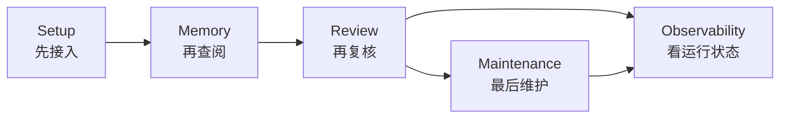
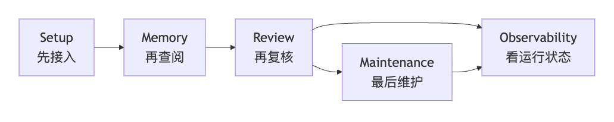
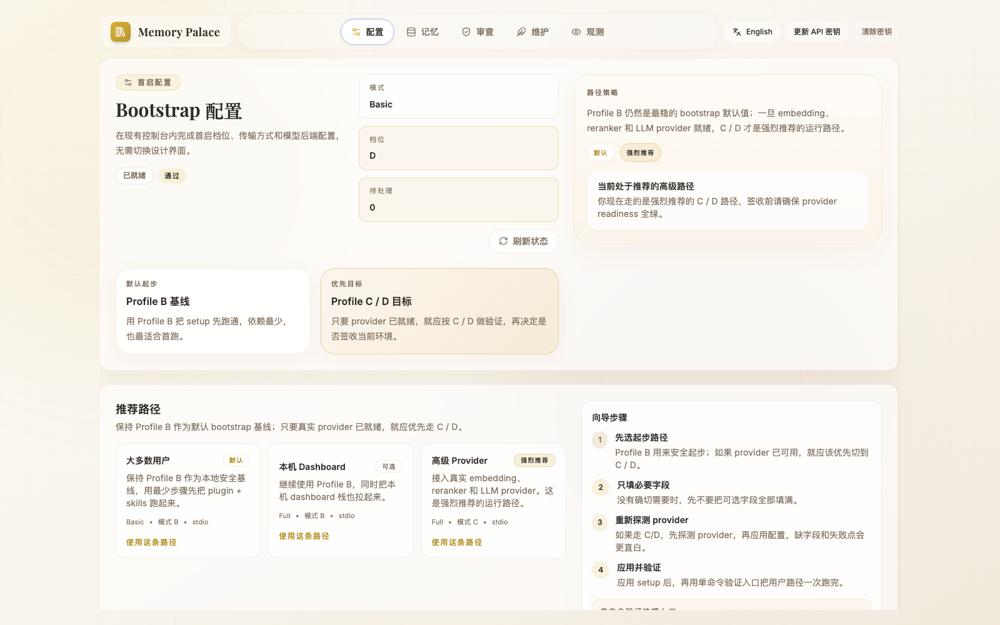
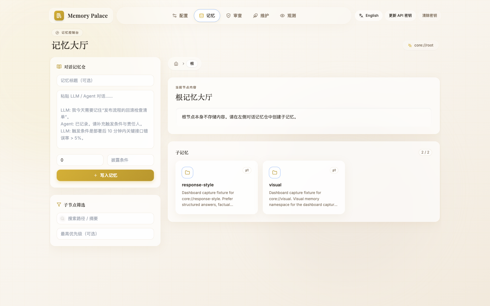
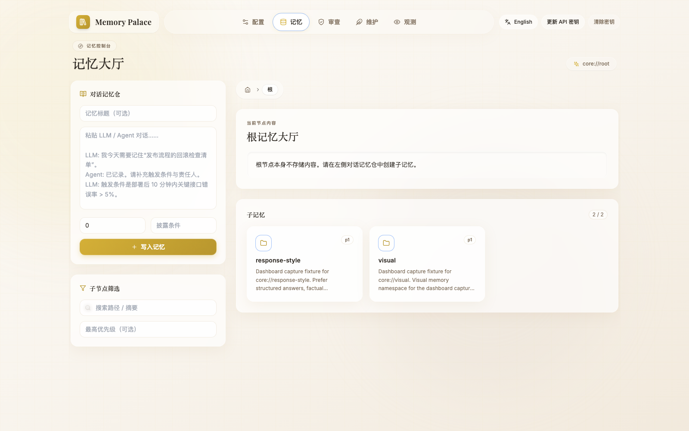
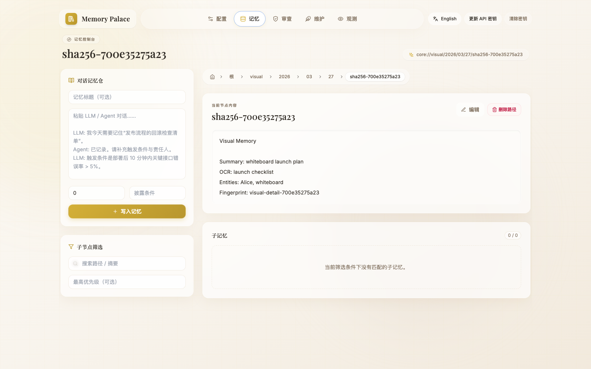
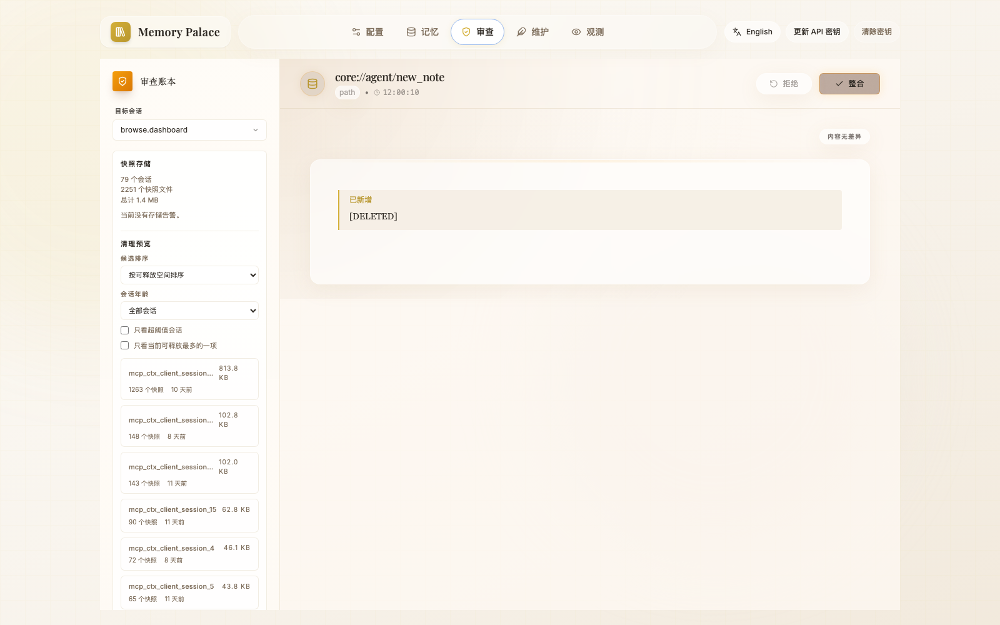

> [English](16-DASHBOARD_GUIDE.en.md)

# 16 · Dashboard 使用指南

这页只讲一件事：

> **当前这个 Dashboard 到底负责什么，应该怎么看。**

先把定位说清：

- 它是 `memory-palace` 这条 OpenClaw plugin 路线的**配套运行面**
- 不是仓库对外的主产品首页
- 更准确的理解是：
  - OpenClaw plugin 负责接进宿主
  - CLI 负责最稳的命令面
  - Dashboard 负责把 setup / memory / review / maintenance / observability 可视化

如果你还没装好 plugin，先回到：

- `01-INSTALL_AND_RUN.md`

如果你只是想先看真实页面长什么样：

- `15-END_USER_INSTALL_AND_USAGE.md`

如果你不想打开 Dashboard，想直接通过对话完成配置：

- `18-CONVERSATIONAL_ONBOARDING.md`

---

## 1. 当前有哪 5 个页面

当前前端导航就是 5 页：

如果当前查看器不渲染 Mermaid，可以直接看这张静态图：

1. `Setup`
2. `Memory`
3. `Review`
4. `Maintenance`
5. `Observability`

一句话理解：

- `Setup`
  - 首启和配置
- `Memory`
  - 看记忆、写记忆
- `Review`
  - 看快照 diff、回滚、确认集成
- `Maintenance`
  - 孤儿清理、vitality 清理
- `Observability`
  - 检索诊断、队列状态、transport 观测

---

## 2. 先看哪一页

### 你是第一次接通

先看：

1. `Setup`
2. `Memory`

### 你在排查问题

优先看：

1. `Observability`
2. `Review`
3. `Maintenance`

### 你在做维护或发布前复核

通常会一起看：

1. `Review`
2. `Maintenance`
3. `Observability`

---

## 3. 这 5 页分别干什么

### 3.1 Setup

界面上的标题是：

- `Bootstrap Setup`

第一次进来，你主要用它做 4 件事：

- 选起步路径
- 选 `mode / profile / transport`
- 检查模型服务是不是已经能用
- 写入配置并触发验证

当前页面里最重要的不是“把所有配置都填满”，而是：

- 先把 `Profile B` 作为默认起步档跑通
- 如果 provider 已就绪，再把环境提升到更推荐的 `Profile C / D`
- 只填这条路径真的需要的字段

界面上能直接看到：

- `Most Users`
- `Local Dashboard`
- `Advanced Providers`

这三条引导入口和 `Path Strategy` 区域，主要是在讲：

- `Profile B` 是默认值
- `Profile C` 是模型服务已经配好后的推荐目标
- `Profile D` 是全功能高级面的目标路径

配图：

这里要补一句边界：

- `Setup` 页是可视化配置入口
- 但最稳的安装与签收口径，仍然优先看 CLI：
  - `openclaw memory-palace verify --json`
  - `openclaw memory-palace doctor --json`
  - `openclaw memory-palace smoke --json`

这页提交成功后，会主动清空表单里的 secret 字段，比如：

- `MCP API key`
- embedding / reranker / LLM 这些密钥项

所以如果你打算马上改第二轮配置，需要重新填这些 secret。

### 3.2 Memory

界面上的标题是：

- `Memory Hall`

左侧是：

- `Conversation Vault`
- `Child Filters`

右侧是：

- 当前节点内容
- 子记忆列表

说人话就是：

- 左边负责写
- 右边负责看

配图：

这页还有一个当前公开口径里很关键的点：

- visual memory 的静态独立证据，现在主要放在 Dashboard `Memory` 页

先看这张根节点图：

它证明的是：

- `Memory Hall` 根节点下面确实已经有 `visual` 分支

再看这张节点详情图：

它证明的是：

- `core://visual/...` 节点页里，`Visual Memory / Summary / OCR / Entities` 都已经直接可见

### 3.3 Review

界面上的标题是：

- `Review Ledger`

它负责的不是普通浏览，而是：

- 选 session
- 看 snapshot storage
- 看 diff
- `Reject / Integrate`

更准确地说，它是：

- 快照复核区
- 版本回滚区

配图：

### 3.4 Maintenance

界面上的标题是：

- `Brain Cleanup`
- `Maintenance Console`

它主要分两块：

- `Orphan Cleanup`
- `Vitality Cleanup Candidates`

也就是说，这页重点不是“编辑记忆”，而是：

- 清理孤儿
- 跑活力衰减后的候选检查
- 准备 keep / delete review

配图：

### 3.5 Observability

界面上的标题是：

- `Retrieval Observability Console`

如果你是在排查问题，先看这页。它主要负责：

- 搜索诊断
- runtime snapshot
- write lanes
- transport diagnostics
- index task queue

配图：

---

## 4. Dashboard 最容易误会的边界

### 4.1 它不是替代 CLI

更准确的关系是：

- CLI 是最稳的用户命令面
- Dashboard 是可视化运行面

### 4.2 它不是独立产品前台

当前仓库对外主线仍然是：

- OpenClaw plugin

Dashboard 是这条 plugin 路线的配套页面，不是“另一个产品首页”。

### 4.3 它不是第一次使用的必选项

如果你不想打开 Dashboard，也可以直接走：

- `18-CONVERSATIONAL_ONBOARDING.md`

---

## 5. 这页应该怎么和别的页面配合看

- 想看安装和命令边界：
  - `01-INSTALL_AND_RUN.md`
- 想看真实 WebUI 页面和视频：
  - `15-END_USER_INSTALL_AND_USAGE.md`
- 想直接通过对话完成 install / probe / apply：
  - `18-CONVERSATIONAL_ONBOARDING.md`
- 想看当前记录在案的验证说明：
  - [../EVALUATION.md](../EVALUATION.md)
