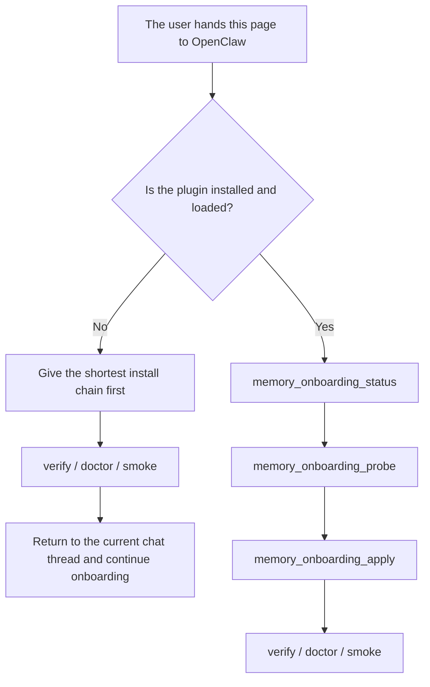
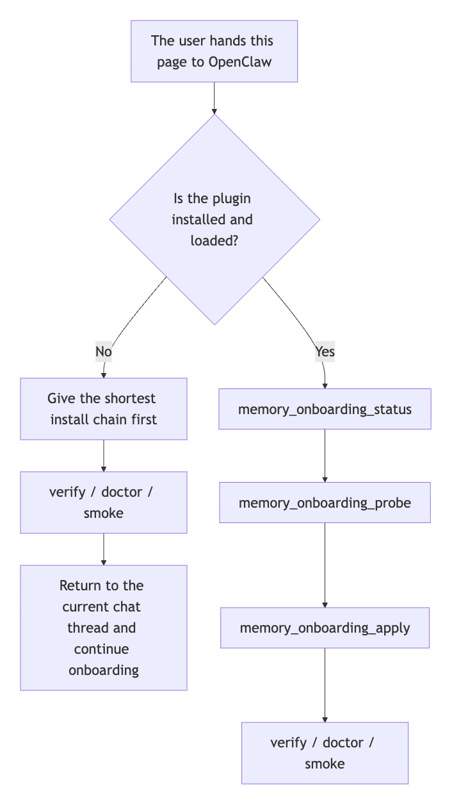
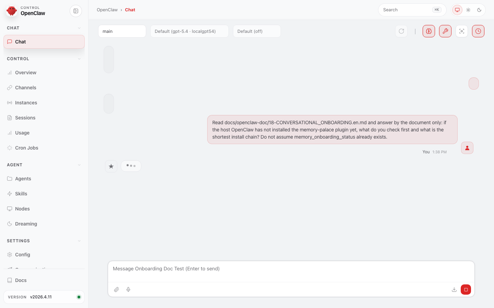
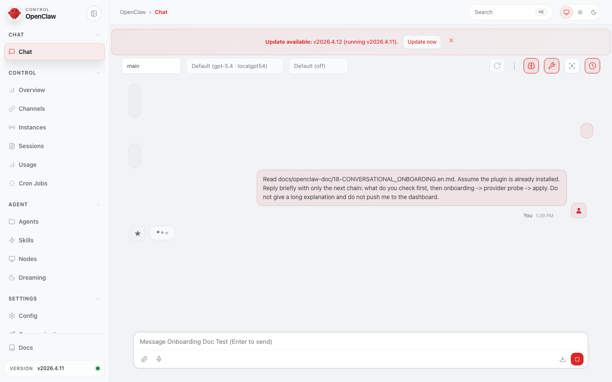
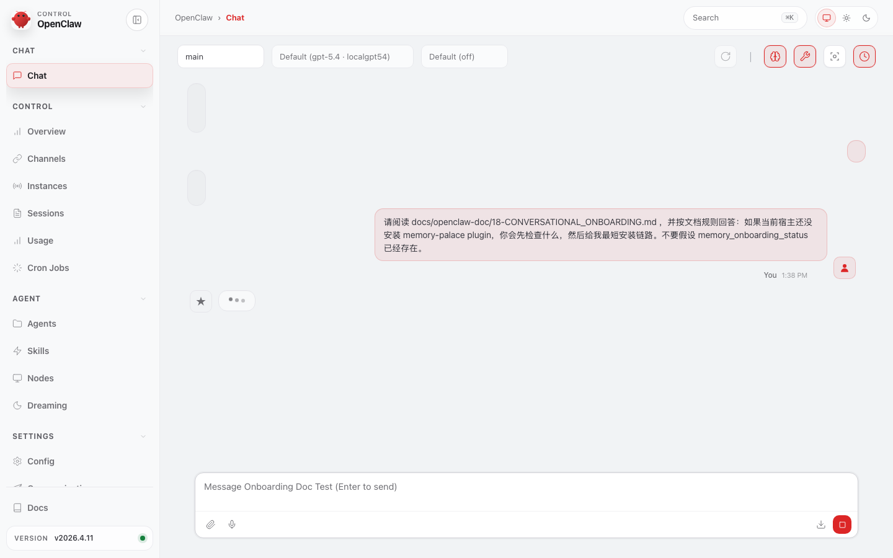

> [中文版](18-CONVERSATIONAL_ONBOARDING.md)

# 18 · Conversational Onboarding

<p align="center">
  
</p>

This page answers one question:

> **If you do not want to open the Dashboard, how do you connect Memory Palace to OpenClaw through conversation?**

Good fit:

- you are on a VPS or remote host
- you prefer terminal or chat over a local Dashboard
- you want OpenClaw to handle installation first, collect provider settings step by step, and then continue onboarding
- you want OpenClaw to first check whether the host already has reusable embedding / reranker / LLM settings before asking the user to fill anything
- you want the recommended starting path for a normal user, not a terminal-first fallback

Keep one boundary explicit up front:

- this page describes **chat-guided install/configuration**
- when the plugin is not installed yet, OpenClaw should still give the shortest install chain first
- it does **not** mean chat can always finish the whole apply path before installation exists
- the public docs now treat this page as the **recommended default starting path**

<p align="center">
  
</p>

---

## Recommended Reading Contract

For normal users, the intended order is:

1. Hand this page to OpenClaw first.
2. If OpenClaw says the plugin is not installed yet, follow the shortest install chain it gives you.
3. After installation, stay in the same chat thread and continue `memory_onboarding_status -> memory_onboarding_probe -> memory_onboarding_apply`.
4. After apply or setup, finish with `openclaw memory-palace verify / doctor / smoke`.

Two install shapes should currently be treated as downgraded, not default:

- the public npm spec `@openclaw/memory-palace` currently returns `Package not found on npm`
- `openclaw plugins install memory-palace` currently resolves to a skill rather than this plugin

So the current public reading is simple:

- start with this conversational onboarding page
- treat the source-checkout `setup` path as the shortest terminal fallback
- keep local `tgz` install only for users who explicitly want package validation

---

## Currently Confirmed Facts

This page now records only facts that are already confirmed. It does not write back private provider endpoints, API keys, or local env files.

The public proof set already includes:

- the same onboarding document has already been verified to drive the correct next step in CLI / WebUI, in installed / uninstalled states, in both Chinese and English
- that doc-chat test set also covers representative corner cases such as provider-probe failure, locked session files, and responses-boundary guidance
- for LLM provider input, `/responses` is only an accepted input alias; the main runtime path still goes through `/chat/completions`
- even if OpenClaw answers from this page alone, it should say this directly: **`/responses` is not the final runtime path, and the real main path is `/chat/completions`.**
- `openclaw plugins inspect memory-palace --json` confirms that the plugin can be loaded; some hosts also accept `openclaw plugins info memory-palace`
- `openclaw skills list` is not the install gate for the bundled onboarding skill
- detailed commands, counts, and caveats live in [../EVALUATION.en.md](../EVALUATION.en.md)

### Direct answer contract for `/responses`

If OpenClaw is answering only from this page and the user asks whether `/responses` is the final runtime path, answer with the sentence below directly instead of hedging:

> **`/responses` is only an accepted input alias, not the final runtime path; the real main path still goes through `/chat/completions`.**

This can also be stated in the shorter two-sentence form below:

> **`/responses` is not the final runtime path. The real main path is `/chat/completions`.**

This is the chat-first path compressed into one map:



If your viewer does not render Mermaid, use this static image instead:



Start with these 4 screenshots:

<p align="center">
  
</p>

<p align="center">
  
</p>

For the Chinese counterpart:

<p align="center">
  
</p>

<p align="center">
  
</p>

These images establish two separate truths:

- **when the plugin is not installed yet**, OpenClaw must not pretend `memory_onboarding_*` already exists and should instead give the shortest install chain first
- **when the plugin is already installed**, OpenClaw should stay in the same chat thread and continue through `memory_onboarding_status -> memory_onboarding_probe -> memory_onboarding_apply`; after `apply`, it should remind the user to run `verify / doctor / smoke`

If you prefer video first:

- [openclaw-onboarding-doc-flow.zh.burned-captions.mp4](./assets/real-openclaw-run/openclaw-onboarding-doc-flow.zh.burned-captions.mp4)
- [openclaw-onboarding-doc-flow.en.burned-captions.mp4](./assets/real-openclaw-run/openclaw-onboarding-doc-flow.en.burned-captions.mp4)

---

## 0. Advanced: If the User Hands This Page or the Local Doc Path to OpenClaw Directly

If you only want the normal user workflow, skip this section and continue with **Section 1**.

This page should not behave like a passive reference page only.

If the user pastes this page, or the checked-out local doc path for this page, into **CLI chat** or the **OpenClaw WebUI chat window**, the intended behavior is:

> **OpenClaw reads this page and then starts guiding installation, configuration, and validation in the current chat thread.**

Current public validation for this claim is intentionally narrow:

- it starts from either a checked-out local repo path or the local checkout doc path
- it covers handing the checked-out local page or local doc path to OpenClaw
- it does **not** claim that every host can fetch arbitrary public GitHub URLs on its own

So OpenClaw should make the repo-location branch explicit first:

1. **if the repo is already cloned locally, prefer the checked-out local doc path**
2. **if the repo is not cloned yet, tell the user to clone it first, then continue from the local doc page**
3. **only after the local repo/doc path exists should it continue the plugin-installed vs plugin-uninstalled branch**

If the user is already handing OpenClaw the checked-out local doc path for this page, that already means the repo exists locally. In that case, do **not** tell the user to clone again.

But one boundary must be explicit first:

- **before the `memory-palace` plugin is installed into the host OpenClaw, the onboarding tools do not exist yet**
- so OpenClaw must not assume that `memory_onboarding_status / probe / apply` are already callable

The correct order is:

1. **first determine whether the local repo / local doc path already exists**
2. **then determine whether the plugin is already installed / loaded**
3. **if not installed yet, guide installation first**
4. **only after installation continue the conversational onboarding flow**

That means this page now serves two phases at once:

- the **before-install entry**
- the **chat-first setup entry after install**
- if the host already exposes chat-native plugin commands, OpenClaw should prefer to install directly in chat
- if the host does not expose chat-native plugin install, OpenClaw should still stay in the same conversation and provide the shortest executable command chain

### First decision OpenClaw should make after reading this page

OpenClaw should first determine which state the user is in:

1. **plugin / bundled skills are not installed yet**
2. **plugin is installed, but the first basic setup is not complete yet**
3. **plugin is installed, the basic setup is complete, and the user only needs provider probe / apply / verify**

Do not use `openclaw skills list` as the definitive install check for the bundled onboarding skill on Windows. Prefer `openclaw plugins inspect memory-palace --json` first, then confirm with `verify / doctor` if needed.

Only states 2 and 3 should go directly into `memory_onboarding_status / probe / apply`.

Before that, OpenClaw should also do one more quick check:

- **look for reusable compatible model/provider settings already present on the host**
- for example existing OpenAI-compatible chat config, embedding / reranker endpoints, or provider entries already configured in the host
- if reusable pieces already exist, explain what can be reused first and only then ask what is still missing

### What OpenClaw should not do

- do not assume the onboarding skill is already available
- do not tell the user to call `memory_onboarding_*` before the plugin is installed
- do not push the user to Dashboard `/setup` by default
- do not ask the user to hand-fill a full `.env` file first

### The safest first prompt a user can paste into OpenClaw

If you want OpenClaw to start the flow directly from this page, this is the safest first sentence to paste:

```text
First determine whether this machine already has a checked-out copy of this repository and prefer the local doc path if it does. If I am already handing you the checked-out local doc path for this page, do not tell me to clone again. If the repo is not cloned yet, tell me to clone it first and then continue from the local doc page. Then determine whether the memory-palace plugin is already installed and loaded. If it is not installed yet, give me the shortest install chain first. For a checked-out repo, that shortest terminal fallback is `python3 scripts/openclaw_memory_palace.py setup --mode basic --profile b --transport stdio --json`; on Windows PowerShell, use `py -3 scripts/openclaw_memory_palace.py setup --mode basic --profile b --transport stdio --json`; then `openclaw memory-palace verify / doctor / smoke`. If it is already installed, continue with memory_onboarding_status -> memory_onboarding_probe -> memory_onboarding_apply. Reuse any provider settings already present on the host, do not push me to the dashboard by default, start with Profile B when no full provider stack is ready yet, and if embedding + reranker + LLM are already ready, strongly recommend Profile D. Only after apply remind me to run openclaw memory-palace verify / doctor / smoke.
```

If you also want it to stay aligned with the current public validation language, add this:

```text
Do not call the setup ready just because env values exist. Only describe Profile C / D as ready after probe / verify / doctor / smoke actually pass. If provider probe fails, explain the failed provider in plain language, ask me to fix it, rerun provider-probe / memory_onboarding_probe, and only apply after the probe passes.
```

---

## 1. Core Entry

If the **plugin is already installed**, the safer first move is no longer to jump back to the repo CLI. The safer first move is:

- stay in the current OpenClaw chat
- confirm that the plugin is actually installed and loaded
- then continue with the onboarding tools: `memory_onboarding_status -> memory_onboarding_probe -> memory_onboarding_apply`
- after apply, use `verify / doctor / smoke` for the final sign-off

The repo CLI `onboarding --json` path still exists, but it is now better treated as:

- a terminal-side fallback
- or a terminal-side way to inspect the readiness report directly

The repo CLI fallback command is:

```bash
python3 scripts/openclaw_memory_palace.py onboarding --profile c --json
```

If you only want the safest first-run baseline first:

```bash
python3 scripts/openclaw_memory_palace.py onboarding --profile b --json
```

On Windows PowerShell, run the same fallback with `py -3`:

```powershell
py -3 scripts/openclaw_memory_palace.py onboarding --profile c --json
py -3 scripts/openclaw_memory_palace.py onboarding --profile b --json
```

The same Windows PowerShell rule applies to later repo CLI fallback examples on this page, including `provider-probe`, `onboarding --apply --validate`, and `setup`.

This is still **read-only readiness output**. It does not install the plugin,
does not apply configuration, and does not replace the actual `setup` step.

This command returns a chat-friendly structured readiness report that includes:

- the recommended profile path
- the boundary between `Profile B` and `Profile C / D`
- which provider fields the user still needs to supply
- the current provider probe result
- embedding-dimension detection and the recommended value
- concrete next actions

In other words:

- `onboarding --json` is a **structured report**
- it is not itself the local terminal's field-by-field questionnaire
- the true field-by-field interactive prompt still belongs to local TTY `setup`
- only `setup ...` or `onboarding --apply --validate ...` actually change the host configuration
- on Windows PowerShell, use `py -3` for the repo-wrapper commands in this section

If you already collected embedding, reranker, and LLM information and want OpenClaw to apply them directly:

```bash
python3 scripts/openclaw_memory_palace.py onboarding --profile c --apply --validate --json
```

Here, `validate` means:

- run `verify` after apply
- then run `doctor`
- then run `smoke`

If this result also reports `restartRequired=true`, the safer next step is:

- restart the current OpenClaw host / gateway first
- then re-check the active profile, provider probe state, and chat-visible behavior
- do not call the setup fully ready before the host has actually reloaded

This onboarding command also distinguishes Chinese and English user-facing output through `LANG` / locale:

- with `LANG=zh_*`, summary and next-step guidance are emitted in Chinese
- with `LANG=en_*`, the same report is emitted in English

---

## 2. Which Install Command OpenClaw Should Prefer First

Start by clarifying the boundary of the two public-looking plugin-install commands:

- `openclaw plugins install @openclaw/memory-palace`
- `openclaw plugins install memory-palace`

The real result today is:

- the npm spec currently returns `Package not found on npm`
- the plain `memory-palace` install currently resolves to a skill rather than a plugin

So the safer public reading is:

- do **not** treat either of those as the default install path
- start with this onboarding page first
- if the repo is not cloned yet, clone it first; if it is already cloned, prefer the checked-out local doc path
- if OpenClaw determines that the plugin is not installed yet and the user is already in a repository checkout on the same machine, use the source-checkout path below as the shortest terminal fallback

```bash
python3 scripts/openclaw_memory_palace.py setup --mode basic --profile b --transport stdio --json
openclaw memory-palace verify --json
openclaw memory-palace doctor --json
openclaw memory-palace smoke --json
```

On Windows PowerShell, the same fallback is `py -3 scripts/openclaw_memory_palace.py setup --mode basic --profile b --transport stdio --json`.

This path will:

- prepare the runtime under `~/.openclaw/memory-palace`
- write `plugins.allow / plugins.load.paths / plugins.slots.memory / plugins.entries.memory-palace` into the host OpenClaw config
- ship the bundled skills together with the plugin

### If the user explicitly wants a local `tgz`

This path is reserved for advanced cases:

- the user already has a trusted local package
- or the user explicitly wants to validate the clean-room / package shape

If the user needs to build a local package from this repository first, start with:

```bash
cd extensions/memory-palace
npm pack
```

Then install that local `tgz` using the **exact requirement of the current host build**. Different OpenClaw builds may handle trust / install flags for local packages differently, so this page should not hard-code one local-package install flag as if it were universal.

After installation, use the packaged entry for setup first:

```bash
openclaw plugins install ./<generated-tgz>
npm exec --yes --package ./<generated-tgz> memory-palace-openclaw -- setup --mode basic --profile b --transport stdio --json
```

Then return to the stable user command surface for sign-off:

```bash
openclaw memory-palace verify --json
openclaw memory-palace doctor --json
openclaw memory-palace smoke --json
```

If your current host build requires an extra trust flag for local tarballs, add the exact flag that host version asks for when running `openclaw plugins install ./<generated-tgz>`.

---

## 3. What OpenClaw Should Ask Next After Installation

As soon as installation succeeds, OpenClaw should continue in the same chat thread and ask:

1. whether the user wants a **zero-external-dependency first run** or an **advanced capability path**
2. whether to stay on **`Profile B`** or move to **`Profile C / D`**
3. which existing host-side settings can be reused directly
4. which provider fields are still missing
5. when to probe and when to apply

So the correct model is:

- **installation is only the first segment**
- **the real goal of this page is still chat-first onboarding**

OpenClaw should explain profiles using this model:

- **Profile B**: default zero-config first-run path
- **Profile C**: embedding + reranker on by default, then explicitly ask whether to enable the optional LLM assist suite
- **Profile D**: full advanced suite, where embedding + reranker + the LLM assist suite are all part of the default target

If the user asks what the optional LLM assists do, OpenClaw should explain:

- `write_guard`: filters risky, contradictory, or low-quality durable writes before commit
- `compact_gist`: makes `compact_context` output more stable and more reusable as a summary
- `intent_llm`: improves ambiguous-query intent classification and routing

### LLM endpoint boundary

When this page talks about provider inputs, the safer public wording is:

- an OpenAI-compatible base URL is the real input target
- `/responses` is only an **accepted input alias**
- `/responses` is **not** presented here as the final runtime path
- the main runtime path still goes through `/chat/completions`

If OpenClaw is answering only from this page, the safest wording should stay close to:

> **`/responses` is only an accepted input alias, not the final runtime path; the real main path still goes through `/chat/completions`.**

Do not answer that this page is silent about the main path. This page already states:

- `/responses` is not the final runtime path
- the real main path still goes through `/chat/completions`

### If provider probe fails

OpenClaw should explain it in plain language and keep the next action explicit:

- say which provider failed and what looks wrong first: base URL, API key, model name, or reachability
- do **not** describe `Profile C / D` as ready yet
- do **not** blindly apply unless the user explicitly wants a temporary safe fallback to `Profile B`
- ask the user to fix the failed item and rerun `python3 scripts/openclaw_memory_palace.py provider-probe --json` or `memory_onboarding_probe`
- on Windows PowerShell, that repo-wrapper retry is `py -3 scripts/openclaw_memory_palace.py provider-probe --json`
- only after the probe passes should it continue to apply

---

## 4. The Safer Public Wording

The stable public wording for this page is:

- `Profile B`: default zero-config first-run path
- `Profile C`: provider-backed retrieval step, with embedding + reranker enabled by default
- `Profile D`: full advanced path when embedding + reranker + the LLM assist suite are all part of the target
- “ready” does not mean “env is filled”
- the real threshold is still whether `probe / verify / doctor / smoke` pass in the target environment

If you want the full WebUI page and video proof, go back to:

- [15-END_USER_INSTALL_AND_USAGE.en.md](15-END_USER_INSTALL_AND_USAGE.en.md)

If you want the recorded validation notes, go to:

- [../EVALUATION.en.md](../EVALUATION.en.md)
