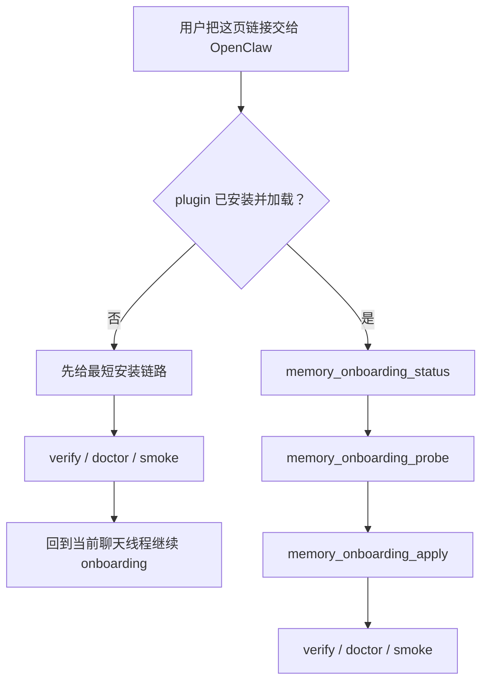
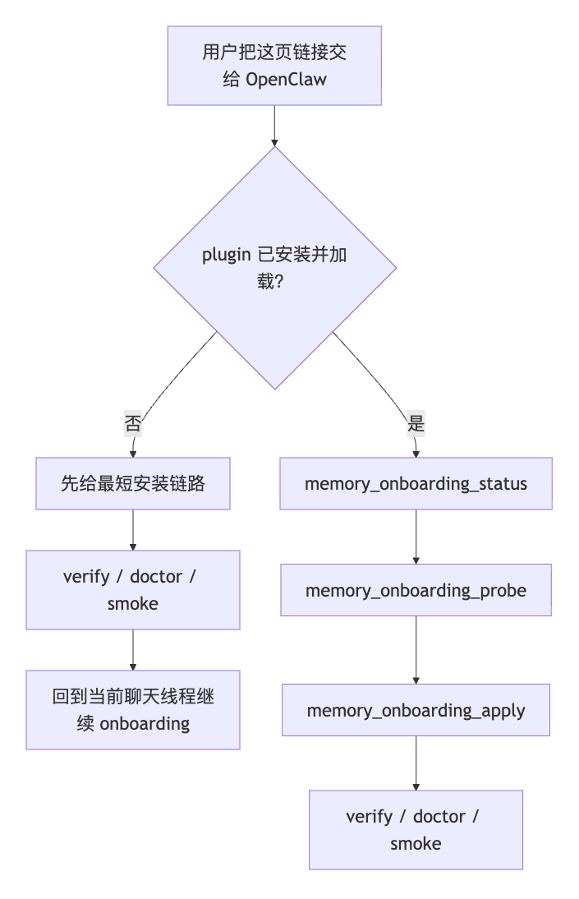

> [English](18-CONVERSATIONAL_ONBOARDING.en.md)

# 18 · 对话式 Onboarding

<p align="center">
  
</p>

这页只讲一件事：

> **如果你不想打开 Dashboard，怎样直接和 OpenClaw 对话，把 Memory Palace 接进来。**

适用场景：

- 你在 VPS / 远程主机上使用 OpenClaw
- 你更习惯终端或聊天，而不是本地 Dashboard
- 你希望 OpenClaw 用对话一步步完成安装、收集 provider 配置，再继续完成 onboarding
- 你希望 OpenClaw 先检查宿主里是否已经有可复用的 embedding / reranker / LLM 配置，再决定让用户补什么
- 你想走普通用户当前最推荐的入口，而不是先走终端 fallback

先把一个边界说死：

- 这页讲的是**聊天引导安装 / 配置**
- 如果 plugin 还没装，OpenClaw 仍然要先给最短安装链路
- 这不等于“还没安装时也能直接在聊天里完成全部 apply”
- 当前公开文档已经把这页当成**默认推荐起步页**

<p align="center">
  
</p>

---

## 默认阅读合同

对普通用户来说，当前更稳的顺序就是：

1. 先把这页交给 OpenClaw。
2. 如果 OpenClaw 说 plugin 还没装，就按它给出的最短安装链路继续。
3. 装好后留在同一个聊天线程里，继续 `memory_onboarding_status -> memory_onboarding_probe -> memory_onboarding_apply`。
4. apply 或 setup 完成后，再用 `openclaw memory-palace verify / doctor / smoke` 做最终签收。

有两种安装形态现在应该降级理解，不要当默认入口：

- 公开 npm spec `@openclaw/memory-palace` 当前会直接返回 `Package not found on npm`
- `openclaw plugins install memory-palace` 当前会解析成 skill，而不是这个 plugin

所以当前公开口径很简单：

- 先走这页的对话式 onboarding
- 把源码仓 `setup` 理解成最短终端 fallback
- 本地 `tgz` 安装只留给明确想验证 package 形态的用户

---

## 当前已经确认的事实

这页现在只写当前已经确认过的事实，不回填任何私有 provider 地址、私有 API key 或本机 env。

当前记录在案的公开证据包括：

- 同一份 onboarding 文档已经验证过可以在 CLI / WebUI、未安装 / 已安装、中英文这些主分支里给出正确下一步
- 这组 doc-chat 测试还覆盖了代表性的 corner case，例如 provider probe 失败、session 文件被占用、responses 边界提示
- 对 LLM provider 输入来说，`/responses` 只算 accepted input alias / 可接受输入别名；当前主 LLM 路径仍然走 `/chat/completions`
- 如果只根据这页回答，也要直接说：**`/responses` 不是最终 runtime path，当前真正主路径就是 `/chat/completions`。**
- `openclaw plugins inspect memory-palace --json` 可以确认 plugin 已加载；有些宿主也接受 `openclaw plugins info memory-palace`
- `openclaw skills list` 不是 bundled onboarding skill 的安装判断条件
- 详细命令、次数和补充说明统一看 [../EVALUATION.md](../EVALUATION.md)

### 这页对 `/responses` 的直接答法

如果 OpenClaw 只根据这页回答“`/responses` 是不是最终 runtime path”，就直接按下面这句说，不要绕开：

> **`/responses` 只算 accepted input alias，不是最终 runtime path；当前真正主路径仍然是 `/chat/completions`。**

也可以把它拆成两句直接说：

> **`/responses` 不是最终 runtime path。当前真正主路径就是 `/chat/completions`。**

先把对话式路径压成一张图：



如果当前查看器不渲染 Mermaid，可以直接看这张静态图：



先看这 4 张图：

<p align="center">
  
</p>

<p align="center">
  
</p>

如果你要英文对照：

<p align="center">
  
</p>

<p align="center">
  
</p>

这组图分别回答两件事：

- **未安装时**：OpenClaw 不会假装 `memory_onboarding_*` 已经存在，而是先给出最短安装链路
- **已安装时**：OpenClaw 会继续留在聊天线程里，按 `memory_onboarding_status -> memory_onboarding_probe -> memory_onboarding_apply` 这条链路往下走；`apply` 之后再提醒你跑 `verify / doctor / smoke`

如果你想先看视频：

- [openclaw-onboarding-doc-flow.zh.burned-captions.mp4](./assets/real-openclaw-run/openclaw-onboarding-doc-flow.zh.burned-captions.mp4)
- [openclaw-onboarding-doc-flow.en.burned-captions.mp4](./assets/real-openclaw-run/openclaw-onboarding-doc-flow.en.burned-captions.mp4)

---

## 0. 高级附录：如果用户把这页文档或本地文档路径直接交给 OpenClaw

如果你现在只想看普通用户怎么操作，可以先跳到**第 1 节**。

这页不应该只被当成“读完就结束”的说明文档。

如果用户在 **CLI** 或 **OpenClaw WebUI 聊天窗口**里直接贴这页文档，或者贴当前仓库里这页的本地文档路径，正确目标是：

> **OpenClaw 读完这页后，直接在当前聊天线程里开始给出安装、配置与验证的下一步引导。**

这里再把公开验证边界说清楚：

- 起点是“当前机器上已有本地 checkout 路径”或“已经能指向本地文档路径”
- 当前验证覆盖的是把当前仓库里的页面或本地文档路径交给 OpenClaw
- 这页**不把**“任意公开 GitHub URL 都能直接抓取并走通”写成默认承诺

所以 OpenClaw 还应该把 repo 位置这条分支先说清：

1. **如果仓库已经 clone 到本地，优先走本地 checkout 文档路径**
2. **如果仓库还没 clone，先告诉用户 clone，再继续从本地文档页往下走**
3. **只有本地 repo / 本地文档路径已经存在后，再进入 plugin 已装 / 未装这条分支**

如果用户当前已经把这页的本地 checkout 文档路径直接交给 OpenClaw，就说明本地 repo 已经存在。这种情况下，**不要**再让用户重复 clone。

但必须先说清一个边界：

- **在 `memory-palace` plugin 还没安装进宿主 OpenClaw 之前，`memory_onboarding_status / probe / apply` 这些 tool 还不存在**
- 所以 OpenClaw 不能一上来就假设自己已经能调用 onboarding tools

正确顺序必须是：

1. **先判断本地 repo / 本地文档路径是否已经存在**
2. **再判断 plugin 是否已经安装 / 加载**
3. **如果还没安装，先引导完成安装**
4. **安装完成后，再继续这条对话式 onboarding**

这也意味着：

- 这页现在同时承担“还没安装时先装”和“装好后继续配置”两段入口
- 不需要再拆成第二份安装前说明页
- 如果宿主已经启用了 chat-native plugin command，OpenClaw 应优先直接在聊天里完成安装
- 如果宿主没有开放 chat-native plugin install，OpenClaw 也不应把用户丢回“自己读文档”，而是要继续在当前对话里给出最短命令链

### OpenClaw 读到这页后的第一件事

OpenClaw 应该先判断用户当前属于哪一类：

1. **还没装 plugin / bundled skills**
2. **plugin 已装，但第一次基础配置还没完成**
3. **plugin 已装，基础配置也完成了，现在只是要继续 provider probe / apply / verify**

在 Windows 上，不要把 `openclaw skills list` 当成 bundled onboarding skill 的 definitive check。更稳的顺序是先看 `openclaw plugins inspect memory-palace --json`，再结合 `verify / doctor` 判断。

只有第 2 / 3 类，才应该直接进入 `memory_onboarding_status / probe / apply`。

在这之前，还应该顺手做一件事：

- **检查宿主当前是否已经存在可复用的兼容模型配置**
- 例如现有 OpenAI-compatible chat model、embedding / reranker 地址、或者用户已经在宿主里启用过的 provider
- 如果有可复用配置，就先把“可直接复用哪些项”告诉用户，再问还缺什么

### OpenClaw 不应该做什么

- 不要一上来就假设 onboarding skill 已经可用
- 不要在 plugin 还没装的时候让用户去调用 `memory_onboarding_*`
- 不要默认把用户推去 Dashboard `/setup`
- 不要让用户先手填完整 `.env`

### 用户直接贴给 OpenClaw 的最稳首句

如果你想让 OpenClaw 直接按这页规则开始做，可以直接贴这句：

```text
请先判断这台机器上是否已经有这个仓库的本地 checkout，并且优先走本地文档路径；如果我现在已经把这页的本地 checkout 文档路径交给你，就不要再让我重复 clone。只有在仓库还没 clone 时，才先告诉我 clone，再继续从本地文档页往下走。然后判断 memory-palace plugin 是否已经安装并加载；如果还没装，先给我最短安装链路。对于已经 checkout 到本地的源码仓，这条最短终端 fallback 就是 `python3 scripts/openclaw_memory_palace.py setup --mode basic --profile b --transport stdio --json`；如果是在 Windows PowerShell 里，就直接改成 `py -3 scripts/openclaw_memory_palace.py setup --mode basic --profile b --transport stdio --json`；然后再跑 `openclaw memory-palace verify / doctor / smoke`。如果已经装好，就继续按 memory_onboarding_status -> memory_onboarding_probe -> memory_onboarding_apply 帮我往下走。先检查宿主里是否已有可复用的 provider 配置或线索，不要默认把我推去 dashboard；如果当前没有完整 provider 栈，就先按 Profile B 起步；如果 embedding + reranker + LLM 都已经就绪，就强烈建议直接走 Profile D。如果我在 onboarding/setup 里只提供一套共享 LLM 的 API base + key + model，请默认把它当成 WRITE_GUARD / COMPACT_GIST / INTENT 的来源，并在 apply 之前把最终解析后的字段说明白。不要在这些 resolved 字段还是占位值时就把 Profile D 说成 ready。apply 之后再提醒我跑 openclaw memory-palace verify / doctor / smoke。
```

如果你想明确要求它按“当前公开验证口径”说话，再补一句：

```text
不要把“填了 env”说成“已经配好”；只有 probe / verify / doctor / smoke 真正通过，才算 Profile C / D 已就绪。对 Profile D 来说，还要求最终解析后的 WRITE_GUARD_* / COMPACT_GIST_* / INTENT_* 都不是占位值。如果 provider probe fail，要先用人话说明是哪条 provider 出问题，再让我修正后重跑 provider-probe / memory_onboarding_probe；只有 probe 通过后再 apply。
```

---

## 1. 核心入口

如果 **plugin 已经装好**，当前更稳的首选动作不是跳回 repo CLI，而是：

- 继续留在当前 OpenClaw 聊天里
- 先判断 plugin 是否真的已经安装并加载
- 然后继续走 onboarding tool：`memory_onboarding_status -> memory_onboarding_probe -> memory_onboarding_apply`
- apply 之后，再用 `verify / doctor / smoke` 做最终签收

repo CLI 里的 `onboarding --json` 仍然保留，但现在更适合作为：

- 终端 fallback
- 或者你明确想在终端里单独看一份 readiness 报告时再用

对应的 repo CLI fallback 命令是：

```bash
python3 scripts/openclaw_memory_palace.py onboarding --profile c --json
```

如果你当前只是想先跑通最稳基线，也可以用：

```bash
python3 scripts/openclaw_memory_palace.py onboarding --profile b --json
```

如果你在 Windows PowerShell 里跑，对应 fallback 直接写成：

```powershell
py -3 scripts/openclaw_memory_palace.py onboarding --profile c --json
py -3 scripts/openclaw_memory_palace.py onboarding --profile b --json
```

这页后面再出现的 repo CLI fallback，例如 `provider-probe`、`onboarding --apply --validate`、`setup`，在 Windows PowerShell 里也统一改成 `py -3`。

这里仍然只是**只读 readiness 报告**。它不会替你安装 plugin，不会真正 apply 配置，也不能替代真正的 `setup`。

这条命令会返回一份**对话友好**的结构化 readiness 报告，包含：

- 当前建议的 profile 路径
- `Profile B` 与 `Profile C / D` 的边界
- provider 还需要补哪些字段
- 当前 provider probe 结果
- embedding 维度探测与推荐值
- 下一步建议动作

也就是说：

- `onboarding --json` 是**结构化报告**
- 它本身不是本地终端里的逐项提问器
- 真正的逐项交互仍然属于本地 TTY 里的 `setup`
- 真正会改配置的，仍然只有 `setup ...` 或 `onboarding --apply --validate ...`
- 在 Windows PowerShell 里，这一节的 repo wrapper 命令统一用 `py -3`

如果你已经把 embedding / reranker / LLM 信息都收齐，并且想直接让 OpenClaw 代你 apply：

```bash
python3 scripts/openclaw_memory_palace.py onboarding --profile c --apply --validate --json
```

这里的 `validate` 指的是：

- apply 之后继续补跑 `verify`
- 再补跑 `doctor`
- 再补跑 `smoke`

如果这一步返回里带了 `restartRequired=true`，更稳的下一步是：

- 先重启当前 OpenClaw 宿主 / gateway
- 再重新看当前 profile、provider probe 和聊天里的实际表现
- 不要在宿主还没重载前，就把 setup 说成已经完全 ready

当前这条 onboarding 命令已经按 `LANG` / locale 区分中英文：

- `LANG=zh_*` 时，summary / next steps / 关键说明优先输出中文
- `LANG=en_*` 时，同一份结果会切成英文说明

---

## 2. OpenClaw 安装前应该先给哪条命令

先把两条看起来像公开 plugin 安装入口的命令边界讲清楚：

- `openclaw plugins install @openclaw/memory-palace`
- `openclaw plugins install memory-palace`

当前真实结果是：

- npm spec 现在会直接返回 `Package not found on npm`
- 直接写 `memory-palace` 当前会被解析成 skill，而不是 plugin

所以当前更稳的公开口径是：

- 不要把这两条当默认安装入口
- 先走这页的 onboarding
- 如果仓库还没 clone，先 clone；如果已经 clone，优先走本地 checkout 文档路径
- 如果 OpenClaw 判断 plugin 还没装，而且用户已经在同一台机器上的源码仓目录里，再把下面这条源码仓路径当成最短终端 fallback

```bash
python3 scripts/openclaw_memory_palace.py setup --mode basic --profile b --transport stdio --json
openclaw memory-palace verify --json
openclaw memory-palace doctor --json
openclaw memory-palace smoke --json
```

如果你在 Windows PowerShell 里跑，对应 fallback 直接写成 `py -3 scripts/openclaw_memory_palace.py setup --mode basic --profile b --transport stdio --json`。

这条路径会：

- 准备 `~/.openclaw/memory-palace` 下的 runtime
- 把 `plugins.allow / plugins.load.paths / plugins.slots.memory / plugins.entries.memory-palace` 写进宿主 OpenClaw 配置
- 把 bundled skills 一起带进宿主

### 如果用户明确要验证本地 `tgz`

这条路径只保留给高级场景：

- 用户手里已经有受信任的本地包
- 或者用户就是要验证 clean-room / package 形态

如果用户要从当前源码仓先构建本地包，先执行：

```bash
cd extensions/memory-palace
npm pack
```

然后按**当前宿主构建实际要求**安装这个本地 `tgz`。最短模板先写成：

```bash
openclaw plugins install ./<generated-tgz>
```

如果你这台宿主的当前版本还要求额外 trust flag，就按那一版宿主提示补上同一条 flag，不要把某一个宿主版本的额外 flag 写死成所有宿主都一样。

安装完成后，先用包内入口完成 setup：

```bash
npm exec --yes --package ./<generated-tgz> memory-palace-openclaw -- setup --mode basic --profile b --transport stdio --json
```

然后回到稳定用户命令面签收：

```bash
openclaw memory-palace verify --json
openclaw memory-palace doctor --json
openclaw memory-palace smoke --json
```

---

## 3. 装完之后 OpenClaw 应该继续问什么

只要安装完成，OpenClaw 后续在同一个聊天线程里就应该继续问：

1. 你是要 **零外部依赖直接起步**，还是要 **进入高级能力路径**
2. 当前是保持 **`Profile B`**，还是进入 **`Profile C / D`**
3. 宿主里已有配置哪些可以直接复用
4. 还缺哪些 provider 字段
5. 什么时候先 probe，再什么时候 apply

也就是说：

- **安装只是第一段**
- **这页真正的目标仍然是让 OpenClaw 在聊天里继续完成 onboarding**

OpenClaw 后续对 profile 的解释应该统一成下面这套：

- **Profile B**：默认零配置起步档，推荐给“先跑通再说”的用户
- **Profile C**：默认启用 embedding + reranker；然后要明确问用户是否开启可选 LLM 辅助套件
- **Profile D**：面向“全功能高级面”，默认目标就是 embedding + reranker + LLM 辅助套件一起开启

如果用户问 “这些 LLM 辅助到底在干嘛”，OpenClaw 应该直接解释：

- `write_guard`：在 durable write 落盘前筛掉低质量、矛盾或不该写入的内容
- `compact_gist`：把 `compact_context` 压缩结果做得更稳定、更像可复用摘要
- `intent_llm`：补强模糊查询的 intent 分类与路由判断

### shared LLM 自动扇出与 Profile D ready 边界

如果用户在 `setup` 或对话式 onboarding 里只提供一套共享 LLM 配置，
OpenClaw 后续应该明确解释：这套输入会作为下面三组 resolved runtime
字段的默认来源：

- `WRITE_GUARD_*`
- `COMPACT_GIST_*`
- `INTENT_*`

只有同时满足下面两条，OpenClaw 才应该把 `Profile D` 说成 ready：

- 最终解析后的 `WRITE_GUARD_*`、`COMPACT_GIST_*`、`INTENT_*` 都不是占位值
- 目标环境里的真实 `probe / verify / doctor / smoke` 都通过

如果用户不是走 `setup` / `onboarding`，而是手工改静态 env 模板，
OpenClaw 应该明确建议：把这些 resolved 字段也显式填满，不要留 placeholder，
否则仍可能触发降级 / 回退。

### LLM endpoint 边界

这页讲 provider 输入时，更稳的公开说法是：

- 真正收的是 OpenAI-compatible base URL
- `/responses` 只算 **accepted input alias / 可接受输入别名**
- `/responses` **不是**这页里的最终 runtime path
- 当前主 LLM 路径仍然走 `/chat/completions`

如果 OpenClaw 只根据这页回答“`/responses` 是不是最终 runtime path”，更稳的说法应该尽量接近这句：

> **`/responses` 只算 accepted input alias，不是最终 runtime path；当前真正主路径仍然是 `/chat/completions`。**

不要把这页回答成“文档没有明确主路径”。这页已经明确写了：

- `/responses` 不是最终 runtime path
- 当前真正主路径仍然是 `/chat/completions`

### 如果 provider probe fail

OpenClaw 后续应该用人话把下一步说清楚：

- 先明确说是哪条 provider 失败了，看起来更像是哪类问题：base URL、API key、模型名，还是可达性
- 这时候不要把 `Profile C / D` 说成 ready
- 不要在用户没确认的情况下，直接把“继续 apply”当默认动作
- 先让用户修正失败项，再重跑 `python3 scripts/openclaw_memory_palace.py provider-probe --json` 或 `memory_onboarding_probe`
- 如果是在 Windows PowerShell 里，这条 repo wrapper retry 写成 `py -3 scripts/openclaw_memory_palace.py provider-probe --json`
- 只有 probe 通过后，再继续 apply

---

## 4. 当前更稳的公开说法

当前这页对应的公开口径可以稳定表达为：

- `Profile B`：默认零配置起步档
- `Profile C`：先升级到 provider-backed retrieval，embedding + reranker 默认开启
- `Profile D`：embedding + reranker + LLM 辅助套件都要开的全功能高级档；如果 onboarding/setup 只收到一套 shared LLM，就默认扇出到 `WRITE_GUARD_*`、`COMPACT_GIST_*`、`INTENT_*`
- “ready” 不等于“env 填了”
- 只有 `probe / verify / doctor / smoke` 在你的目标环境真实通过，才算真正就绪
- 对 `Profile D` 来说，最终解析后的 `WRITE_GUARD_*`、`COMPACT_GIST_*`、`INTENT_*` 还必须都不是占位值
- 如果用户是手工改静态 env 文件，而不是走 onboarding/setup，应该建议他显式填写这些 resolved 字段，不要依赖模板占位值

如果你想看完整用户页面和视频，回到：

- [15-END_USER_INSTALL_AND_USAGE.md](15-END_USER_INSTALL_AND_USAGE.md)

如果你想看当前记录在案的验证说明，直接看：

- [../EVALUATION.md](../EVALUATION.md)
