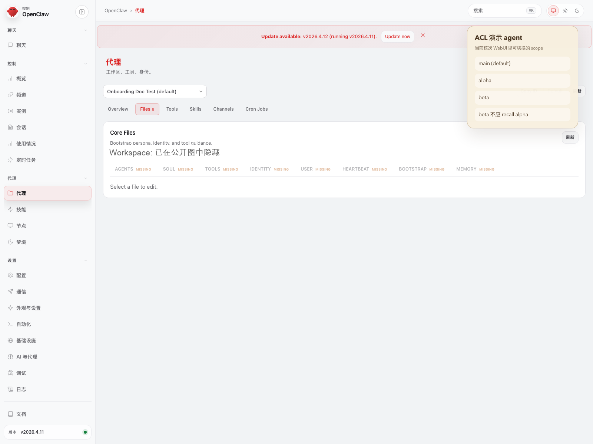
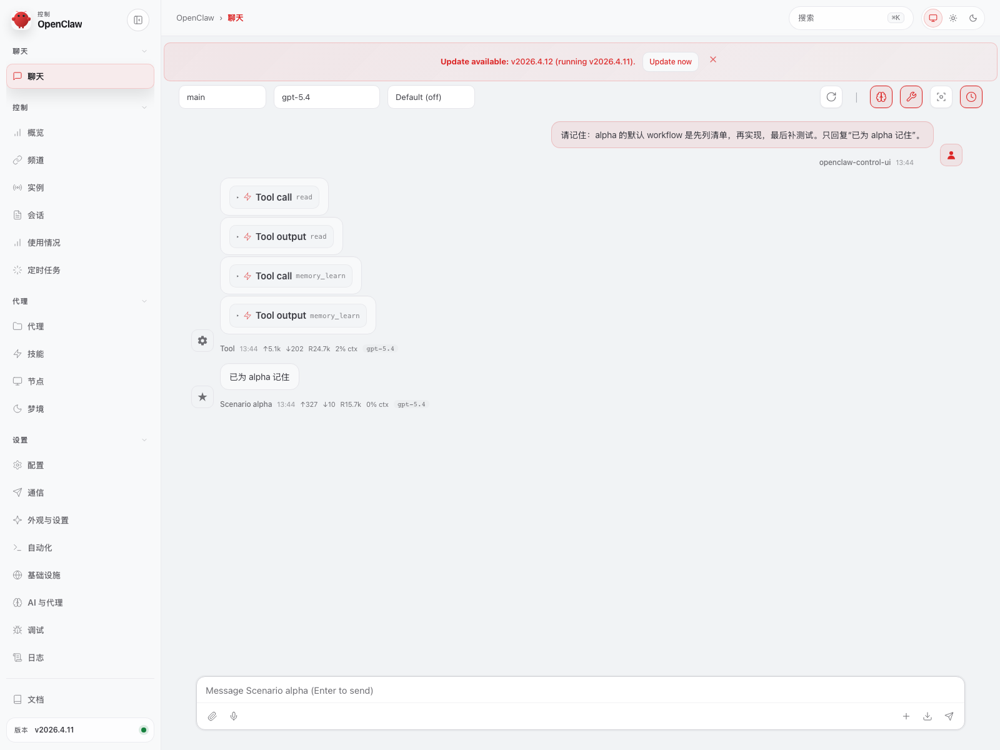
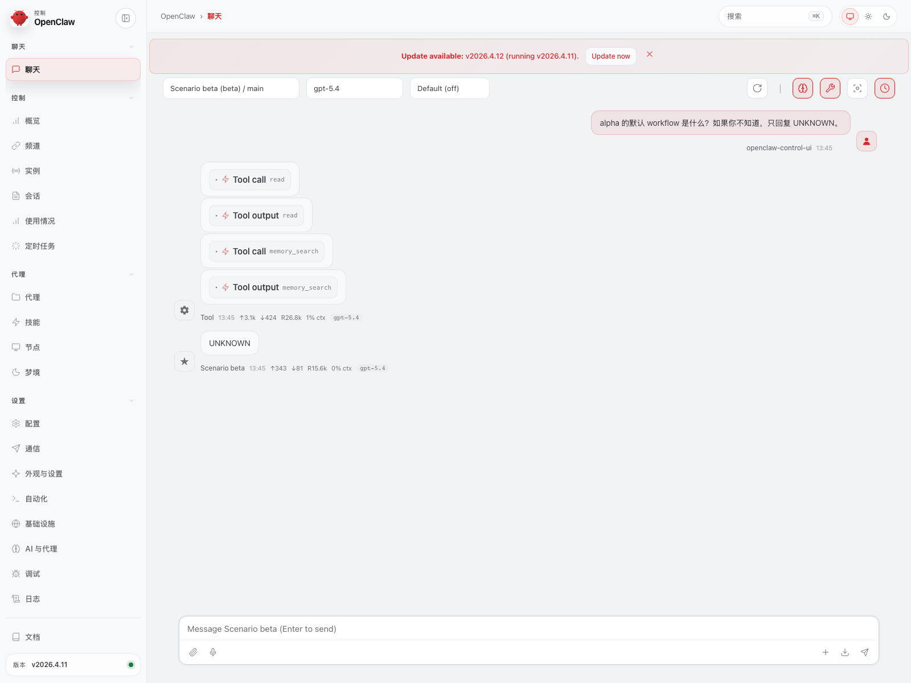

> [English](24-AGENT_ACL_ISOLATION.en.md)

# 24 · 多 Agent 记忆隔离（ACL）快速指南

这页现在只讲一件事：

> **怎样让用户看懂：`alpha` 先存进记忆，`beta` 仍然读不到它；如果你要开这层隔离，又该怎么配。**

先把 `ACL` 这三个字讲成人话：

> **这里的 ACL，当前更准确地说是“实验性的多 Agent 记忆隔离”。开了以后，当前已验证的 plugin 主路径里，每个 agent 默认会收紧到自己那一块长期记忆，但它还不是已经完全硬化的安全边界。**

如果你还没把插件接起来，先看：

1. [01-INSTALL_AND_RUN.md](01-INSTALL_AND_RUN.md)
2. [15-END_USER_INSTALL_AND_USAGE.md](15-END_USER_INSTALL_AND_USAGE.md)
3. [18-CONVERSATIONAL_ONBOARDING.md](18-CONVERSATIONAL_ONBOARDING.md)

如果你已经 clone 到本地，还想补看单页总览 HTML，再按需打开：

- [23-PROFILE_CAPABILITY_BOUNDARIES.html](23-PROFILE_CAPABILITY_BOUNDARIES.html)

---

## 1. 如果你是来开启 ACL，先做这 3 步

1. 先跑：

```bash
openclaw config file
```

2. 在当前正在生效的 `openclaw.json` 里，找到：

- `plugins.entries.memory-palace.config.acl`

3. 把 `enabled` 改成 `true`，再按你自己真实在用的 agent id 填：

- `allowedUriPrefixes`
- `writeRoots`

改完后重启 gateway，再按后面的 `alpha -> beta -> UNKNOWN` 路线验收。

如果你想让 OpenClaw 帮你改，直接跳到下面的 **6.2**。

---

## 2. 先说当前公开结论

当前 `memory-palace` 的多 agent ACL：

- **当前应按实验特性理解**
- **默认不启用**
- **启用后仍然可以在 OpenClaw WebUI 里被直接看见**
- 最新一轮 profile-matrix 记录里，已经复现当前 `A / B / C / D + ACL` 的实验行为
- 当前公开 ACL 截图和视频，继续能支撑这页要表达的 `alpha -> stored`、`beta -> UNKNOWN` 证据链

更准确地说：

- 不开 ACL 时，多 agent 长期记忆不一定是严格边界
- 开了 ACL 后，当前已验证的 plugin 主路径里，真正改变的是每个 agent 能看到哪块长期记忆、能往哪块写
- 这个变化最后会反映到用户在 WebUI 里看到的 recall block 与回答结果
- 但当前设计在后端 / 直连 API 这一层还没完全硬化，所以这页不能当成“严格安全边界已经完成”的承诺
- 最新一轮隔离 ACL 记录继续符合这条结论：
  - `alpha` 写入后，`alpha` 自己能 recall
  - `beta` 和 `main` 继续回答 `UNKNOWN`

如果你只想记一句：

- **不开 ACL**：多个 agent 之间不保证严格隔离
- **开 ACL**：当前实验路径里，每个 agent 默认会收紧到自己那一块长期记忆，但还不要把它当成已经完全硬化的安全边界

---

## 3. WebUI 里最直观的验证方法

最稳的用户视角验证顺序现在是：

1. 在 `Agents` 页确认当前不是单 agent，而是 `main / alpha / beta`
2. 先切到 `alpha` 聊天，明确写入一条 workflow 记忆
3. 再切到 `beta` 聊天
4. 观察 recall block 只剩 `core://agents/beta/...`
5. 再问：

```text
What is alpha's default workflow? Reply UNKNOWN if you cannot know.
```

如果当前实验性 ACL 行为生效：

- `beta` 最终应该回答 `UNKNOWN`
- 这时 `UNKNOWN` 的含义不是“系统没记住”，而是“在这条已验证链路里，beta 没读到 alpha 那条长期记忆”
- 说人话就是：**alpha 记住了，但在这条录制链路里 beta 还是读不到**

---

## 4. 直接看视频

当前 ACL 场景视频已经统一改成**烧录字幕 MP4**：

- 中文：
  - [openclaw-control-ui-acl-scenario.zh.mp4](./assets/real-openclaw-run/openclaw-control-ui-acl-scenario.zh.mp4)
- English:
  - [openclaw-control-ui-acl-scenario.en.mp4](./assets/real-openclaw-run/openclaw-control-ui-acl-scenario.en.mp4)

这支视频现在的叙事顺序固定是：

- `Agents` 页看到 `main / alpha / beta`
- 进入 `alpha` 范围并写入一条记忆
- 再切到 `beta` 范围
- 看到 recall block 收缩到 `core://agents/beta/...`
- 问 `What is alpha's default workflow?`
- 回答 `UNKNOWN`

这次口径已经明确：

> **字幕烧录进 MP4，不再用 HTML overlay 字幕。**

---

## 5. 三张关键证据图

### 5.1 先在 `Agents` 页确认三个 agent



这里要看的不是样式，而是作用域主体：

- 当前 WebUI 里确实存在 `main / alpha / beta`
- 这一步展示的是当前实验性 ACL 叙事所依赖的 agent scope

### 5.2 再在 `alpha` 对话里明确写入记忆



这张图只看 2 件事：

1. 用户确实在 `alpha` 对话里让系统记住一条 workflow
2. WebUI 里也确实给出了“已为 alpha 记住”的确认回复

这一步是后面 ACL 证明的前提：必须先证明记忆真的写进去了。

### 5.3 最后在 `beta` 对话里明确读不到



这张图要同时看 3 件事：

1. recall block 收缩到 `core://agents/beta/...`
2. 用户问的是 `alpha` 的 workflow
3. 最终回答是 `UNKNOWN`

所以这里的真实结论是：

> **Memory Palace 已经记住了那条记忆，而且在这条当前实验链路里，`beta` 还是没有读到 `alpha` 那一块长期记忆。**

这也就是为什么这轮 ACL 视频现在可以继续沿用这条公开结论：

- 公开叙事没有改：`Agents -> alpha 写入 -> beta UNKNOWN` 仍然是这页最准确的用户面表达

---

## 6. 最小可用配置

如果你想自己手动开 ACL，先找到当前宿主配置文件：

```bash
openclaw config file
```

然后把下面这段放进：

- `plugins.entries.memory-palace.config.acl`

先说清楚：

- 下面这段只是**示例模板**
- `main / alpha / beta` 只是占位示例
- 真正要按你自己宿主里实际在用的 agent 来改

```json
{
  "enabled": true,
  "sharedUriPrefixes": [],
  "sharedWriteUriPrefixes": [],
  "defaultPrivateRootTemplate": "core://agents/{agentId}",
  "allowIncludeAncestors": false,
  "defaultDisclosure": "Agent-scoped durable memory.",
  "agents": {
    "main": {
      "allowedUriPrefixes": ["core://agents/main"],
      "writeRoots": ["core://agents/main"],
      "allowIncludeAncestors": false
    },
    "alpha": {
      "allowedUriPrefixes": ["core://agents/alpha"],
      "writeRoots": ["core://agents/alpha"],
      "allowIncludeAncestors": false
    },
    "beta": {
      "allowedUriPrefixes": ["core://agents/beta"],
      "writeRoots": ["core://agents/beta"],
      "allowIncludeAncestors": false
    }
  }
}
```

你真正要改的只有两件事：

1. 把 `enabled` 改成 `true`
2. 按你的真实 agent id 补每个 agent 的：
   - `allowedUriPrefixes`
   - `writeRoots`

### 6.1 如果你想自己手改，就按这个顺序

1. 先跑 `openclaw config file`，确认你改的是当前正在生效的那份 `openclaw.json`
2. 找到 `plugins.entries.memory-palace.config.acl`
3. 先把 `enabled` 改成 `true`
4. 再按你真实在用的 agent id，给每个 agent 填：
   - `allowedUriPrefixes`
   - `writeRoots`
5. 保存后重启 gateway，再按上面的 `alpha -> beta -> UNKNOWN` 路线验收

如果你当前实际 agent 不是 `main / alpha / beta`，就直接换成你自己的真实 agent id，不要照抄这三个名字。

### 6.2 如果你想交给 OpenClaw 帮你配，就这样说

先说清一个边界：

- **当前没有专门的 ACL onboarding tool**
- 所以不要等一个“ACL 向导”
- 直接让 OpenClaw先读当前配置，给你一段 ACL JSON，再做最小 patch 就行

你可以直接把这句发给 OpenClaw：

```text
请先读取当前 OpenClaw 配置里的 plugins.entries.memory-palace.config.acl。不要覆盖整份 memory-palace 配置。按 24 号 ACL 文档只做最小 patch：1）把 enabled 改成 true；2）按我当前真实 agent id 为每个 agent 写 allowedUriPrefixes 和 writeRoots。先把你准备写入的 ACL JSON 和 dry-run 命令发给我确认，再执行。
```

如果它已经给出了 ACL JSON，可以直接用：

```bash
openclaw config set plugins.entries.memory-palace.config.acl '<ACL_JSON>' --strict-json --dry-run
openclaw config set plugins.entries.memory-palace.config.acl '<ACL_JSON>' --strict-json
```

这条 `config set` 命令属于当前公开可用的配置路径。更稳的做法是始终先按下面顺序来：

1. 先让 OpenClaw 生成 ACL JSON
2. 先跑一遍 `--dry-run`
3. 你确认没问题后，再去掉 `--dry-run` 真写入
4. 写入后重启 gateway
5. 最后再做一次 `alpha -> beta -> UNKNOWN` 验收

---

## 7. ACL 主要隔离什么

这份最小配置当前主要尝试收紧下面这些 agent 私有长期记忆路径：

- `profileMemory`
  - `core://agents/<agentId>/profile/...`
- `autoCapture`
  - `core://agents/<agentId>/captured/...`
- `hostBridge`
  - `core://agents/<agentId>/host-bridge/...`
- `assistant-derived / llm-extracted`
  - `core://agents/<agentId>/...`

一句话：

> **只要长期记忆本来就在 `core://agents/<agentId>/...` 下面，当前 ACL 设计主要就是尝试把它收紧到对应 agent。**

要提前说清楚的边界：

- `core://visual/...` 仍然通常是全局 visual namespace
- 如果你想让 visual memory 也严格按 agent 分开
  - 需要额外规划 visual root

---

## 8. 最容易配错的地方

### 8.1 agent id 写错

OpenClaw 里真实 agent 叫：

```text
reviewer
```

ACL 却写成：

```text
review
```

这条策略就不会命中。

### 8.2 只配读，不配写

如果只写 `allowedUriPrefixes`，不写 `writeRoots`：

- 读写边界会不一致

建议：

- 两个都写成同一个 agent 根

### 8.3 误以为 visual 也自动隔离

当前这份模板主要解决的是：

- **agent 私有 durable recall**

不是：

- “所有 namespace 自动严格分区”

---

## 9. 当前最稳的公开口径

建议统一写成这句话：

> **Memory Palace 的多 Agent 记忆隔离（ACL）当前属于实验特性，默认不启用。当前已验证的 plugin 主路径已经能展示 `alpha -> stored -> beta -> UNKNOWN`，但设计还在继续硬化，所以暂时不要把它写成已经完成的严格安全边界。**

不要写成：

- “默认所有 agent 都已经严格隔离”
- “ACL 主要靠 Dashboard 或独立页面来理解”

因为现在最直观的证据已经在 OpenClaw WebUI 视频和聊天截图里。

---

## 完整架构见 25

如果你还想继续往下看，不只是看 ACL 本身，而是想一起看清：

- `memory-palace` 怎么接管 OpenClaw 当前 memory slot
- backend 里的长期记忆为什么是版本化的
- `write_guard`、hybrid retrieval、reflection、host bridge 分别在主链里做什么
- `ACL` 和 `Profile A / B / C / D` 在整套记忆系统里分别扮演什么角色

直接看：

- [25-MEMORY_ARCHITECTURE_AND_PROFILES.md](25-MEMORY_ARCHITECTURE_AND_PROFILES.md)
