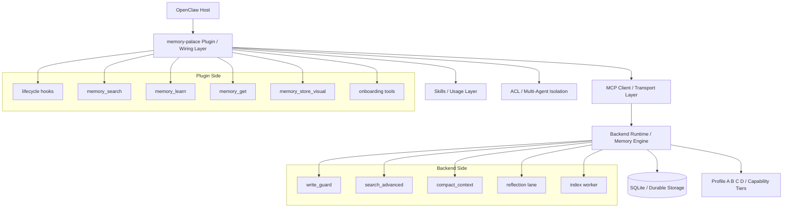
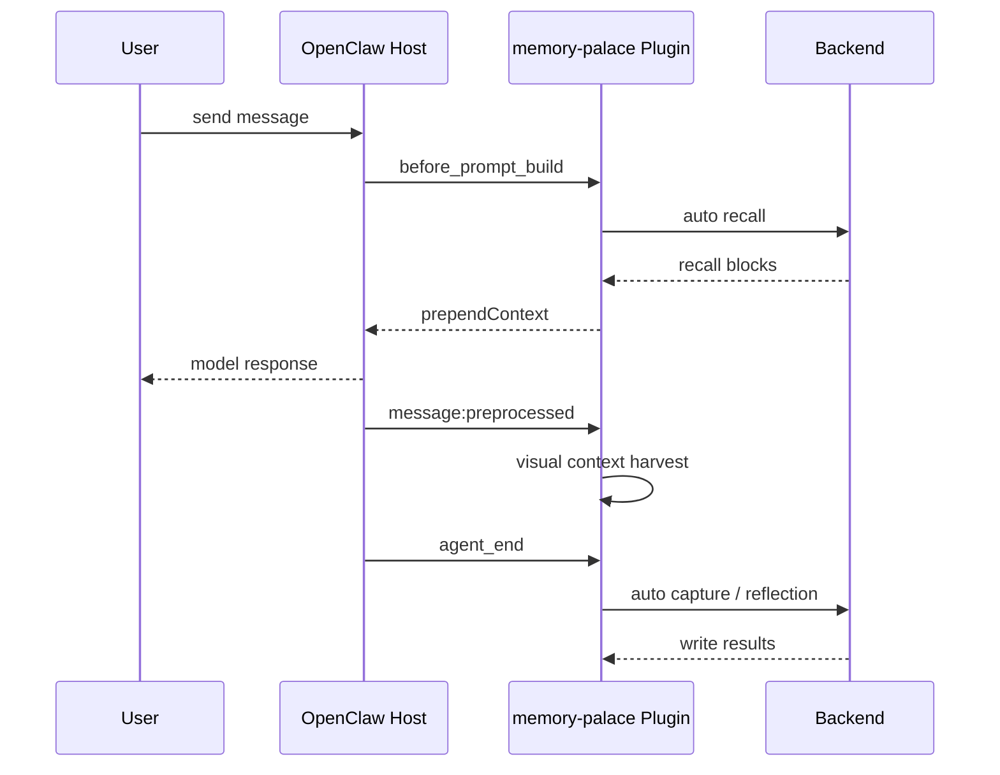
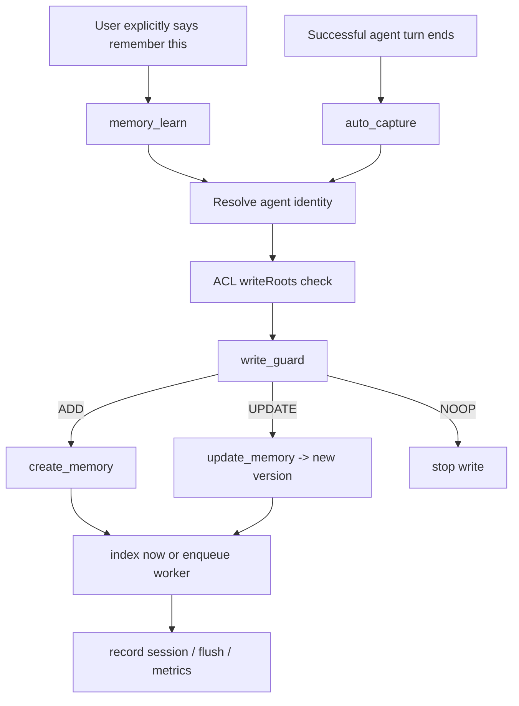
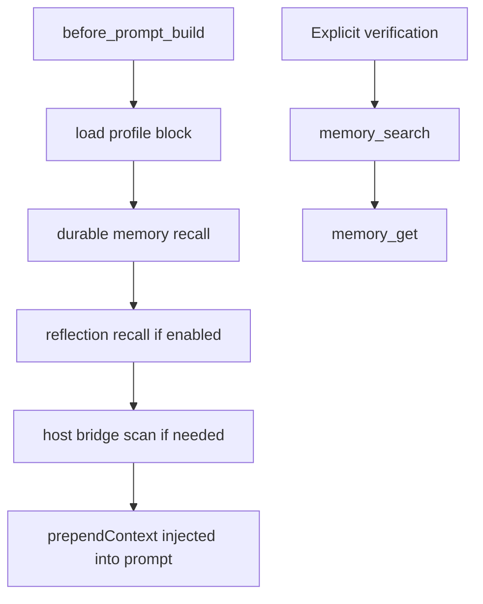
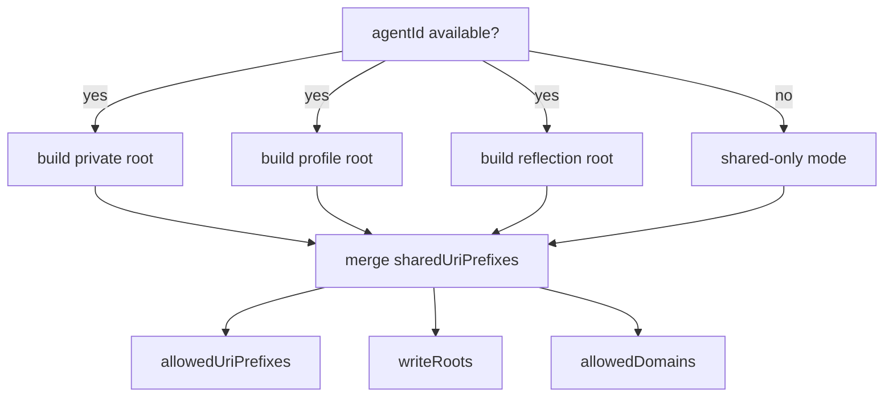
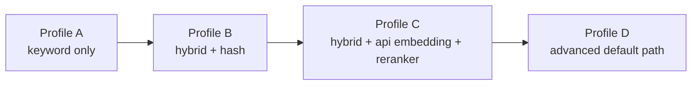

> [中文版](25-MEMORY_ARCHITECTURE_AND_PROFILES.md)

# 25 · OpenClaw Memory Mechanism Technical Notes (Section-Aligned English Version)

> Paired Chinese version: `25-MEMORY_ARCHITECTURE_AND_PROFILES.md`
> This document is based on the current code in this repository. It explains how
> `memory-palace` takes over the OpenClaw memory slot, how durable memory works
> in the backend, how ACL enforces multi-agent isolation, and what really
> differs across Profiles A/B/C/D.

---

## 0. One-Sentence Summary

This system does not rewrite OpenClaw core memory in place. Instead, it:

1. Attaches a `kind: "memory"` plugin called `memory-palace` to the OpenClaw memory slot.
2. Uses skills to tell the agent when to rely on default automatic memory and when to use explicit memory tools.
3. Runs the actual durable memory engine in the backend with `SQLite + Path alias + versioned memory + FTS/vector/hybrid retrieval`.
4. Uses ACL to narrow read/write scope across multiple agents.

If you only remember one plain-English line:

> **The plugin is the wiring layer, skills are the usage layer, the backend is the engine, profiles are capability tiers, and ACL is the isolation gate.**

---

## 1. System Positioning

### 1.1 What it is

- It is an OpenClaw memory plugin, declared in `extensions/memory-palace/openclaw.plugin.json`.
- It mounts backend memory capabilities into the host memory slot.
- It registers lifecycle hooks, explicit tools, and a CLI.
- It is not “prompt-only memory”; it has a real durable backend.

### 1.2 What it is not

- It is not a direct modification of OpenClaw core memory source code.
- It is not “just a vector store”.
- It is not “fake memory implemented only by skills text”.
- It does not fully replace host-side `USER.md / MEMORY.md`; `hostBridge` still imports those as supplemental memory context.

### 1.3 Key code anchors

- Plugin identity: `extensions/memory-palace/openclaw.plugin.json`
- Plugin entry: `extensions/memory-palace/index.ts`
- Hook registration: `extensions/memory-palace/src/lifecycle-hooks.ts`
- Explicit tools: `extensions/memory-palace/src/memory-tools.ts`
- Auto recall: `extensions/memory-palace/src/auto-recall.ts`
- Auto capture: `extensions/memory-palace/src/auto-capture.ts`
- Host bridge: `extensions/memory-palace/src/host-bridge.ts`
- Backend schema: `backend/db/sqlite_models.py`
- Backend main logic: `backend/db/sqlite_client.py`
- Runtime bus: `backend/runtime_state.py`

---

## 2. Overall Architecture

The diagram below shows the five main layers together.

### 2.1 What each layer does

- **OpenClaw Host**
  - Provides the memory slot, hook lifecycle, and agent runtime.
- **Plugin**
  - Connects backend capabilities to the host.
  - Registers recall/capture/visual/onboarding behaviors as hooks or tools.
- **Skills**
  - Tell the agent how to use the system by default.
  - They do not implement storage logic themselves.
- **MCP Client**
  - Handles stdio / sse connection, healthchecks, retries, and fallback.
- **Backend Runtime**
  - Actually stores, retrieves, compacts, indexes, and guards durable memory.
- **Profiles**
  - Decide how strong retrieval and optional assist features should be.
- **ACL**
  - Decides what the current agent can read and where it can write.

### 2.2 It takes over the memory slot, not the host source code

This point matters because “replacing the native OpenClaw memory system” can easily be misunderstood as “patching host source code directly”.

The actual integration path in code is:

- the host must allow this plugin
- the host must include it in plugin load paths
- the host must enable it under `plugins.entries.memory-palace`
- the host must point `plugins.slots.memory` to `memory-palace`

So the takeover point is the **host memory slot**, not a direct rewrite of OpenClaw core.
That is also why the plugin, backend, profiles, and ACL can evolve somewhat independently.

  

### 2.3 What plugin, skills, and MCP each do

These three are easy to mix up.

- **Plugin**
  - wiring and orchestration layer
  - registers hooks, tools, CLI, and memory capability
- **Skills**
  - usage-policy layer
  - tell the agent when to rely on default recall and when to use explicit `memory_search` or `memory_learn`
- **MCP**
  - implementation interface layer
  - the plugin uses an MCP client to call backend tools such as `search_memory / read_memory / create_memory / update_memory`

So skills should not be confused with the storage implementation.
Skills decide “how to use the system”, not “how memory is physically stored”.

### 2.4 The default path is hooks first, explicit tools second

In the current code, the default path is:

1. `before_prompt_build`
   - run auto recall first
2. `message:preprocessed`
   - harvest visual context and some webchat fallback content
3. `agent_end`
   - run auto capture, reflection, and visual harvest

Only when default recall is not enough, verification is needed, an explicit durable write is needed, or durable visual storage is requested does the flow move up to explicit tools:

- `memory_search`
- `memory_get`
- `memory_learn`
- `memory_store_visual`

This ordering explains why memory can appear to “just work” even when the user does not see manual tool use on every turn.

  

---

## 3. Memory Data Model

One of the most important design choices is that the backend is not built around a single flat memory table.

### 3.1 Core objects

- `Memory`
  - Durable memory body.
- `Path`
  - Address / URI binding from `domain + path` to a specific `Memory`.
- `MemoryChunk`
  - Text chunk for retrieval.
- `MemoryChunkVec`
  - Vector-index carrier.
- `EmbeddingCache`
  - Embedding reuse cache.
- `MemoryGist`
  - Summary layer for recall and compaction.
- `FlushQuarantine`
  - Quarantine zone used during compaction or reflection flow.

### 3.2 Why this model is practical

- **Content and path are separated**
  - One body can be reachable through multiple paths.
  - That makes aliasing, shared roots, private roots, and path migration practical.
- **Updates are versioned rather than in-place**
  - `update_memory()` creates a new version, deprecates the old one, and repoints the path.
  - That improves auditability and stale-write safety.
- **Retrieval is not “scan one table and hope”**
  - It combines chunks, FTS, vectors, gist, priority, recency, and reranking.

### 3.3 Plain-language analogy

- `Memory` = archive body
- `Path` = doorplate
- `Alias` = one room with multiple doorplates
- `Chunk` = index cards cut from a long archive
- `Gist` = summary label attached to the archive

  

---

## 4. Write Path

The important part is not just that the system can write memory. The important part is that it tries hard not to write the wrong thing.

### 4.1 Explicit writes

- When the user explicitly says “remember this”, the system should use `memory_learn`.
- This is not a silent write path.
- If `write_guard` decides the content is really an update or a duplicate, the tool returns that outcome explicitly.
- If the write is blocked, a force retry should only happen after explicit user confirmation.

### 4.2 Automatic writes

- After a successful agent turn, `auto_capture` analyzes whether any user content should become durable memory.
- But explicit “remember this” requests are not silently consumed by auto-capture.
- The code already excludes the `explicit` decision from automatic persistence.

### 4.3 What write_guard really does

`write_guard` is not just duplicate filtering.

- Empty content: `NOOP`
- Visual memory: fast path through visual hash
- Regular text: run both
  - `semantic`
  - `keyword`
- If both fail: `fail-closed` instead of blindly adding memory
- For dense embeddings:
  - normalize scores
  - cross-check semantic and keyword signals
  - for borderline cases, optionally run LLM rescue / decision

### 4.4 What update_memory really means

`update_memory()` does not overwrite the old record in place.

- Find the current memory behind a path
- Create a new `Memory`
- Mark the old one deprecated
- Repoint the path to the new one

This is closer to “file a new archive version and keep the same doorplate”.

---

## 5. Recall Path

### 5.1 Automatic recall

The main recall hook is `before_prompt_build`.

The practical order is:

1. inject profile block
2. recall durable memory (the current path also merges the current session into recall scope)
3. optionally recall reflection entries (the current path also merges the current session into recall scope)
4. scan host bridge if needed
5. assemble prompt prefix

One conservative boundary is worth keeping explicit:

- if `command:new` reflection or smart extraction cannot identify the target session transcript
- the current behavior is to skip that transcript read
- it no longer falls back to scanning the latest unrelated transcript under the sessions directory
- workflow-related recall is also sanitized before prompt assembly
- onboarding doc paths, provider diagnostics, and confirmation-code text are now supposed to be filtered out instead of being treated as durable workflow context
- the `message:preprocessed` fallback capture path also strips injected `memory-palace-profile` / `memory-palace-recall` blocks first, so internal recall scaffolding is not written back as new workflow
- control-ui / WeChat-style tag-sensitive chat surfaces are no longer supposed to echo raw recall tags back into visible replies on the default path
- on the capture side, a single workflow statement that only quotes a documentation example is skipped instead of being treated as a stable long-term workflow
- when smart extraction builds its transcript, assistant thinking blocks are skipped and the budget is kept for actual user / assistant workflow turns

### 5.2 What host bridge is for

`hostBridge` shows that the system is not completely isolated from file-based host memory.

It can read controlled host-side sources such as:

- `USER.md`
- `MEMORY.md`
- memory-related files under the workspace

So this is better understood as “bridging old file memory into the new system”, not “deleting the old style completely”.

One more boundary matters here:

- `hostBridge` is not supposed to dump matched files into the prompt or durable workflow verbatim
- especially for workflow hits, the current path sanitizes the text first and only then decides whether anything should reach profile / host-bridge durable storage
- onboarding doc paths, provider diagnostics, confirmation-code text, and durable-memory scaffold noise are not supposed to be written back by host bridge as stable workflow
- this fix changes the plugin's own bridge/recall behavior; it does not rewrite the host files themselves

### 5.3 Explicit recall

If default recall is not enough, or if the model needs explicit verification:

- first `memory_search`
- then `memory_get`

That is also the usage order recommended by the bundled skills.

  

---

## 6. Runtime, Compaction, and Reflection

The backend is not just a database. It includes a runtime orchestration layer.

### 6.1 What exists inside runtime_state

- `SessionSearchCache`
  - per-session short-term recall cache
  - think of it as “front-desk sticky notes”
- `SessionFlushTracker`
  - tracks which parts of the current session are worth consolidating
- `IndexTaskWorker`
  - background indexing worker
- `WriteLaneCoordinator`
  - serializes writes to reduce conflicts

### 6.2 What compact_context is for

Its purpose is not “dump the full conversation forever”.

Instead it:

- extracts high-value session content
- generates summaries / gist
- runs the result through `write_guard` again
- only persists durable or reflection memory when the result passes

### 6.3 Why reflection is a separate lane

Reflection mainly stores things like:

- lessons learned
- invariants
- open loops
- command:new / reset reflection records

That is why it makes sense to separate it from ordinary durable recall.
This is also why the code keeps a dedicated `core://reflection/...` root.

  

---

## 7. Technical Highlights

### 7.1 Versioned memory rather than overwrite-style memory

This is a practical design.
Many memory systems overwrite old values directly. This one keeps a version chain, which is easier to audit and safer under concurrency.

### 7.2 Retrieval is genuinely hybrid

This is not “we have embeddings so we call it hybrid”.

It combines:

- keyword / FTS
- semantic / vector
- gist
- priority
- recency
- vitality
- access
- reranker
- same-URI collapse
- MMR deduplication

### 7.3 Clear split between automatic and explicit paths

- Automatic: auto recall / auto capture / reflection / visual harvest
- Explicit: memory_search / memory_get / memory_learn / memory_store_visual

That makes the system easier to use and easier to debug.

### 7.4 Backward-compatible with host-side memory files

`hostBridge` is important for migration because it keeps file-based host memory relevant.

### 7.5 Multi-agent isolation is wired into main paths

ACL already affects:

- search scope
- get path validation
- learn write validation
- visual write validation
- auto-capture / profile / reflection path planning

So ACL is not just a UI layer story. It participates in the main runtime path.

### 7.6 The product surface is more complete than a simple plugin demo

This repository already includes:

- conversational onboarding
- launcher subprocesses
- doctor checks
- CLI
- profile env presets
- benchmark / smoke / validation logic

  

---

## 8. ACL and Multi-Agent Isolation

### 8.1 The real ACL model today

ACL in the current code is best described as **URI-prefix-based multi-agent memory isolation**.

The main config fields are:

- `sharedUriPrefixes`
- `sharedWriteUriPrefixes`
- `defaultPrivateRootTemplate`
- `agents[agentId].allowedDomains`
- `agents[agentId].allowedUriPrefixes`
- `agents[agentId].writeRoots`
- `allowIncludeAncestors`
- `defaultDisclosure`

### 8.2 What resolveAclPolicy does

Practical behavior:

- `acl.enabled=false`
  - isolation is off by default
  - but if multi-agent config is present, the system warns that memory is not isolated
- `acl.enabled=true`
  - the current agent gets a default private root
  - the profile root and reflection root are also included
- `agentId` missing
  - the system falls back to shared-only mode
  - it does not silently create an anonymous private root

### 8.3 Where ACL really takes effect

- `memory_search`
  - narrows search scope to allowed roots
- `memory_get`
  - blocks out-of-scope URIs before calling the backend
- `memory_learn`
  - rejects target URIs outside `writeRoots`
- `memory_store_visual`
  - visual writes are also checked against write roots
- `auto_capture`
  - profile / workflow / synthesis targets are ACL-scoped too
- `reflection`
  - reflection lane is agent-scoped as well

### 8.4 Current ACL capability boundary

This part matters.

- The current ACL can already narrow read/write scope on the main plugin paths.
- But it is not yet a “final-form security model”.
- The current core is prefix-based policy, not a fully fine-grained action-based authorization model.
- The default still keeps `acl.enabled=false`, which tells you the system is currently “optional isolation” rather than “strict isolation by default”.

  

### 8.5 ACL technical roadmap

Given the current code structure, the most natural next steps are:

1. **Centralize ACL decision logic**
   - Today the checks are spread across several modules.
2. **Move from prefix-only isolation to action-aware isolation**
   - For example: separate read / search / write / visual / reflection / host-bridge permissions.
3. **Add a unified ACL audit trail**
   - Record allow / deny events in one visible place.
4. **Tighten missing-identity handling**
   - Shared-only fallback is safe, but the policy can become more explicit.
5. **Refine host bridge rules**
   - Make it clearer which host-side files can feed which memory lane.
6. **Revisit the default**
   - If multi-agent collaboration is a primary use case, ACL probably needs to move from “default off” toward “default recommended on”.

---

## 9. What Really Differs Across Profiles A / B / C / D

There is one easy trap here:

> **Product A/B/C/D semantics are not identical to benchmark A/B/C/D semantics.**

### 9.1 Product semantics first

The actual deployment behavior is defined by:

- `deploy/profiles/linux/profile-a.env`
- `deploy/profiles/linux/profile-b.env`
- `deploy/profiles/linux/profile-c.env`
- `deploy/profiles/linux/profile-d.env`
- `scripts/installer/_onboarding.py`
- `scripts/installer/_provider.py`

On the product/deployment side, the profiles are best understood as follows.

#### Profile A

- Retrieval mode: `keyword`
- Embedding: `none`
- Reranker: `false`
- Good for:
  - very low-spec environments
  - no external provider setup
  - safest bootstrap path
- Boundary:
  - no real semantic retrieval
  - weak semantic recall
  - basically a fallback tier

#### Profile B

- Retrieval mode: `hybrid`
- Embedding: `hash`
- Vector dimension: `64`
- Reranker: `false`
- Good for:
  - cheap local hybrid retrieval
  - no dependency on external embedding / reranker providers
- Boundary:
  - hash embedding is not high-quality semantic embedding
  - stronger than A, but still clearly below real semantic retrieval

#### Profile C

- Retrieval mode: `hybrid`
- Embedding: `api`
- Reranker: `true`
- Default reranker weight: `0.30`
- LLM assists: optional
- Good for:
  - provider setup is ready
  - you want the real semantic retrieval path
- Boundary:
  - depends on external embedding / reranker services
  - more sensitive to provider quality and network behavior

#### Profile D

- Retrieval mode: `hybrid`
- Embedding: `api`
- Reranker: `true`
- Default reranker weight: `0.35`
- More aligned with the advanced assist suite by default
- Installer also cares more about `WRITE_GUARD_LLM_*`
- Good for:
  - the most complete advanced path in current deployment
- Boundary:
  - highest external dependency surface
  - highest cost and service-stability expectations

### 9.2 Benchmark semantics are different

In the benchmark directory, A/B/C/D is often used as an ablation ladder:

- A: keyword only
- B: hybrid + hash embedding
- C: hybrid + API embedding, **without reranker**
- D: hybrid + API embedding + reranker

That is useful for controlled experiments because it isolates reranker gain.
But it is not the full product configuration story.

### 9.3 The right way to read the two systems

- If you are deploying, installing, configuring, or operating the product:
  - **trust `deploy/profiles + installer`**
- If you are reading experiments, ablations, or benchmark analysis:
  - **trust the benchmark runner definitions**

Do not collapse these two meanings into one.

  

---

## 10. Capability Boundaries by Profile

### 10.1 From “can run” to “runs strong”

### 10.2 Summary of boundaries

#### Boundary of A

- Can run the most conservative path
- Should not be expected to deliver strong semantic recall

#### Boundary of B

- Has the shape of hybrid retrieval
- But hash embedding is still a compromise, not a high-quality semantic path

#### Boundary of C

- Already on the real embedding + reranker path
- But optional LLM assists are not automatically treated as the full advanced suite

#### Boundary of D

- The most complete advanced path today
- Also the most dependent on external services

### 10.3 Simple selection advice

- **Need the safest user bootstrap path**: B
- **Need the most conservative validation-only path**: A
- **Need real semantic retrieval quality**: C
- **Need the more complete advanced assist path**: D

  

---

## 11. Practical Boundaries of the Whole System

- Without typed lifecycle hooks, the automatic path degrades.
- Visual auto-harvest is not the same thing as durable visual storage.
- Explicit “remember this” requests should go through `memory_learn`, not silent auto-capture.
- ACL is not enabled by default, so strict isolation should not be assumed.
- When `agentId` is missing, ACL falls back to shared-only mode instead of creating a private anonymous root.
- The plugin does not patch OpenClaw core, but it does write its own durable memory and diagnostics by design; if the host already contains polluted historical workflow data, cleanup is still a one-time maintenance task rather than part of the normal runtime path.
- `lastCapturePath / lastReconcile` are runtime diagnostic snapshots, not a direct synonym for “the current prompt is still dirty”; those fields only refresh when a newer successful capture overwrites them.
- The system is already quite complete, but it is not yet “the final security model for every edge case”.

---

## 12. Suggested Reading Order

If this is your first serious pass through the code, this order works well:

1. `extensions/memory-palace/openclaw.plugin.json`
2. `extensions/memory-palace/index.ts`
3. `extensions/memory-palace/src/lifecycle-hooks.ts`
4. `extensions/memory-palace/src/memory-tools.ts`
5. `extensions/memory-palace/src/auto-recall.ts`
6. `extensions/memory-palace/src/auto-capture.ts`
7. `extensions/memory-palace/src/acl-search.ts`
8. `backend/db/sqlite_models.py`
9. `backend/db/sqlite_client.py`
10. `backend/runtime_state.py`
11. `deploy/profiles/linux/profile-*.env`
12. `scripts/installer/_onboarding.py`

---

## 13. Appendix: Key Code Anchors

- Plugin entry: `extensions/memory-palace/index.ts`
- Plugin manifest: `extensions/memory-palace/openclaw.plugin.json`
- Tool registration: `extensions/memory-palace/src/memory-tools.ts`
- Hook registration: `extensions/memory-palace/src/lifecycle-hooks.ts`
- Recall path: `extensions/memory-palace/src/auto-recall.ts`
- Capture path: `extensions/memory-palace/src/auto-capture.ts`
- Host bridge: `extensions/memory-palace/src/host-bridge.ts`
- ACL logic: `extensions/memory-palace/src/acl-search.ts`
- Config defaults: `extensions/memory-palace/src/config.ts`
- Backend schema: `backend/db/sqlite_models.py`
- Backend write/update/search: `backend/db/sqlite_client.py`
- Runtime state machine: `backend/runtime_state.py`
- Profile envs: `deploy/profiles/linux/profile-a.env` through `profile-d.env`
- Installer: `scripts/installer/_onboarding.py`, `scripts/installer/_provider.py`

---

## Related Topic Pages

If you finish this overview and want to go deeper by topic, these are the two best follow-up pages:

- for `Profile` selection, deployment tiers, and provider-readiness boundaries:
  - [03-PROFILES_AND_DEPLOY.en.md](03-PROFILES_AND_DEPLOY.en.md)
- for `ACL` enablement, alpha/beta isolation verification, and the current experimental boundary:
  - [24-AGENT_ACL_ISOLATION.en.md](24-AGENT_ACL_ISOLATION.en.md)

If you only want one simple routing rule:

- go back to `03` when you want to answer **which profile should I choose**
- go back to `24` when you want to answer **how do I enable and verify ACL**

---

## 14. Final Takeaway

The real value of this project is not “the model can remember more things”.

The real value is that long-term memory has been broken down into clear engineering layers:

- plugin integration
- explicit tools
- versioned storage
- hybrid retrieval
- automatic compaction and reflection
- multi-agent isolation
- tiered deployment

That makes it closer to an **operable memory runtime** than to a small “search some old text” feature.
