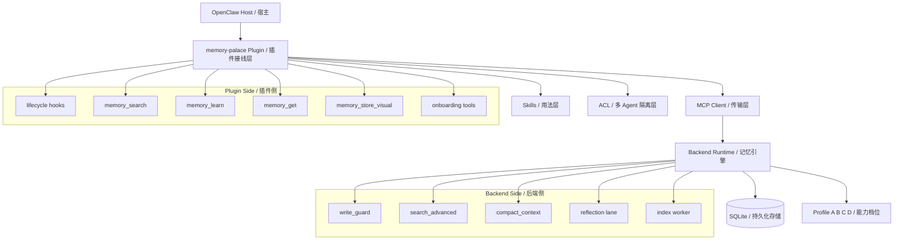
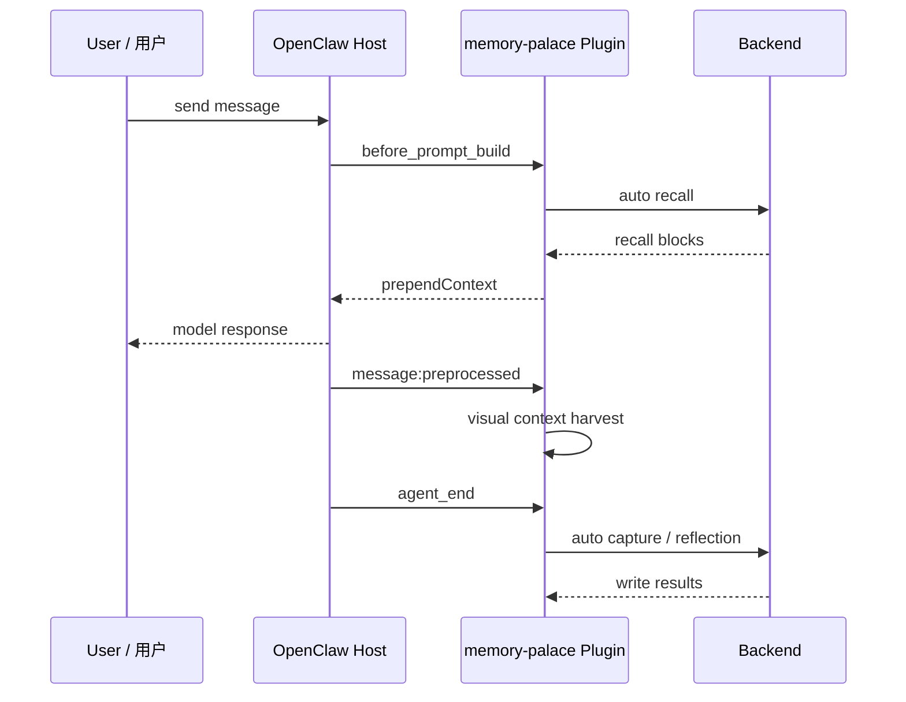
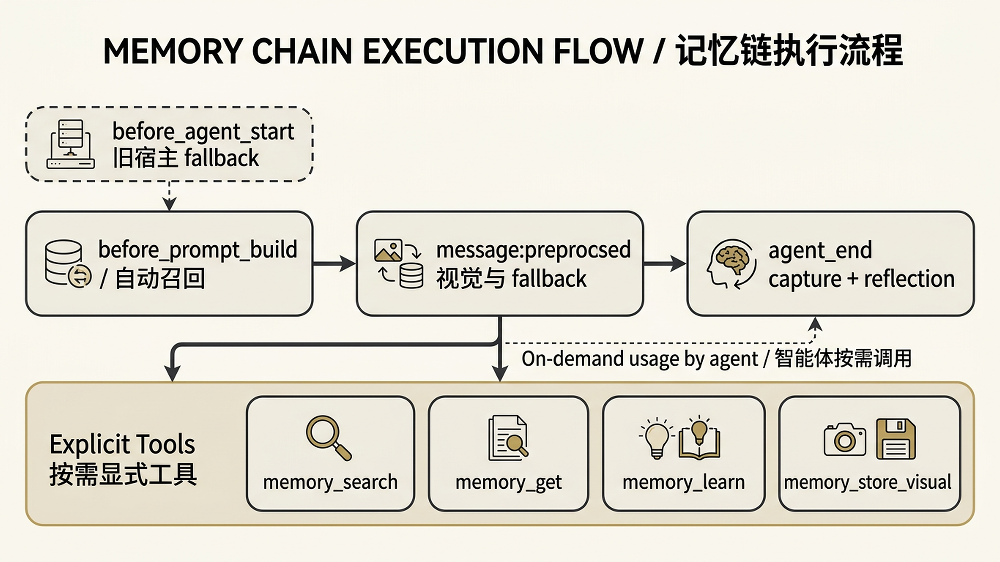
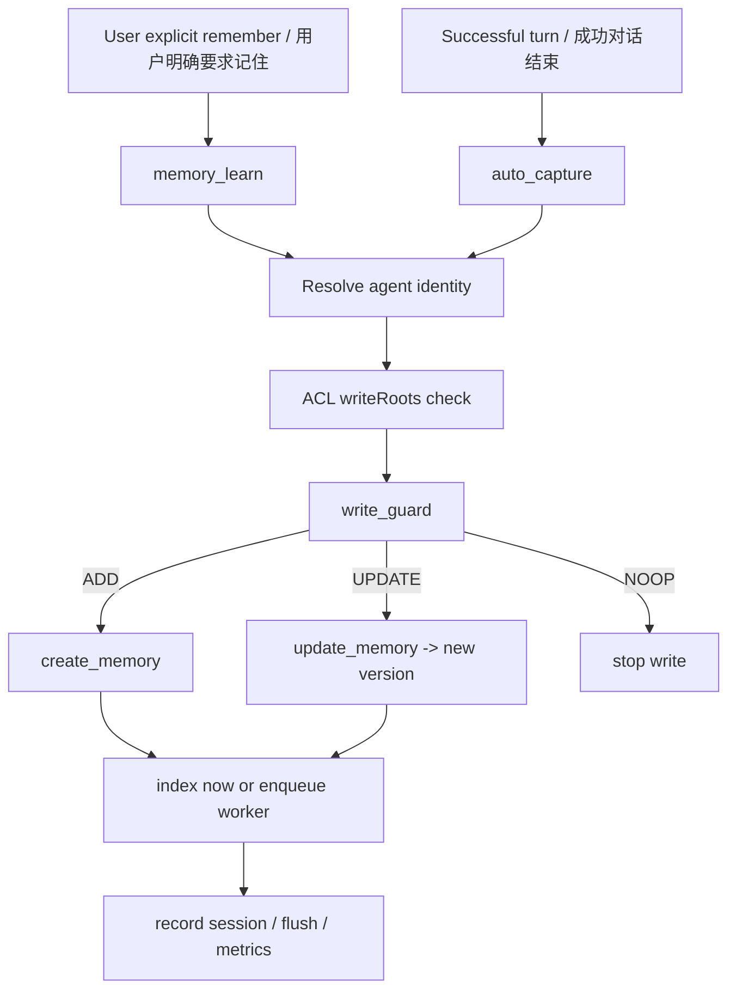
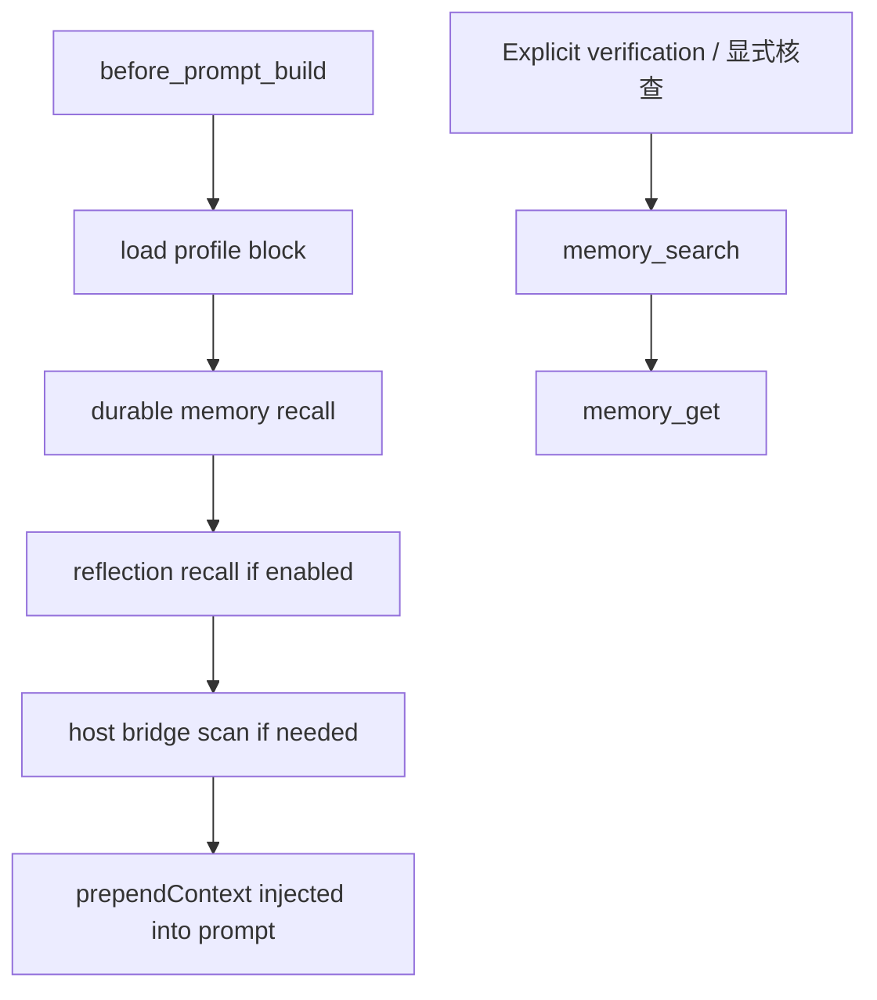
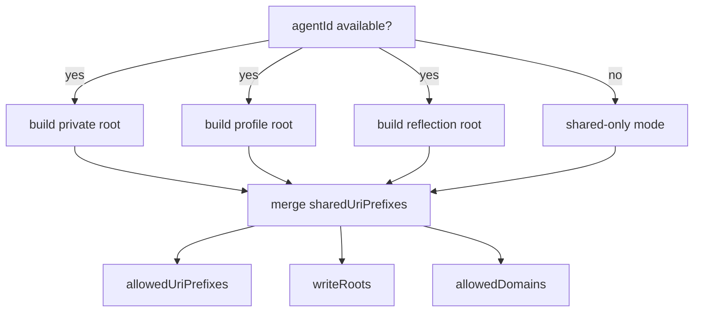
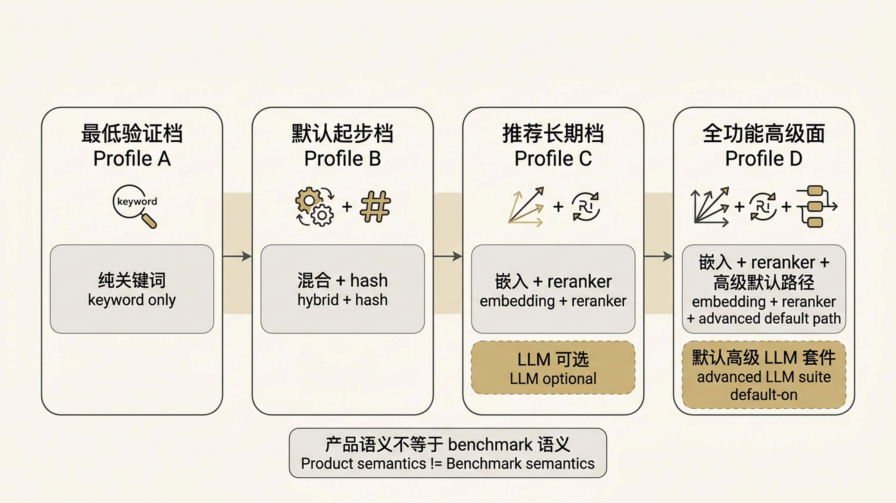
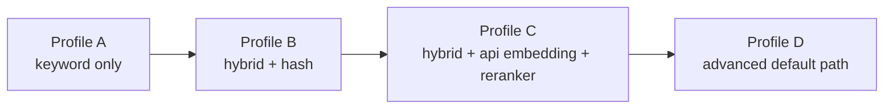
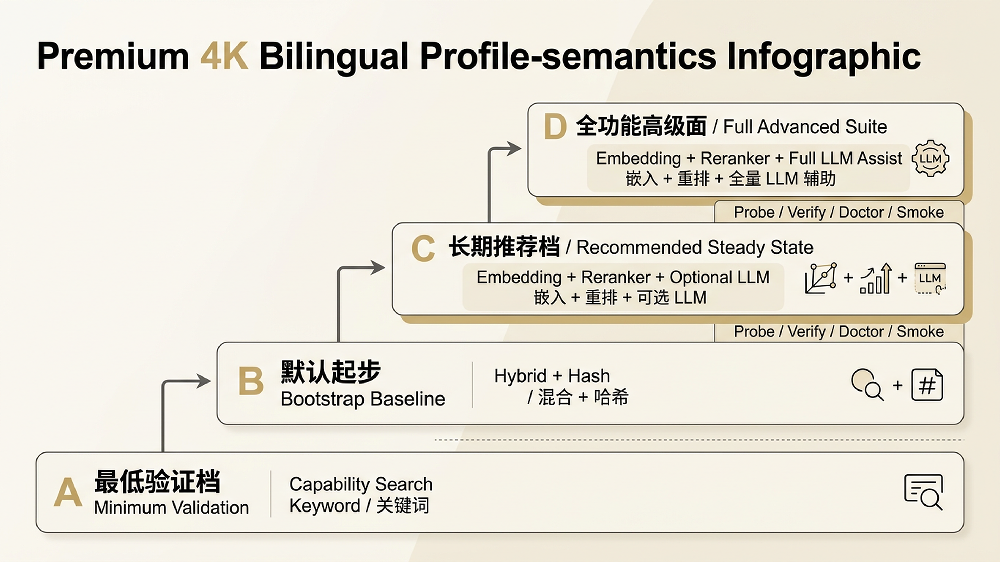

> [English](25-MEMORY_ARCHITECTURE_AND_PROFILES.en.md)

# 25 · OpenClaw 记忆机制技术说明（中英对照结构版）

> 对应英文版：`25-MEMORY_ARCHITECTURE_AND_PROFILES.en.md`
> 这份文档按当前仓库真实代码整理，重点解释：
> `memory-palace` 插件怎样接管 OpenClaw 的 memory slot、backend 里的记忆是怎么存取的、ACL 怎样做多 agent 隔离、Profile A/B/C/D 到底差在哪里。

---

## 0. 一句话先说清楚

这套系统不是“把 OpenClaw 原生 memory 改坏再重写一遍”，而是：

1. 用 `memory-palace` 这个 `kind: "memory"` 的插件接到 OpenClaw memory slot 上。
2. 用一组 skills 告诉 agent 什么时候走默认自动记忆，什么时候走显式工具。
3. 真正的长期记忆引擎放在 backend 里，用 `SQLite + Path alias + versioned memory + FTS/vector/hybrid retrieval` 跑。
4. 再用 ACL 把多 agent 的读写范围收紧，避免不同 agent 互相串记忆。

如果只想记一句人话：

> **plugin 是接线层，skills 是用法层，backend 是发动机，profile 是档位，ACL 是隔离闸门。**

---

## 1. 系统定位 / System Positioning

### 1.1 它是什么

- 它是一个 OpenClaw memory plugin，manifest 在 `extensions/memory-palace/openclaw.plugin.json`。
- 它把 backend 的记忆能力挂到宿主 memory slot 上。
- 它同时注册 lifecycle hooks、显式工具和 CLI。
- 它不是只靠 prompt 记忆，而是有真正的 durable memory backend。

### 1.2 它不是什么

- 它不是直接修改 OpenClaw core memory 源码。
- 它不是“只有 embedding 的向量库”。
- 它不是“只靠 skills 文档在提示词里装作有记忆”。
- 它也不是“把宿主 `USER.md / MEMORY.md` 废掉”。`hostBridge` 还会把这些文件作为补充记忆源接进来。

### 1.3 关键代码锚点

- 插件身份：`extensions/memory-palace/openclaw.plugin.json`
- 插件总入口：`extensions/memory-palace/index.ts`
- hooks 注册：`extensions/memory-palace/src/lifecycle-hooks.ts`
- 显式工具：`extensions/memory-palace/src/memory-tools.ts`
- auto recall：`extensions/memory-palace/src/auto-recall.ts`
- auto capture：`extensions/memory-palace/src/auto-capture.ts`
- host bridge：`extensions/memory-palace/src/host-bridge.ts`
- backend 数据层：`backend/db/sqlite_models.py`
- backend 主逻辑：`backend/db/sqlite_client.py`
- runtime 总线：`backend/runtime_state.py`

---

## 2. 总体架构 / Overall Architecture

下面这张图把五层关系放在一起。

### 2.1 每层负责什么

- **OpenClaw Host**
  - 提供 memory slot、hook 生命周期和 agent 运行环境。
- **Plugin**
  - 负责把 backend 能力接进宿主。
  - 负责把 recall/capture/visual/onboarding 这些能力挂成 hooks 或 tools。
- **Skills**
  - 负责告诉 agent“默认怎么用这套能力”。
  - 它不直接实现存储逻辑。
- **MCP Client**
  - 负责 stdio / sse 连接、healthcheck、重试、fallback。
- **Backend Runtime**
  - 真正负责 durable memory 的存、搜、压缩、索引和判重。
- **Profile**
  - 决定检索和辅助能力开到哪一档。
- **ACL**
  - 决定当前 agent 能看什么、能写到哪。

### 2.2 它接管的是 memory slot，不是宿主源码

这点必须说清楚，因为“替代 OpenClaw 原生 memory system”很容易被理解成“直接改宿主源码”。

当前代码里的真实接法是：

- 宿主要允许加载这个插件
- 宿主要把它加入 plugin load path
- 宿主要在 `plugins.entries.memory-palace` 里启用它
- 宿主要把 `plugins.slots.memory` 指向 `memory-palace`

也就是说，它接管的是**宿主的 memory 插槽**，不是“直接把 OpenClaw core 改掉”。
这也是为什么它能相对独立地演进 plugin、backend、profile 和 ACL。

  

### 2.3 Plugin、Skills、MCP 各管什么

这三个概念最容易混。

- **Plugin**
  - 接线和编排层
  - 负责注册 hooks、tools、CLI、memory capability
- **Skills**
  - 使用规程层
  - 负责告诉 agent 什么时候优先走默认 recall，什么时候该显式 `memory_search` 或 `memory_learn`
- **MCP**
  - 实现接口层
  - plugin 通过 MCP client 去调用 backend 的 `search_memory / read_memory / create_memory / update_memory`

所以不要把 skills 当成“底层实现”。
skills 决定的是“怎么用”，不是“怎么存”。

### 2.4 默认主链先跑 hooks，再补显式工具

在当前代码里，默认主链是：

1. `before_prompt_build`
   - 先做 auto recall
2. `message:preprocessed`
   - 采视觉上下文和部分 webchat fallback 内容
3. `agent_end`
   - 做 auto capture、reflection、visual harvest

只有在默认 recall 不够、需要验证、需要显式 durable write、或者需要 visual durable storage 时，才升到显式工具：

- `memory_search`
- `memory_get`
- `memory_learn`
- `memory_store_visual`

这个顺序很重要，因为它解释了为什么“平时看起来没手动调工具，记忆也还是在工作”。

  

---

## 3. 记忆数据模型 / Memory Data Model

这套 backend 最容易被低估的地方，是它不是一张“记忆表”了事。

### 3.1 核心对象

- `Memory`
  - 记忆正文。
- `Path`
  - 门牌号。负责把 `domain + path` 映射到某条 `Memory`。
- `MemoryChunk`
  - 正文切片，方便全文检索和向量检索。
- `MemoryChunkVec`
  - 向量索引载体。
- `EmbeddingCache`
  - embedding 复用缓存。
- `MemoryGist`
  - 摘要层，给 recall 和压缩链路用。
- `FlushQuarantine`
  - 压缩或归档过程里的隔离区，避免可疑内容直接进长期记忆。

### 3.2 这套模型为什么实用

- **内容和路径分离**
  - 一条正文可以挂多个路径。
  - 这意味着 alias、共享根、私有根、迁移路径都能做。
- **更新是版本化，不是原地覆盖**
  - `update_memory()` 会创建新版本，旧版本标记为 deprecated，再把路径指过去。
  - 好处是并发更安全，历史也更好追。
- **检索不是直接扫全文**
  - 它会同时用 chunk、FTS、向量、gist、priority、recency、reranker 等信号。

### 3.3 人话类比

- `Memory` 像档案正文
- `Path` 像门牌号
- `Alias` 像同一个房间挂多个门牌
- `Chunk` 像给大段正文切索引卡片
- `Gist` 像给档案写摘要标签

  

---

## 4. 写入链路 / Write Path

这套系统最重要的不是“能写”，而是“不会乱写”。

### 4.1 显式写入

- 用户明确说“记住这个”“以后按这个偏好来”时，走 `memory_learn`。
- 这条链不是 silent write。
- 如果 `write_guard` 认为这不是新记忆，而是更新或重复，工具会按结果返回。
- 如果出现 blocked write，用户要明确确认后，才应该用 `force=true` 重试。

### 4.2 自动写入

- 成功 agent turn 结束后，`auto_capture` 会分析用户消息里有没有值得长期保留的稳定信息。
- 但如果用户是在“明确要求记住”，`auto_capture` 不会偷偷代替 `memory_learn` 执行。
- 代码里已经把这种 `explicit` 决策从自动持久化链路里排除了。

### 4.3 write_guard 在干什么

`write_guard` 不是简单“重复就不写”。

- 空内容：直接 `NOOP`
- visual memory：优先走 visual hash 快路
- 普通文本：同时跑
  - `semantic`
  - `keyword`
- 两路都挂：`fail-closed`，不盲目写入
- 对 dense embedding：
  - 做分数归一化
  - 做 semantic / keyword cross-check
  - 边界情况可再走 LLM rescue / decision

### 4.4 update_memory 的真实含义

`update_memory()` 不是把旧内容直接改掉。

- 先找到当前 path 指向的老版本
- 创建新 `Memory`
- 把老版本标记为 deprecated
- 把路径重新指向新版本

这相当于“存新档，废旧档，门牌不变”。

---

## 5. 召回链路 / Recall Path

### 5.1 自动召回

主 recall hook 是 `before_prompt_build`。

默认顺序大体是：

1. 先放 profile block
2. 再查 durable memory（当前会把本 session 一起纳入检索合并）
3. 再按配置查 reflection（当前也会把本 session 一起纳入检索合并）
4. 如果还需要，再扫 host bridge
5. 最后把这些内容拼成 prompt 前缀

这里再补一个现在的保守边界：

- `command:new` reflection 和 smart extraction 如果找不到目标 session transcript
- 当前会直接跳过这次 transcript 读取
- 不再回退去读 sessions 目录里“最新但无关”的 transcript
- `workflow` 相关 recall 在拼 prompt 前也会先做净化
- onboarding 文档路径、provider 诊断、confirmation code 这类明显不该进入长期 workflow 的内容，当前会尽量在这一步被挡掉
- `message:preprocessed` fallback capture 在回退前也会先剥掉 injected `memory-palace-profile` / `memory-palace-recall` block，避免把内部 recall scaffold 再写回 workflow
- control-ui / 微信这类 tag-sensitive 聊天面，默认链路也不再把 raw recall tag 直接回显到可见回复里
- capture 侧如果只看到“引用文档示例”的单条 workflow，当前会直接跳过，不把它当成稳定长期流程
- smart extraction 组 transcript 时会跳过 assistant thinking block，并把预算优先留给真正的 user / assistant workflow turn

### 5.2 host bridge 的角色

`hostBridge` 说明这套系统不是完全和宿主文件记忆割裂。

它会在受控路径里读取这类内容：

- `USER.md`
- `MEMORY.md`
- 相关 memory 目录文件

然后把命中的内容导进插件可理解的记忆上下文里。
所以它更像“把老文件记忆接到新系统里”，而不是“一刀切废弃旧习惯”。

但这里也要补一个边界：

- `hostBridge` 不是“看到文件就原样塞进 prompt 或 durable workflow”
- 尤其是 `workflow` 命中，当前会先做一层净化，再决定是否继续写到 profile / host-bridge durable 侧
- onboarding 文档路径、provider 诊断、confirmation code、durable-memory scaffold 这类明显不该进长期 workflow 的噪声，不该再被 host bridge 当成稳定 workflow 落盘
- 这次修的是插件自己的桥接/召回逻辑，不是去改宿主文件本身

### 5.3 显式召回

如果默认 recall 不够，或者模型需要明确验证：

- 先 `memory_search`
- 再 `memory_get`

这也是 skills 里推荐的使用顺序。

  

---

## 6. runtime、压缩与 reflection / Runtime, Compaction, Reflection

backend 不只是数据库，还带一层 runtime orchestration。

### 6.1 runtime_state 里有什么

- `SessionSearchCache`
  - 当前会话的短时 recall cache
  - 可以理解为“前台便签”
- `SessionFlushTracker`
  - 追踪这一轮对话里哪些内容值得整理
- `IndexTaskWorker`
  - 后台索引整理员
- `WriteLaneCoordinator`
  - 控制写入串行化，减少冲突

### 6.2 compact_context 是干什么的

它的作用不是“把聊天全量备份”，而是：

- 抽取这轮上下文里值得保留的高价值部分
- 生成 summary / gist
- 再次过 write_guard
- 合格才进入 durable memory 或 reflection lane

### 6.3 reflection 为什么单独一条 lane

reflection 主要存的不是用户事实，而是：

- lessons learned
- invariants
- open loops
- command:new / reset 后的复盘信息

所以它和普通 durable memory 分开是合理的。
这也是为什么代码里单独有 `core://reflection/...` 根。

  

---

## 7. 项目技术亮点 / Technical Highlights

### 7.1 版本化记忆，不是覆盖式记忆

这个设计很实在。
很多“记忆系统”一更新就直接覆盖旧值，这里不是。这里保留版本链，出问题更容易追。

### 7.2 混合检索做得比较完整

不是“有 embedding 就叫混合检索”，而是把这些信号都合到一起：

- keyword / FTS
- semantic / vector
- gist
- priority
- recency
- vitality
- access
- reranker
- same-URI collapse
- MMR 去重

### 7.3 明确区分自动链路和显式链路

- 自动：auto recall / auto capture / reflection / visual harvest
- 显式：memory_search / memory_get / memory_learn / memory_store_visual

这会让使用边界更清楚，排错也更容易。

### 7.4 兼容老记忆方式

`hostBridge` 让宿主文件记忆还能接进来，这一点对迁移很重要。

### 7.5 多 agent 隔离不是事后补丁

ACL 已经进入：

- search scope
- get path check
- learn write check
- visual write check
- auto capture/profile/reflection path planning

说明它不是 UI 层的装饰，而是真的参与了主链路。

### 7.6 安装与运行面比较完整

不是“只有代码，没有产品面”。

当前仓库里已经有：

- conversational onboarding
- launcher 子进程
- doctor checks
- CLI
- profile env
- benchmark / smoke / validation

  

---

## 8. ACL 与多 Agent 记忆隔离 / ACL and Multi-Agent Isolation

### 8.1 当前 ACL 的真实模型

ACL 当前更准确地说，是**基于 URI 前缀的多 agent 记忆隔离**。

核心配置项包括：

- `sharedUriPrefixes`
- `sharedWriteUriPrefixes`
- `defaultPrivateRootTemplate`
- `agents[agentId].allowedDomains`
- `agents[agentId].allowedUriPrefixes`
- `agents[agentId].writeRoots`
- `allowIncludeAncestors`
- `defaultDisclosure`

### 8.2 resolveAclPolicy 在做什么

具体行为：

- `acl.enabled=false`
  - 默认不隔离
  - 但如果已经有多 agent 配置，会发 warning，提醒你当前没有真正隔离
- `acl.enabled=true`
  - 为当前 agent 拼装默认私有根
  - 同时把 profile root 和 reflection root 也算进去
- `agentId` 缺失
  - 退成 shared-only mode
  - 不给 anonymous 默认私有根

### 8.3 ACL 真正生效在哪些入口

- `memory_search`
  - 先把搜索范围收缩到允许根
- `memory_get`
  - 越权 URI 在打 backend 前就拦住
- `memory_learn`
  - 目标 URI 不在 `writeRoots` 就拒绝
- `memory_store_visual`
  - visual 记忆同样要过写根检查
- `auto_capture`
  - 自动捕获出来的 profile / workflow / synthesis 目标 URI 也受 ACL 影响
- `reflection`
  - reflection lane 也是 agent-scoped 的

### 8.4 当前 ACL 的能力边界

这部分要说实话。

- 它现在已经能把 plugin 主路径上的读写 scope 收紧。
- 但它还不是“最终形态的安全模型”。
- 它目前核心是 prefix-based policy，不是更细的动作级授权模型。
- 默认值仍然是 `acl.enabled=false`，说明项目当前更偏“可选隔离”，不是“默认硬隔离”。

  

### 8.5 ACL 技术路线图

按当前代码结构，最顺的后续演进路线是：

1. **统一 ACL 判断中心**
   - 现在判断分散在多个模块里，后续可以收口成统一 policy engine。
2. **从 URI 前缀隔离，升级到动作级隔离**
   - 例如显式区分 read / search / write / visual / reflection / host-bridge。
3. **补 ACL 审计链**
   - 把 allow / deny 事件沉淀成统一可追踪记录。
4. **收紧匿名身份策略**
   - 现在 shared-only 是安全的，但后面可以把缺失身份原因和处理策略做得更细。
5. **细化 host bridge 规则**
   - 继续明确哪些宿主文件能进入哪条记忆 lane。
6. **重新评估默认值**
   - 如果项目重点是多 agent 协作，后面很可能需要把 ACL 从“默认关”往“默认建议开”推进。

---

## 9. Profile A / B / C / D 到底有什么不同 / What Really Differs Across Profiles

这里有一个非常容易混淆的点：

> **产品里的 A/B/C/D，和 benchmark 里的 A/B/C/D，不完全是一回事。**

### 9.1 先看产品语义

当前真正决定部署行为的，是：

- `deploy/profiles/linux/profile-a.env`
- `deploy/profiles/linux/profile-b.env`
- `deploy/profiles/linux/profile-c.env`
- `deploy/profiles/linux/profile-d.env`
- `scripts/installer/_onboarding.py`
- `scripts/installer/_provider.py`

按这条产品线，四个 profile 应该这样理解：

#### Profile A

- 检索模式：`keyword`
- embedding：`none`
- reranker：`false`
- 适合：
  - 极低配置
  - 没有外部 provider
  - 先跑通最保守路径
- 边界：
  - 没有真正 semantic retrieval
  - 语义召回弱
  - 更像兜底启动档

#### Profile B

- 检索模式：`hybrid`
- embedding：`hash`
- 向量维度：`64`
- reranker：`false`
- 适合：
  - 希望有“便宜的混合检索”
  - 又不想依赖外部 embedding / reranker 服务
- 边界：
  - hash embedding 不是高质量语义 embedding
  - 能力比 A 强，但离高质量语义检索还有明显距离

#### Profile C

- 检索模式：`hybrid`
- embedding：`api`
- reranker：`true`
- 默认权重：`0.30`
- LLM 辅助：可选
- 适合：
  - provider 已经就绪
  - 希望进入真实语义检索主路径
- 边界：
  - 依赖外部 embedding / reranker 服务
  - 对 provider 质量和网络更敏感

#### Profile D

- 检索模式：`hybrid`
- embedding：`api`
- reranker：`true`
- 默认权重：`0.35`
- 默认更倾向高级辅助套件
- 安装器对 `WRITE_GUARD_LLM_*` 也更重视
- 适合：
  - 想把 retrieval 和辅助链路都开到比较完整的状态
- 边界：
  - 外部依赖最多
  - 成本、网络和服务稳定性要求最高

### 9.2 再看 benchmark 语义

benchmark 目录里，经常把 A/B/C/D 当成实验分层：

- A：keyword only
- B：hybrid + hash embedding
- C：hybrid + API embedding，**不带 reranker**
- D：hybrid + API embedding + reranker

这套定义在实验里有用，因为它方便单独观察 reranker 的增益。
但它不是产品配置语义的完整描述。

### 9.3 正确的理解方式

- 如果你在部署、安装、上线、配置：
  - **以 `deploy/profiles + installer` 为准**
- 如果你在看实验、消融、benchmark：
  - **以 benchmark runner 的定义为准**

不要把这两套语义混成一套。

  

---

## 10. 各个 Profile 的能力边界 / Capability Boundaries by Profile

### 10.1 从“能跑”到“跑得强”的梯度

### 10.2 边界总结

#### A 的边界

- 能跑最保守链路
- 但不要指望强语义召回

#### B 的边界

- 有混合检索的形状
- 但 hash embedding 只是平衡方案，不是高质量语义方案

#### C 的边界

- 已经进入真实 embedding + reranker 路径
- 但 LLM 辅助不是强制默认全开

#### D 的边界

- 是当前更完整的高级路径
- 但也是对外部服务依赖最重的一档

### 10.3 一个直观选择建议

- **只求最稳的用户 bootstrap**：B
- **只求最保守的验证路径**：A
- **要真正可用的语义检索**：C
- **要更完整的高级辅助链路**：D

  

---

## 11. 这套系统当前最值得记住的边界 / Practical Boundaries

- 没有 typed lifecycle hook API 时，自动链路会降级。
- visual auto-harvest 不等于 visual durable storage。
- 用户明确要求“记住这个”时，应该走 `memory_learn`，不是让 auto-capture 偷偷写。
- ACL 默认没开，不能假定天然隔离。
- `agentId` 缺失时，ACL 走 shared-only，不会默认给匿名私有根。
- 这套插件不会去改 OpenClaw core，但它会按设计写自己的 durable memory / diagnostics；如果宿主里已经留下历史脏 workflow 数据，清理仍是一锤子维护动作，不是正常运行路径。
- `lastCapturePath / lastReconcile` 是 runtime 诊断快照，不等于“当前 prompt 已经脏了”；只有新的成功 capture 覆盖它们时，这两个字段才会刷新。
- 这套系统已经很完整，但还不是“所有安全问题都已经最终定型”的状态。

---

## 12. 推荐阅读顺序 / Suggested Reading Order

如果你是第一次接触这套系统，建议按这个顺序继续看代码：

1. `extensions/memory-palace/openclaw.plugin.json`
2. `extensions/memory-palace/index.ts`
3. `extensions/memory-palace/src/lifecycle-hooks.ts`
4. `extensions/memory-palace/src/memory-tools.ts`
5. `extensions/memory-palace/src/auto-recall.ts`
6. `extensions/memory-palace/src/auto-capture.ts`
7. `extensions/memory-palace/src/acl-search.ts`
8. `backend/db/sqlite_models.py`
9. `backend/db/sqlite_client.py`
10. `backend/runtime_state.py`
11. `deploy/profiles/linux/profile-*.env`
12. `scripts/installer/_onboarding.py`

---

## 13. 附：关键代码清单 / Key Code Anchors

- 插件入口：`extensions/memory-palace/index.ts`
- 插件 manifest：`extensions/memory-palace/openclaw.plugin.json`
- tool 注册：`extensions/memory-palace/src/memory-tools.ts`
- hook 注册：`extensions/memory-palace/src/lifecycle-hooks.ts`
- recall：`extensions/memory-palace/src/auto-recall.ts`
- capture：`extensions/memory-palace/src/auto-capture.ts`
- host bridge：`extensions/memory-palace/src/host-bridge.ts`
- ACL：`extensions/memory-palace/src/acl-search.ts`
- 配置默认值：`extensions/memory-palace/src/config.ts`
- backend schema：`backend/db/sqlite_models.py`
- backend write/update/search：`backend/db/sqlite_client.py`
- runtime 状态机：`backend/runtime_state.py`
- profile 环境：`deploy/profiles/linux/profile-a.env` 到 `profile-d.env`
- 安装器：`scripts/installer/_onboarding.py`、`scripts/installer/_provider.py`

---

## 相关专题阅读 / Related Topic Pages

如果你已经看完这份总说明，想按主题继续往下钻，最适合回跳这两页：

- `Profile` 选型、部署档位、provider 就绪边界：
  - [03-PROFILES_AND_DEPLOY.md](03-PROFILES_AND_DEPLOY.md)
- `ACL` 启用方法、alpha/beta 隔离验证、当前实验边界：
  - [24-AGENT_ACL_ISOLATION.md](24-AGENT_ACL_ISOLATION.md)

如果你只想记一个跳转规则：

- 想看 **Profile 怎么选**，回 `03`
- 想看 **ACL 怎么开、怎么验收**，回 `24`

---

## 14. 最后一句总结 / Final Takeaway

这套项目的核心价值，不是“让模型多记一点东西”，而是把长期记忆这件事拆成了几层清晰的工程部件：

- 插件接入
- 可控工具
- 版本化存储
- 混合检索
- 自动压缩与反思
- 多 agent 隔离
- 分档部署

所以它更像一个**可运营的记忆 runtime**，而不是一个“会搜一下历史文本”的小功能。
