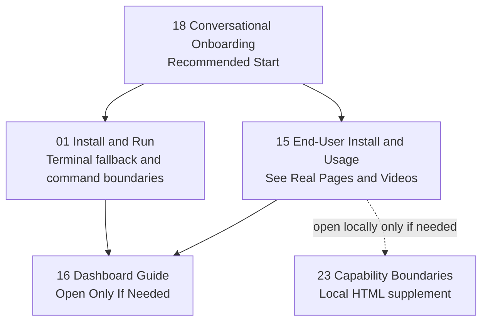
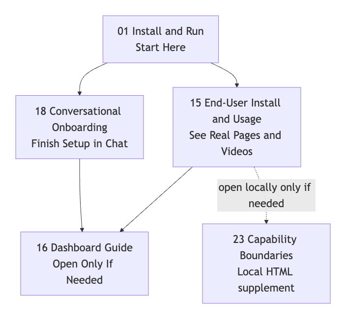

> [中文版](README.md)

# Memory Palace x OpenClaw Integration Documentation

<p align="center">
  
</p>

This documentation covers one thing:

> **How to integrate `memory-palace` as a memory plugin for OpenClaw.**

> If this repo helps with your OpenClaw workflow, please give it a GitHub star ⭐.

<p align="center">
  
</p>

Keep these 7 points in mind:

- It plugs into the memory slot OpenClaw is currently using
- The default `setup/install` path modifies your local OpenClaw configuration file to register and activate the plugin — it does not modify OpenClaw's source code
- This does not replace the host's own `USER.md / MEMORY.md / memory/*.md`
- The stable command surface is `openclaw memory-palace ...`
- Automatic recall / auto-capture / visual auto-harvest depend on a host that supports hooks
- The minimum supported host version for this automatic chain is `OpenClaw >= 2026.3.2`
- Legacy standalone Memory Palace references are treated as historical background here, not as the primary entry point

If you only want the safest reading order first, start with this map:



If your viewer does not render Mermaid, use this static image instead:



---

## Document Index by Number

Complete document index sorted by number. Each document is tagged with its audience (User / Maintainer) and core content.

| No. | Filename | Audience | Title | Core Content Summary | Key Modules/Concepts |
|---|---|---|---|---|---|
| 00 | [00-IMPLEMENTED_CAPABILITIES.en.md](00-IMPLEMENTED_CAPABILITIES.en.md) | Maintainer | Implemented Capabilities Checklist | Lists all shipped capabilities that should no longer appear in "future plans," including MCP tools, command surface, WAL mode, intent classification, vitality scoring, write guard contradiction detection, atomic database migrations, etc. | memory plugin, MCP toolchain, write guard, WAL, intent classification, vitality, contradiction detection, modular installer |
| 01 | [01-INSTALL_AND_RUN.en.md](01-INSTALL_AND_RUN.en.md) | User | Installation and Running | Terminal fallback commands, command-surface boundaries, and local `tgz` validation notes after the chat-first path tells you what to do. | setup, verify, doctor, smoke, Profile B, stdio transport |
| 02 | [02-SKILLS_AND_MCP.en.md](02-SKILLS_AND_MCP.en.md) | User | Skills and MCP Configuration | Explains how the default OpenClaw chat path, plugin features, and the underlying service layer split the work. Most users stay on the default path; touch skill / MCP only when you want to wire things manually. | memory entry, hooks, skill, MCP |
| 03 | [03-PROFILES_AND_DEPLOY.en.md](03-PROFILES_AND_DEPLOY.en.md) | User | Profiles and Deployment Options | Comparison and recommendations for Profile A/B/C/D: start with B, use C long-term, D when you want the full advanced surface enabled by default. | Profile A/B/C/D, embedding, reranker, deployment profiles |
| 04 | [04-TROUBLESHOOTING.en.md](04-TROUBLESHOOTING.en.md) | User | Troubleshooting | Common installation and runtime troubleshooting methods, including command surface confusion, MCP connection failures, DATABASE_URL configuration, etc. | openclaw memory-palace, transport, DATABASE_URL, SSE |
| 05 | _(Deleted)_ | -- | CODE_MAP | Removed from the repository. | -- |
| 06 | [06-UPGRADE_CHECKLIST.en.md](06-UPGRADE_CHECKLIST.en.md) | Maintainer | Upgrade Test Review Checklist | Minimum maintainer pre-release checklist: command surface, package form, user-facing messaging, and documentation hygiene. | setup/verify/doctor/smoke/migrate/upgrade, npm pack, plugins install |
| 07 | [07-PHASED_UPGRADE_ROADMAP.en.md](07-PHASED_UPGRADE_ROADMAP.en.md) | Maintainer | Phased Upgrade Roadmap | Archival retrospective of how the mainline evolved into the current maintenance state; not a current user entry point. | history, maintenance, ACL, visual memory, observability |
| 14 | _(Deleted)_ | -- | WINDOWS_REAL_MACHINE_TEST_CHECKLIST | Removed from the repository. | -- |
| 15 | [15-END_USER_INSTALL_AND_USAGE.en.md](15-END_USER_INSTALL_AND_USAGE.en.md) | User | End-User Installation and Usage Records | WebUI real page asset collection, including bilingual onboarding videos, capability tour, and ACL scenario demonstration screenshots. | WebUI, onboarding videos, ACL demo, burned-subtitle MP4 |
| 16 | [16-DASHBOARD_GUIDE.en.md](16-DASHBOARD_GUIDE.en.md) | User | Dashboard Guide | Positioning and functionality of the Dashboard's 5 pages, plus the difference between `repo full` and `packaged full`. | Dashboard, Setup, Memory, Review, Maintenance, Observability, static bundle |
| 17 | [17-REAL_ASSETS_INDEX.en.md](17-REAL_ASSETS_INDEX.en.md) | Maintainer | Real Assets Index | Asset ledger for public-page copies, local build outputs, and re-capture rules. | video assets, screenshots, asset ledger, capture rules |
| 18 | [18-CONVERSATIONAL_ONBOARDING.en.md](18-CONVERSATIONAL_ONBOARDING.en.md) | User | Conversational Onboarding (English) | Recommended chat-first install/setup path for normal users, covering both the “not installed yet” path and the “already installed, continue setup” path. | conversational onboarding, before install, continue setup, provider probe/apply |
| 18-zh | [18-CONVERSATIONAL_ONBOARDING.md](18-CONVERSATIONAL_ONBOARDING.md) | User | Conversational Onboarding (Chinese) | Chinese counterpart of the same chat-first path. | conversational onboarding, before install, continue setup, provider probe/apply |
| 23 | [23-PROFILE_CAPABILITY_BOUNDARIES.en.html](23-PROFILE_CAPABILITY_BOUNDARIES.en.html) | User | Profile Capability Boundaries (English HTML) | English single-page HTML overview of capabilities and profile boundaries. | Profile boundaries, WebUI, ACL |
| 23-zh | [23-PROFILE_CAPABILITY_BOUNDARIES.html](23-PROFILE_CAPABILITY_BOUNDARIES.html) | User | Profile Capability Boundaries (Chinese HTML) | Chinese single-page HTML overview: WebUI capabilities, profile boundaries, ACL demonstration. | Profile boundaries, WebUI capabilities, ACL |
| 24 | [24-AGENT_ACL_ISOLATION.en.md](24-AGENT_ACL_ISOLATION.en.md) | User | Experimental Multi-Agent ACL Isolation Guide | How to enable the current experimental ACL flow and verify it in the WebUI: alpha writes a memory, beta still returns UNKNOWN, and the current design boundary is explained explicitly. | ACL, multi-agent, long-term memory isolation, alpha/beta isolation |
| 25 | [25-MEMORY_ARCHITECTURE_AND_PROFILES.en.md](25-MEMORY_ARCHITECTURE_AND_PROFILES.en.md) | User / Developer | Memory Architecture, ACL, and Profile Technical Notes (English) | Code-grounded overview page: first the OpenClaw memory-slot takeover, then the plugin / skills / backend split, and finally the write/recall path, ACL isolation, and the product semantics and boundaries of Profiles A/B/C/D. | memory slot takeover, plugin/skills/backend, write path, recall path, ACL, Profile A/B/C/D |
| 25-zh | [25-MEMORY_ARCHITECTURE_AND_PROFILES.md](25-MEMORY_ARCHITECTURE_AND_PROFILES.md) | User / Developer | Memory Architecture, ACL, and Profile Technical Notes (Chinese) | Chinese counterpart of the same code-grounded overview page. | memory slot takeover, plugin/skills/backend, write path, recall path, ACL, Profile A/B/C/D |

### Gaps in Numbering

- **05, 08-11, 13, 14, 19-22, 26+**: Documents 05 and 14 have been deleted from the repository; 08-11, 13, 19-22 do not exist in the current repository (likely merged into other documents or removed historically).

---

## Where to Start

### If You Are Integrating for the First Time

1. [18-CONVERSATIONAL_ONBOARDING.en.md](18-CONVERSATIONAL_ONBOARDING.en.md)
   - Recommended first step: hand this page to OpenClaw in CLI or WebUI
2. [01-INSTALL_AND_RUN.en.md](01-INSTALL_AND_RUN.en.md)
   - Use this when OpenClaw tells you the plugin is not installed yet, or when you need the terminal/package fallback details
3. [15-END_USER_INSTALL_AND_USAGE.en.md](15-END_USER_INSTALL_AND_USAGE.en.md)
   - Includes onboarding video recordings delivered directly through OpenClaw (bilingual)
4. [04-TROUBLESHOOTING.en.md](04-TROUBLESHOOTING.en.md)

Prompt to paste into OpenClaw:

```text
I want to install Memory Palace for OpenClaw through the recommended chat-first path. First determine whether this machine already has a checked-out copy of https://github.com/AGI-is-going-to-arrive/Memory-Palace-Openclaw. If it is already cloned, start with docs/openclaw-doc/18-CONVERSATIONAL_ONBOARDING.en.md from that local repo. If it is not cloned yet, tell me to clone the repo first and then continue from docs/openclaw-doc/18-CONVERSATIONAL_ONBOARDING.en.md. If you can also open repo links, use this page only as the matching reference: https://github.com/AGI-is-going-to-arrive/Memory-Palace-Openclaw/blob/main/docs/openclaw-doc/18-CONVERSATIONAL_ONBOARDING.en.md. Once the local repo exists, prefer the local doc path over the GitHub page. Then determine whether the memory-palace plugin is already installed and loaded. If it is not installed yet, give me the shortest install chain first. If it is already installed, continue with memory_onboarding_status -> memory_onboarding_probe -> memory_onboarding_apply. Reuse any provider settings already present on the host, do not push me to the dashboard by default, start with Profile B when no provider stack is ready yet, and if embedding + reranker + LLM are already ready, recommend Profile D directly. Only after apply remind me to run openclaw memory-palace verify / doctor / smoke.
```

If you are not sure where to start, the simplest default order is:

1. `18`
2. `01`
3. `15`
4. `16` (only if you actually want the Dashboard)

If you want to keep your existing memory slot binding, you can use the `--no-activate` flag mentioned in `01`; however, that is not the default path.

### If You Want to Understand the Plugin / Skill / MCP Division of Labor

1. [02-SKILLS_AND_MCP.en.md](02-SKILLS_AND_MCP.en.md)

### If You Need to Configure a Profile

1. [03-PROFILES_AND_DEPLOY.en.md](03-PROFILES_AND_DEPLOY.en.md)

### If You Want to Understand the Dashboard First

1. [16-DASHBOARD_GUIDE.en.md](16-DASHBOARD_GUIDE.en.md)

### If You Need Experimental Multi-Agent Durable Memory Isolation

1. [24-AGENT_ACL_ISOLATION.en.md](24-AGENT_ACL_ISOLATION.en.md)

### If You Want One Page That Explains the Overall Architecture, ACL, and Profile Boundaries

1. [25-MEMORY_ARCHITECTURE_AND_PROFILES.en.md](25-MEMORY_ARCHITECTURE_AND_PROFILES.en.md)

### If You Want the Easiest GitHub-Friendly User Evidence Page First

1. [15-END_USER_INSTALL_AND_USAGE.en.md](15-END_USER_INSTALL_AND_USAGE.en.md)

### If You Already Cloned the Repo and Want the Standalone HTML Page Locally

Treat these as a **local supplement**, not as the default GitHub-first entry:

1. [23-PROFILE_CAPABILITY_BOUNDARIES.en.html](23-PROFILE_CAPABILITY_BOUNDARIES.en.html)

---

## Maintainer / Historical Materials

Documents numbered `00 / 06 / 07 / 17` are retained, but none of them should be used as default installation entry points.

A simpler way to think about it:

- These pages are for maintenance, retrospectives, assets, or historical reference
- Regular users do not need to read them first
- `12-WINDOWS_NATIVE_VALIDATION_PLAN.md` is maintainer-only material and is intentionally excluded from public navigation
- The unified public verification baseline is at [../EVALUATION.en.md](../EVALUATION.en.md)
- User-facing pages should not inherit maintainer-only local environment details from these appendices

---

## Current Public Verification Baseline

- The current repo no longer maintains active `.github/workflows/*`
- The public verification baseline should be understood as local / package / target-environment reproduction, not as hosted CI
- Complete numbers and reproduction commands are at [../EVALUATION.en.md](../EVALUATION.en.md)
- This round reconfirmed that:
  - `openclaw plugins info memory-palace` reports the plugin as loaded
  - the same onboarding document can drive the correct next step in CLI / WebUI, in installed / uninstalled states, in both Chinese and English
  - the latest profile-matrix record reproduced the current experimental `A / B / C / D + ACL` behavior
- Read `15 / 16 / 18 / 23 / 24` as the current public user-evidence pages
- If a page still keeps an older screenshot or video asset, treat it as repository history or supplemental evidence rather than as a separate “version baseline”
- The `Profile C / D` boundary stays the same everywhere: “env is filled” does not mean “ready”; `probe / verify / doctor / smoke` still have to pass in the target environment

If you only want the four proof anchors that matter first:

- **User-visible proof**: start with [15-END_USER_INSTALL_AND_USAGE.en.md](15-END_USER_INSTALL_AND_USAGE.en.md); if you already opened the repo locally, then add [23-PROFILE_CAPABILITY_BOUNDARIES.en.html](23-PROFILE_CAPABILITY_BOUNDARIES.en.html)
- **Profile B baseline**: treat `Profile B` as the safest first-run path; the real threshold is whether your own `verify / doctor / smoke` chain passes
- **Profile C/D boundary**: “env is filled” does not mean “ready”; the real threshold is still `provider-probe / verify / doctor / smoke`
- **Quality gates**: all public benchmark / ablation numbers live in [../EVALUATION.en.md](../EVALUATION.en.md), including the `intent 200 case`, `write guard 200 case`, contradiction checks, and the live LLM benchmark

---

## Most Common Misconceptions

### 1. This Does Not "Replace Host Memory"

A more accurate description:

- `memory-palace` handles the long-term memory layer
- The host's file-based memory is still retained and may still contribute to responses

### 2. OpenClaw Users Do Not Start with a Pile of Low-Level Tools

For OpenClaw users, the default experience is more like:

```text
current memory entry
-> plugin hooks
-> a few high-level tools
-> underlying service layer
-> backend
```

### 3. Visual Auto-Harvest Is Not Visual Auto-Storage

- Visual context can be automatically harvested
- Long-term visual memory still requires an explicit `memory_store_visual` call

---

## One-Line Summary

If you just want to get the right mental model:

> **This is a memory plugin + bundled skills for OpenClaw. It plugs into the current memory entry, but it does not delete the host's own file-based memory.**
