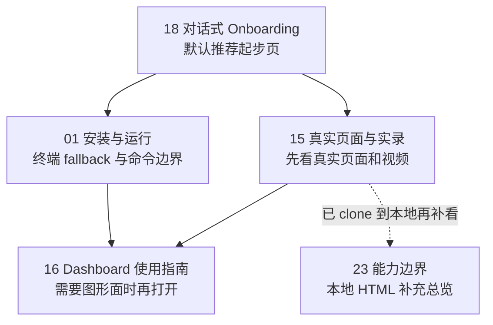
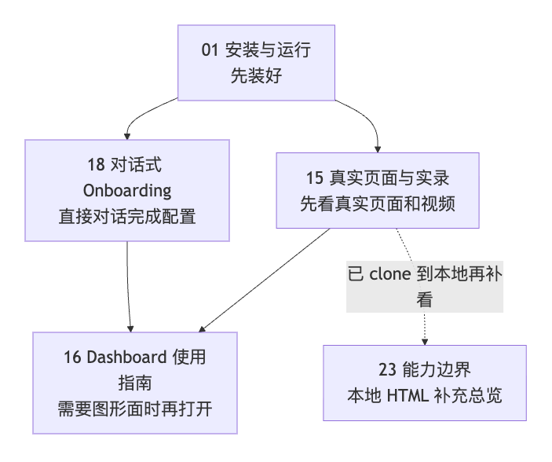

> [English](README.en.md)

# Memory Palace x OpenClaw 接入文档

<p align="center">
  
</p>

这套文档只讲一件事：

> **怎么把 `memory-palace` 作为 OpenClaw 的 memory plugin 接进来。**

> 如果这个项目对你的 OpenClaw 使用有帮助，欢迎顺手点个 Star ⭐。

<p align="center">
  
</p>

先记住 7 句话：

- 它会接到 OpenClaw 当前在用的记忆入口上
- 默认 `setup/install` 走的是"改你本机 OpenClaw 配置文件，把插件接进去并激活"
  这条路，不是改 OpenClaw 源码
- 这不等于替代宿主自己的 `USER.md / MEMORY.md / memory/*.md`
- 稳定命令面是 `openclaw memory-palace ...`
- 自动 recall / auto-capture / visual auto-harvest 依赖支持 hooks 的宿主
- 当前这条自动链路的支持下限是 `OpenClaw >= 2026.3.2`
- 旧版独立 Memory Palace 叙事在这里都按历史背景处理，不当主入口

如果你只想先看最稳的阅读顺序，可以先看这张图：



如果当前查看器不渲染 Mermaid，可以直接看这张静态图：



---

## 编号文档内容索引

按编号排序的完整文档索引。每篇文档标注受众（用户 / 维护者）和核心内容。

| 编号 | 文件名 | 受众 | 标题 | 核心内容摘要 | 关键模块/概念 |
|---|---|---|---|---|---|
| 00 | [00-IMPLEMENTED_CAPABILITIES.md](00-IMPLEMENTED_CAPABILITIES.md) | 维护者 | 当前已实现能力清单 | 列举所有已落地、不应再写回"未来计划"的能力边界，包括 MCP 工具、命令面、WAL 模式、intent 分类、vitality 排序、write guard 矛盾检测、数据库原子迁移等。 | memory plugin, MCP 工具链, write guard, WAL, intent 分类, vitality, contradiction 检测, installer 模块化 |
| 01 | [01-INSTALL_AND_RUN.md](01-INSTALL_AND_RUN.md) | 用户 | 安装与运行 | 终端 fallback 命令、命令面边界，以及本地 `tgz` 验证路径的说明页；适合在 chat-first 路径告诉你下一步后再看。 | setup, verify, doctor, smoke, Profile B, stdio transport |
| 02 | [02-SKILLS_AND_MCP.md](02-SKILLS_AND_MCP.md) | 用户 | Skills 与 MCP 配置 | 解释 OpenClaw 默认聊天链路、插件能力和底层服务怎么分工：平时先走默认链路，只有要自己直连时才需要碰 skill / MCP 这一层。 | 记忆入口, hooks, skill, MCP |
| 03 | [03-PROFILES_AND_DEPLOY.md](03-PROFILES_AND_DEPLOY.md) | 用户 | Profile 与部署选择 | Profile A/B/C/D 四档的对比与推荐：B 先跑通，C 长期使用，D 适合要把完整高级能力面默认开起来的场景。 | Profile A/B/C/D, embedding, reranker, 部署档位 |
| 04 | [04-TROUBLESHOOTING.md](04-TROUBLESHOOTING.md) | 用户 | 常见问题排查 | 常见安装和运行问题的排查方法，包括命令面混淆、MCP 连接失败、DATABASE_URL 配置等。 | openclaw memory-palace, transport, DATABASE_URL, SSE |
| 05 | _(已删除)_ | -- | CODE_MAP | 已从仓库移除。 | -- |
| 06 | [06-UPGRADE_CHECKLIST.md](06-UPGRADE_CHECKLIST.md) | 维护者 | 升级测试 Review 清单 | 维护者发布前最小复核清单：命令面、插件包形态、用户口径、文档卫生四项必检。 | setup/verify/doctor/smoke/migrate/upgrade, npm pack, plugins install |
| 07 | [07-PHASED_UPGRADE_ROADMAP.md](07-PHASED_UPGRADE_ROADMAP.md) | 维护者 | 分阶段升级路线图 | 归档性质的历史阶段回顾页，用来解释主线如何演进到当前维护状态，而不是当前用户入口。 | history, maintenance, ACL, visual memory, observability |
| 14 | _(已删除)_ | -- | WINDOWS_REAL_MACHINE_TEST_CHECKLIST | 已从仓库移除。 | -- |
| 15 | [15-END_USER_INSTALL_AND_USAGE.md](15-END_USER_INSTALL_AND_USAGE.md) | 用户 | 最终用户安装与使用实录 | WebUI 真实页面素材汇总，包含中英文 onboarding 视频、capability tour、ACL 场景演示截图。 | WebUI, onboarding 视频, ACL 演示, 烧录字幕 MP4 |
| 16 | [16-DASHBOARD_GUIDE.md](16-DASHBOARD_GUIDE.md) | 用户 | Dashboard 使用指南 | Dashboard 5 个页面的定位与功能，以及 `repo full` 与 `packaged full` 两条运行面的差别。 | Dashboard, Setup, Memory, Review, Maintenance, Observability, static bundle |
| 17 | [17-REAL_ASSETS_INDEX.md](17-REAL_ASSETS_INDEX.md) | 维护者 | 真实素材索引 | 当前公开页素材台账、公开副本位置，以及本地构建输出与复拍规则。 | 视频素材, 截图, asset ledger, capture rules |
| 18 | [18-CONVERSATIONAL_ONBOARDING.md](18-CONVERSATIONAL_ONBOARDING.md) | 用户 | 对话式 Onboarding（中文） | 当前默认推荐的 chat-first 安装/配置入口，覆盖“还没安装”和“已经安装、继续配置”两种情况。 | 对话式 onboarding, 安装前, 已安装继续配置, provider probe/apply |
| 18-en | [18-CONVERSATIONAL_ONBOARDING.en.md](18-CONVERSATIONAL_ONBOARDING.en.md) | 用户 | Conversational Onboarding (English) | English version of the same chat-first path: both the “not installed yet” path and the “already installed, continue setup” path. | conversational onboarding, before install, continue setup, provider probe/apply |
| 23 | [23-PROFILE_CAPABILITY_BOUNDARIES.html](23-PROFILE_CAPABILITY_BOUNDARIES.html) | 用户 | Profile 能力边界总览（中文 HTML） | 中文单页 HTML 总览：WebUI 能力面、Profile 边界、ACL 演示。 | Profile 边界, WebUI 能力, ACL |
| 23-en | [23-PROFILE_CAPABILITY_BOUNDARIES.en.html](23-PROFILE_CAPABILITY_BOUNDARIES.en.html) | 用户 | Profile Capability Boundaries (English HTML) | English single-page HTML overview of capabilities and profile boundaries. | Profile boundaries, WebUI, ACL |
| 24 | [24-AGENT_ACL_ISOLATION.md](24-AGENT_ACL_ISOLATION.md) | 用户 | 实验性多 Agent ACL 隔离指南 | 当前实验性 ACL 的启用方法和 WebUI 验证步骤：alpha 写入记忆，beta 仍返回 UNKNOWN，并明确当前设计边界。 | ACL, multi-agent, 长期记忆隔离, alpha/beta 隔离 |
| 25 | [25-MEMORY_ARCHITECTURE_AND_PROFILES.md](25-MEMORY_ARCHITECTURE_AND_PROFILES.md) | 用户 / 开发者 | 记忆机制架构、ACL 与 Profile 技术说明 | 基于当前真实代码的总说明页：先讲 `memory-palace` 如何接管 OpenClaw memory slot，再讲 plugin / skills / backend 分层，最后讲写入与召回主链、ACL 多 Agent 隔离，以及 Profile A/B/C/D 的产品语义和能力边界。 | memory slot takeover, plugin/skills/backend, write path, recall path, ACL, Profile A/B/C/D |
| 25-en | [25-MEMORY_ARCHITECTURE_AND_PROFILES.en.md](25-MEMORY_ARCHITECTURE_AND_PROFILES.en.md) | 用户 / 开发者 | Memory Architecture, ACL, and Profile Technical Notes | Code-grounded overview page: first the OpenClaw memory-slot takeover, then the plugin / skills / backend split, and finally the write/recall path, ACL isolation, and the product semantics and boundaries of Profiles A/B/C/D. | memory slot takeover, plugin/skills/backend, write path, recall path, ACL, Profile A/B/C/D |

### 编号缺口说明

- **05, 08-11, 13, 14, 19-22, 26+**: 编号 05 和 14 已从仓库删除；08-11, 13, 19-22 在当前仓库中不存在（可能为历史文档已合并或移除）。

---

## 先看哪一页

### 如果你是第一次接入

1. [18-CONVERSATIONAL_ONBOARDING.md](18-CONVERSATIONAL_ONBOARDING.md)
   - 默认推荐第一步：直接把这页交给 OpenClaw CLI 或 WebUI
2. [01-INSTALL_AND_RUN.md](01-INSTALL_AND_RUN.md)
   - 只有当 OpenClaw 告诉你 plugin 还没装，或者你需要看终端/package fallback 时，再回来读这页
3. [15-END_USER_INSTALL_AND_USAGE.md](15-END_USER_INSTALL_AND_USAGE.md)
   - 包含当前保留的 onboarding 文档直交 OpenClaw 的中英实录视频
4. [04-TROUBLESHOOTING.md](04-TROUBLESHOOTING.md)

直接贴给 OpenClaw 的 prompt：

```text
我想按当前默认推荐的 chat-first 路径给 OpenClaw 安装 Memory Palace。请先判断这台机器上是否已经 clone 了 https://github.com/AGI-is-going-to-arrive/Memory-Palace-Openclaw。 如果已经 clone 了，就优先读取本地仓库里的 docs/openclaw-doc/18-CONVERSATIONAL_ONBOARDING.md；如果还没 clone，就先告诉我把仓库 clone 下来，再继续从 docs/openclaw-doc/18-CONVERSATIONAL_ONBOARDING.md 往下走。 如果你也能打开仓库链接，可以把这个 GitHub 页面当成对应参考页：https://github.com/AGI-is-going-to-arrive/Memory-Palace-Openclaw/blob/main/docs/openclaw-doc/18-CONVERSATIONAL_ONBOARDING.md；但一旦本地仓库已经存在，就优先按本地文档路径执行。 然后请先判断 memory-palace plugin 是否已经安装并加载；如果还没装，先给我最短安装链路；如果已经装好，就继续按 memory_onboarding_status -> memory_onboarding_probe -> memory_onboarding_apply 帮我往下走。先检查宿主里是否已有可复用的 provider 配置，不要默认把我推去 dashboard；如果当前还没有完整 provider 栈，就先按 Profile B 起步；如果 embedding + reranker + LLM 都已经就绪，就直接把 Profile D 当成推荐目标。只有 apply 完成后，再提醒我跑 openclaw memory-palace verify / doctor / smoke。
```

如果你不确定自己该看哪一页，最简单的默认顺序就是：

1. `18`
2. `01`
3. `15`
4. `16`（只有你确实要打开 Dashboard 时）

如果你想自己保留原来的 memory slot 绑定，也可以看 `01` 里提到的
`--no-activate`；但那不是默认路径。

### 如果你想先搞懂 plugin、skill、MCP 分工

1. [02-SKILLS_AND_MCP.md](02-SKILLS_AND_MCP.md)

### 如果你要配 Profile

1. [03-PROFILES_AND_DEPLOY.md](03-PROFILES_AND_DEPLOY.md)

### 如果你想先搞懂 Dashboard

1. [16-DASHBOARD_GUIDE.md](16-DASHBOARD_GUIDE.md)

### 如果你要做实验性多 Agent 记忆隔离

1. [24-AGENT_ACL_ISOLATION.md](24-AGENT_ACL_ISOLATION.md)

### 如果你想一次看懂整体架构、ACL 和 Profile 边界

1. [25-MEMORY_ARCHITECTURE_AND_PROFILES.md](25-MEMORY_ARCHITECTURE_AND_PROFILES.md)

### 如果你想先看 GitHub 里最容易直接浏览的用户侧证据

1. [15-END_USER_INSTALL_AND_USAGE.md](15-END_USER_INSTALL_AND_USAGE.md)

### 如果你已经 clone 到本地，想直接打开 standalone HTML 页

这组页属于**本地补充总览**，不是默认 GitHub 主入口：

1. [23-PROFILE_CAPABILITY_BOUNDARIES.html](23-PROFILE_CAPABILITY_BOUNDARIES.html)

---

## 维护者 / 历史资料

`00 / 06 / 07 / 17` 这组编号页现在继续保留，
但都不建议当默认安装入口。

更简单的理解是：

- 这些页是维护、回顾、素材或历史资料
- 普通用户先不用读
- `12-WINDOWS_NATIVE_VALIDATION_PLAN.md` 属于维护者内部材料，不在公开导航里
- 公开验证口径统一看 [../EVALUATION.md](../EVALUATION.md)
- 用户面文档不要直接继承这些页里的维护者本地环境细节

---

## 当前公开验证口径

- 当前 repo 不再保留 active `.github/workflows/*`
- 公开验证口径按本机 / package / 目标环境复跑理解，不按 hosted CI 理解
- 完整数字和复跑命令统一看 [../EVALUATION.md](../EVALUATION.md)
- 这轮已经再次确认：
  - `openclaw plugins inspect memory-palace --json` 已能确认 plugin 已加载；有些宿主也接受 `openclaw plugins info memory-palace`
  - `openclaw skills list` 不是 bundled onboarding skill 的安装判断条件
  - 同一份 onboarding 文档已经验证过可以在 CLI / WebUI、未安装 / 已安装、中英文这些主分支里给出正确下一步
  - 最新一轮 profile-matrix 记录里，已经复现当前实验性 `A / B / C / D + ACL` 行为
- 对 `Profile D` 来说，一组 shared `LLM_*` 可以作为 setup/onboarding 输入，但最终解析后的 `WRITE_GUARD_*`、`COMPACT_GIST_*`、`INTENT_*` 仍然必须都不是占位值，才能把真实检查说成 ready
- `15 / 16 / 18 / 23 / 24` 这些用户页，现在统一按“当前公开用户证据页”理解
- 如果某页保留了旧素材或历史截图，它只是仓库里的补充材料，不再作为单独的“版本基线”叙事
- `Profile C / D` 的边界统一不变：不是“填了 env 就算配好”，而是 `probe / verify / doctor / smoke` 在目标环境里真实通过才算 ready

如果你想先抓最重要的 4 个验证锚点：

- **用户可见证据**：优先看 [15-END_USER_INSTALL_AND_USAGE.md](15-END_USER_INSTALL_AND_USAGE.md)；如果你已经在本地打开文档，再补看 [23-PROFILE_CAPABILITY_BOUNDARIES.html](23-PROFILE_CAPABILITY_BOUNDARIES.html)
- **Profile B 基线**：把 `Profile B` 理解成最稳的第一次安装路径；真正的判断标准，是你自己的 `verify / doctor / smoke` 是否通过
- **Profile C/D 边界**：不是“填了 env 就算配好”，而是 `provider-probe / verify / doctor / smoke` 真正通过才算已经跑通
- **质量门禁**：当前公开可引用的 benchmark / ablation 统一看 [../EVALUATION.md](../EVALUATION.md)，其中已经包含 `intent 200 case`、`write guard 200 case`、`contradiction` 和 `live LLM benchmark`

---

## 最容易误会的边界

### 1. 这不是"替代宿主 memory"

更准确的说法是：

- `memory-palace` 负责长期记忆这一层
- 宿主文件记忆仍然保留，也仍然可能参与回答

### 2. OpenClaw 用户默认不是先面对一堆底层工具

对 OpenClaw 用户来说，默认更像是：

```text
当前记忆入口
-> plugin hooks
-> 少数高层工具
-> 底层服务
-> backend
```

### 3. visual auto-harvest 不等于 visual auto-storage

- visual context 可以自动 harvest
- 长期 visual memory 仍然是显式 `memory_store_visual`

---

## 一句总结

如果你只想先把这套东西看对：

> **这就是一套给 OpenClaw 用的 memory plugin + bundled skills。它会接到当前记忆入口上，但不会去删除宿主自己的文件记忆。**
